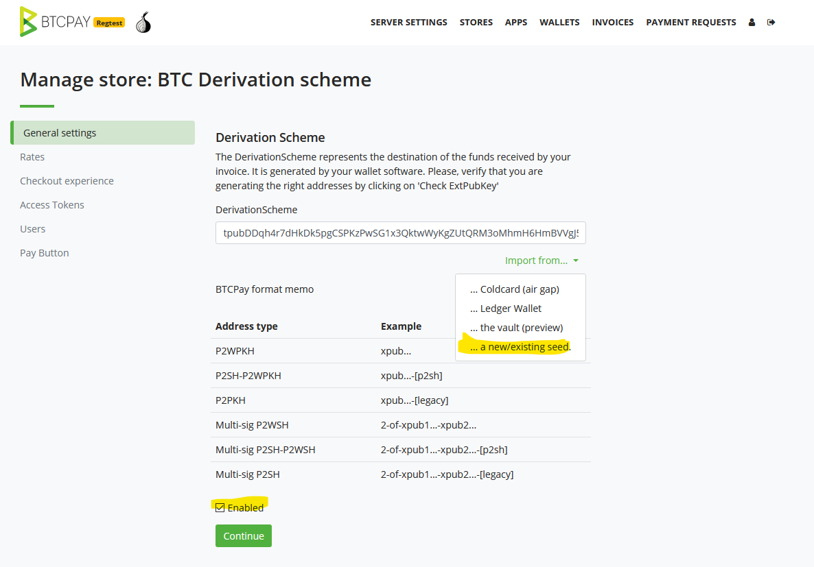
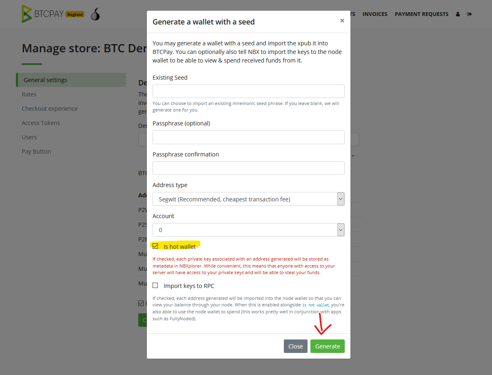
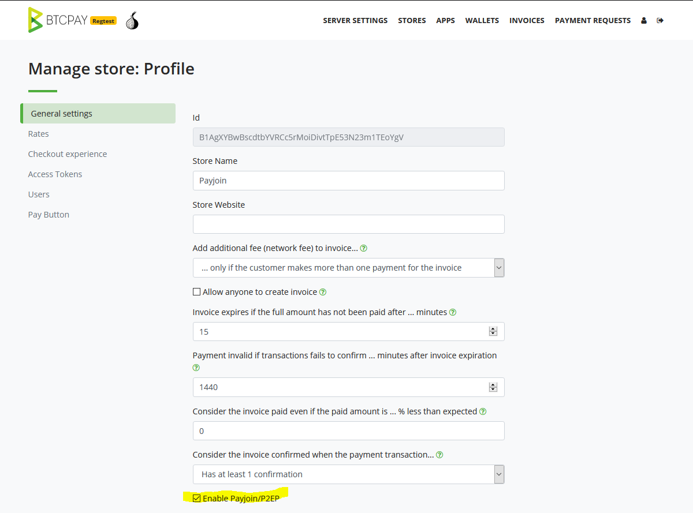
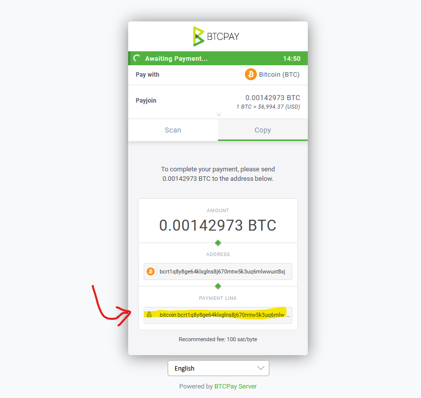
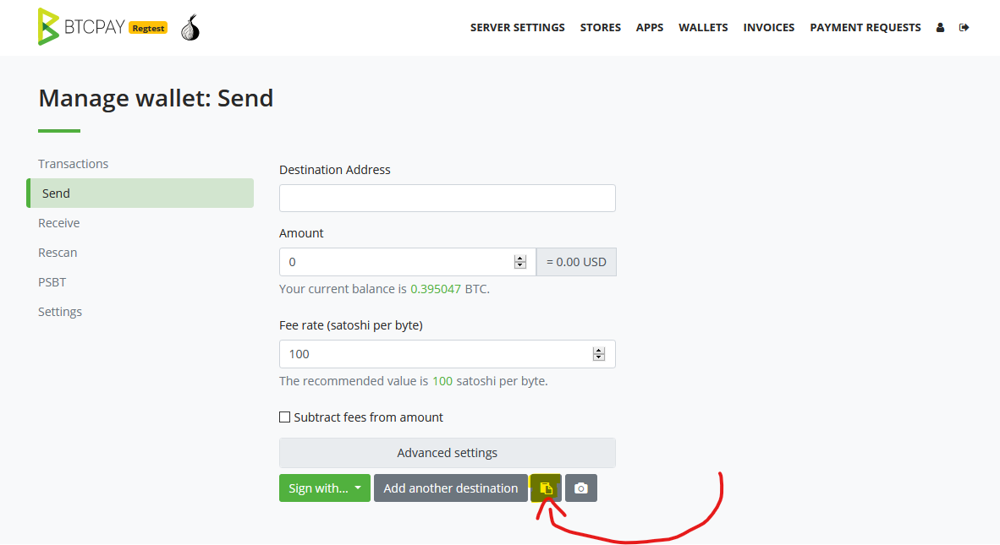
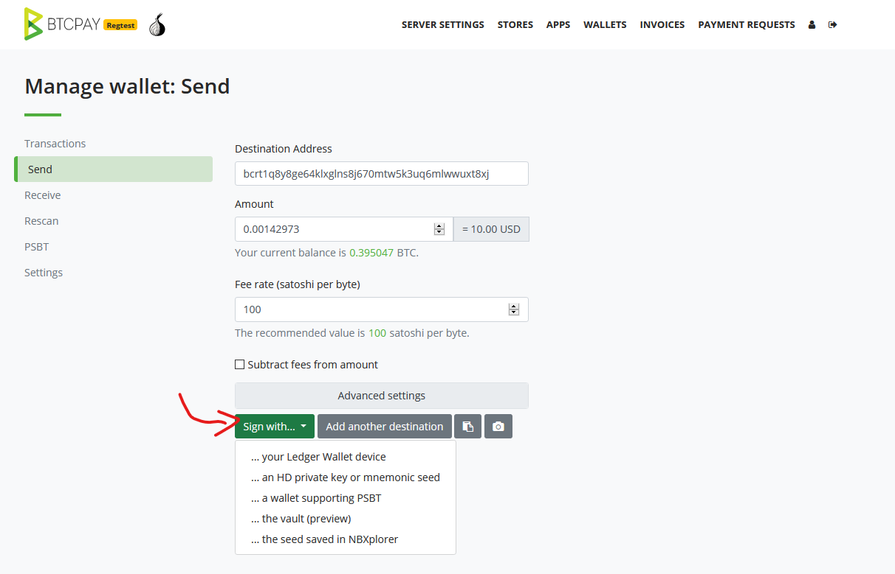
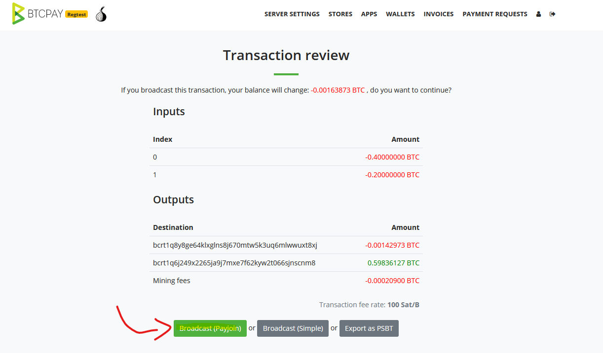

# Mwongozo wa Payjoin wa BTCPay Server

Hati hii inaelezea jinsi ya kutumia kipengele cha **Payjoin** cha BTCPay Server. Kwa maelezo ya kina, ya kiufundi ya jinsi payjoin inavyotekelezwa, angalia [BIP78](https://github.com/bitcoin/bips/blob/master/bip-0078.mediawiki)

Unaweza kufuata video hii kuelewa vizuri payjoin ni nini na jinsi ya kuitumia.

## Kuwezesha Payjoin kama mfanyabiashara

1. Unda duka
2. Sanidi [hot wallet](./CreateWallet.md#hot-wallet) kwa mpango wako wa utokaji. Hakikisha unatumia ama segwit au segwit wrapped kama aina ya anwani.
3. Wezesha Payjoin/P2EP katika "Mipangilio ya Jumla" na ubofye "Save"

Ni muhimu kutambua kuwa utahitaji angalau UTXO 1 ili payjoin ifanye kazi.

## Kulipa kwa Payjoin kama mtumiaji

[BTCPay Wallet](./Wallet.md) inasaidia Payjoin.

1. Pata kiungo cha malipo cha BIP21 kutoka kwa invosi ya BTCPay Server ambayo payjoin imewezeshwa kwa ama:
   - Kuchambua msimbo wa QR na kipengele cha kuchambua kamera
   - Kunakili kiungo kutoka kwenye kitufe cha "Fungua kwenye wallet" na kuibandika kwenye kidokezo cha "Chambua BIP21"
2. Fomu ya kutuma inapaswa kujazwa na maelezo ya malipo. Unaweza kuangalia ikiwa invosi inasaidia payjoin kwa kupanua "mipangilio ya kina" ili kuona ikiwa kuna ingizo la "Mwisho wa Payjoin" lenye url.
3. Saini muamala wako kwa kutumia ama usaidizi wa wallet ya vifaa vya BTCPay Server kupitia [BTCPay Vault](./HardwareWalletIntegration.md) au kipengele cha [hot wallet](./CreateWallet.md#hot-wallet).
4. Mara muamala wako wa awali ukiwa tayari, utapewa chaguo la ama `Tangaza (Payjoin)` au `Tangaza (Rahisi)`. Chagua `Tangaza (Payjoin)`.
5. Seva ya payjoin itapendekeza muamala mpya maalum, ikiwezekana. Ikiwa seva ya payjoin haiwezi kufanya payjoin, muamala wa awali unatangazwa badala yake.
6. Ikiwa unatumia wallet ya vifaa, utaulizwa kusaini muamala wa payjoin tena (kipengele cha hot wallet kinasaini muamala kiotomatiki kwako).
7. Hongera, umesaidia kuboresha ubadilikaji wa Bitcoin na uhuru wako wa kifedha!

## Kwa nini payjoin haikufanyika?

Kuna sababu nyingi za hili:

- Duka halikuwa na UTXO zozote za kuchangia kwenye payjoin
- Wallet yako haitumii muundo sawa na wa duka (ni muhimu ili kutoibua shaka kwa makampuni ya uchambuzi)
- Hutumii SegWit wala SegWit iliyofungwa ndani ya P2SH.
- Seva ya payjoin haipatikani

## Wallet zinazosaidiwa

Tafadhali wasiliana na uwatie moyo watengenezaji wa wallet yako kuongeza usaidizi. Kadri **matumizi ya payjoin** yanavyoenea zaidi, ndivyo mbinu za kiheuristic zinazotumiwa na makampuni ya uchambuzi wa blockchain zinavyovunjika zaidi na haziwezi kufuatilia historia yako ya kifedha kwa ufanisi. Ikiwa wewe ni mtengenezaji wa wallet, tafadhali [wasiliana nasi](./Community.md) ikiwa unahitaji msaada au una maoni.
