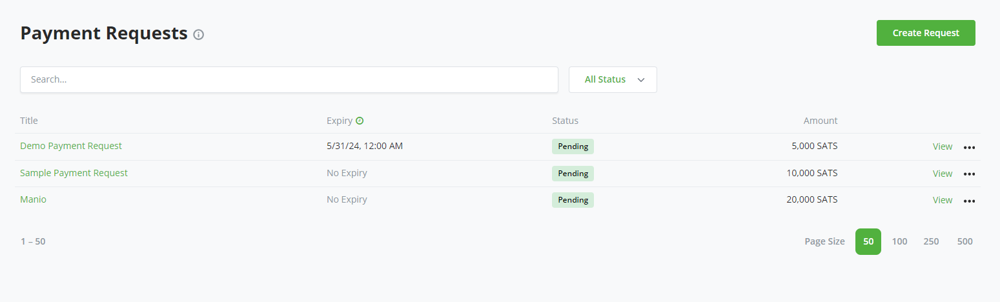
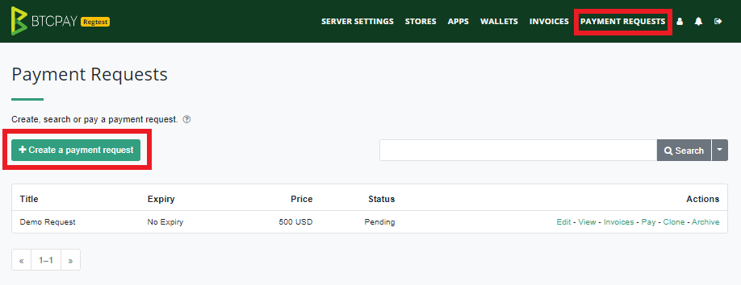
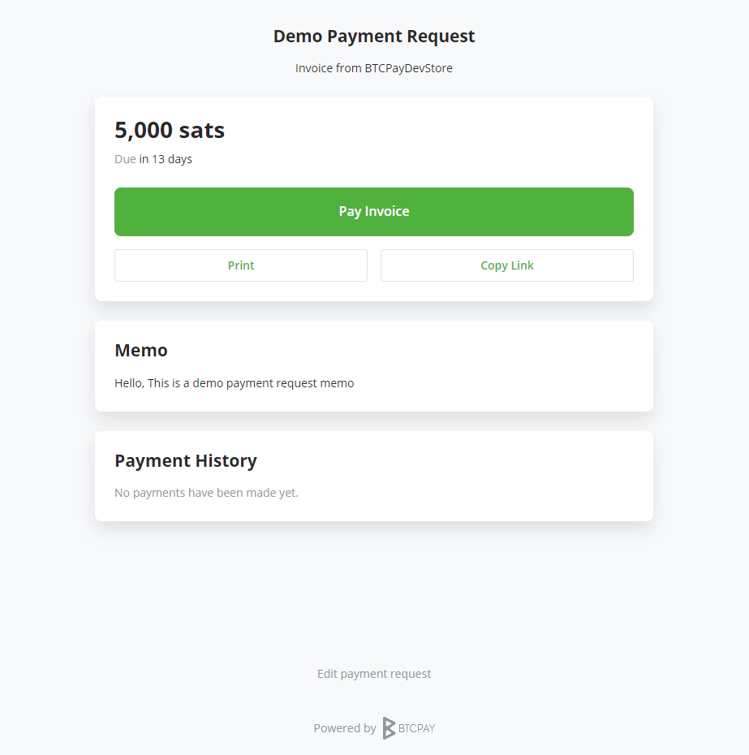
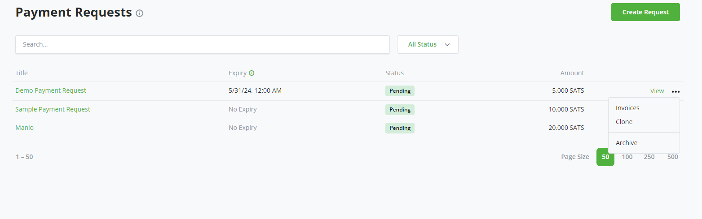
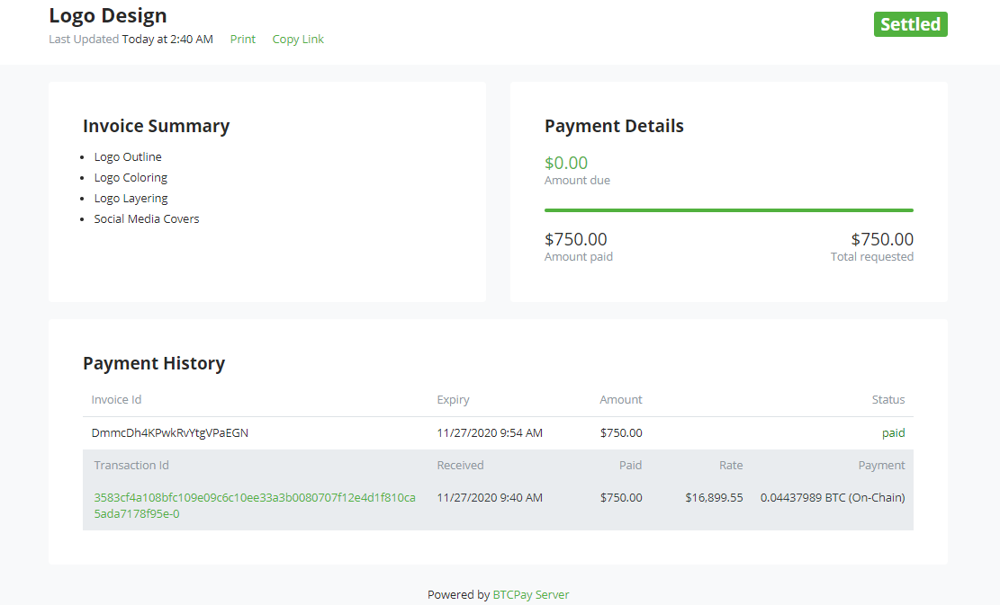

# Maombi ya Malipo

Maombi ya Malipo ni kipengele kinachowezesha wamiliki wa maduka ya BTCPay kuunda invosi za muda mrefu.
Fedha zinazolipwa kwa ombi la malipo hutumia kiwango cha ubadilishaji wakati wa malipo.
Hii inawaruhusu watumiaji kufanya malipo kwa wakati unaowafaa bila kulazimika kujadiliana au kuthibitisha viwango vya ubadilishaji na mmiliki wa duka wakati wa malipo.

Watumiaji wanaweza kulipa maombi kwa malipo ya sehemu.
Ombi la malipo litaendelea kuwa halali hadi litakapolipwa kikamilifu au ikiwa mmiliki wa duka anahitaji muda wa kumalizika.
Anwani hazitumiwi tena. Anwani mpya inazalishwa kila wakati mtumiaji anapobofya kulipa ili kuunda invosi kwa ombi la malipo.

Wamiliki wa maduka wanaweza pia kuchapisha maombi ya malipo (au kusafirisha data ya invosi) kwa ajili ya utunzaji wa kumbukumbu na uhasibu.
BTCPay inatambulisha invosi kiotomatiki kama Maombi ya Malipo katika orodha ya invosi ya duka lako.

## Video ya Maombi ya Malipo

## Unda Ombi la Malipo

Bofya Maombi > Unda Maombi

Wakati wa kuunda ombi la malipo, unatoa maelezo yafuatayo:

- **Kichwa**: Kichwa cha ombi la malipo
- **Kiasi & Sarafu**: Kiasi kilichoombwa katika Fiat au sarafu ya kripto
- **Muda wa Kumalizika**: Tarehe ambayo malipo yatakuwa halali hadi (hiari)
- **Barua Pepe**: Ikibainishwa, anwani ya barua pepe itapokea arifa kuhusu malipo yoyote yaliyofanywa kwa ombi hili
- **Omba data ya Mteja wakati wa malipo**: Unaweza kuomba maelezo ya mteja kama vile anwani ya barua pepe au anwani ya usafirishaji.
- Memo: Ikiwa unataka kuacha ujumbe kwa mteja, unaweza kuandika katika sehemu ya memo. Kihariri cha maandishi kinachokuwezesha kuunda muundo wa ujumbe wako na pia kujumuisha viambatisho

Chagua chaguo la _Ruhusu mlipaji kuunda invosi katika madhehebu yao wenyewe_ ikiwa unataka kuruhusu malipo ya sehemu kufanywa.

:::warning
Maombi ya malipo yanategemea duka, kumaanisha kuwa kila ombi la malipo linahusishwa na duka wakati wa uundaji.
Hakikisha una wallet iliyounganishwa kwenye duka lako ambalo ombi la malipo linamilikiwa nalo.
:::

Bofya Unda ili kukagua ombi lako la malipo.

BTCPay inaunda URL kwa ombi la malipo. Shiriki URL hii kuona ombi lako la malipo.
Unahitaji maombi mengi ya aina moja? Unaweza kutumia chaguo la `Clone` kwenye menyu kuu ili kunakili maombi ya malipo kama inavyoonyeshwa.

## Ombi Lililolipwa la Malipo

Mlipaji na mwombaji wanaweza kuona hali ya ombi la malipo baada ya kutuma malipo.
Hali itaonekana kama **Iliyotatuliwa** ikiwa malipo yamepokelewa kikamilifu.
Ikiwa malipo ya sehemu tu yalifanywa, Kiasi Kinachodaiwa kitaonyesha salio linalodaiwa.

