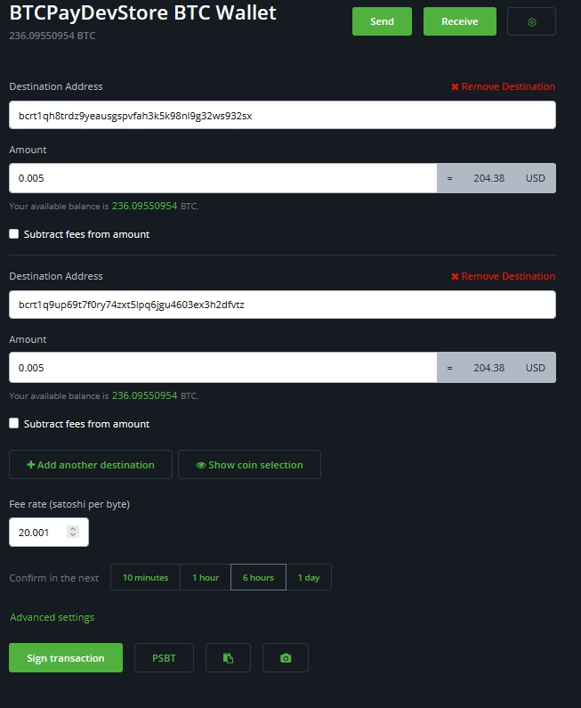

# Malipo

Utendaji wa malipo umeunganishwa na [Malipo ya Kuvuta](./PullPayments.md). Kipengele hiki kinakuwezesha kuunda malipo ndani ya BTCPay yako.
Kipengele hiki kinakuwezesha kuchakata malipo ya kuvuta (marejesho ya pesa, malipo ya mishahara, au uondoaji wa fedha).

## Inafanyaje kazi?

Tutapitia mifano miwili, moja itakuwa Marejesho ya Pesa, na nyingine itakuwa malipo ya mshahara.

### Mfano

Tuanze na mfano wa marejesho ya pesa.
Mteja amenunua bidhaa kwenye duka lako lakini kwa bahati mbaya analazimika kurudisha bidhaa hiyo. Anataka marejesho ya pesa.
Ndani ya BTCPay, unaweza kuunda [Marejesho ya Pesa](./Refund.md) na kumpa mteja kiungo cha kudai fedha zao.
Wakati wowote mteja anapotoa anwani yao na kudai fedha, itaonyeshwa kwenye `Payouts`.

Hali ya kwanza iliyo nayo ni `Awaiting Approval`.
Wahudumu wa duka wanaweza kuangalia ikiwa kuna mengi yanayosubiri, na baada ya kufanya uteuzi, unatumia kitufe cha `Actions`.

Chaguzi kwenye kitufe cha vitendo

- Approve selected payouts
- Approve & send selected payouts
- Cancel selected payouts

Hatua inayofuata ni `Approve & send selected payouts` kwa kuwa tunataka kumrejeshea mteja pesa.
Angalia Anwani ya Mteja, inaonyesha kiasi na ikiwa tunataka ada zitolewe kutoka kwenye marejesho au la.
Mara baada ya kufanya ukaguzi, kinachobaki ni kusaini muamala tu.

Mteja sasa anapokea taarifa kwenye ukurasa wa Kudai. Anaweza kufuatilia muamala kwani amepewa kiungo cha kichunguzi cha block na muamala wake.
Mara muamala unapothibitishwa, na hali inabadilika kuwa Imekamilika.

Sasa tuingie kwenye malipo ya Mshahara, kwani hili linaendeshwa kutoka ndani ya duka na si kwa ombi la Mteja.
Msingi ni ule ule; inatumia Malipo ya Kuvuta. Lakini badala ya kuunda marejesho ya pesa, tutaunda [Malipo ya Kuvuta](./PullPayments.md).

Nenda kwenye kichupo cha `Pull Payments` kwenye seva yako ya BTCPay.
Juu kulia, bofya kitufe cha `Create Pull Payment`.

Sasa tuko katika uundaji wa Malipo, lipe jina na kiasi unachotaka katika sarafu unayotaka, jaza Maelezo, ili mfanyakazi ajue inahusu nini.
Sehemu inayofuata inafanana na marejesho ya pesa. Mfanyakazi anajaza anwani ya Kupokea na kiasi anachotaka kudai kutoka kwenye Malipo haya. Anaweza kuamua kufanya madai 2 tofauti, kwa anwani tofauti, au hata kudai kwa sehemu kupitia lightning.

Ikiwa kuna Malipo mengi yanayosubiri, unaweza kuyaweka pamoja ili kusainiwa na kutumwa. Mara yanaposainiwa, malipo yanahamia kwenye kichupo cha `In progress` na kuonyesha Muamala.
Yanapokubaliwa na mtandao, malipo yanahamia kwenye kichupo cha Imekamilika.
Kichupo cha imekamilika ni kwa madhumuni ya kihistoria pekee. Kinashikilia Malipo yaliyochakatwa na muamala unaohusika nayo.

## Kutumia Greenfield API

Kama ilivyoelezwa katika [Malipo ya Kuvuta](./PullPayments.md#greenfield-api) Greenfield API inaruhusu matumizi mapana ya `Pull Payments`.
Ombi la malipo litaenda daima kwenye kichupo cha Payouts kwenye seva yako ya BTCPay wakati wowote dhana hiyo inapotumika.
Kwa kutumia Greenfield API unaweza kuendesha maombi haya kiotomatiki, toleo lijalo la seva ya BTCPay kwa hakika litakuwa na chaguzi za kiotomatiki za malipo.
