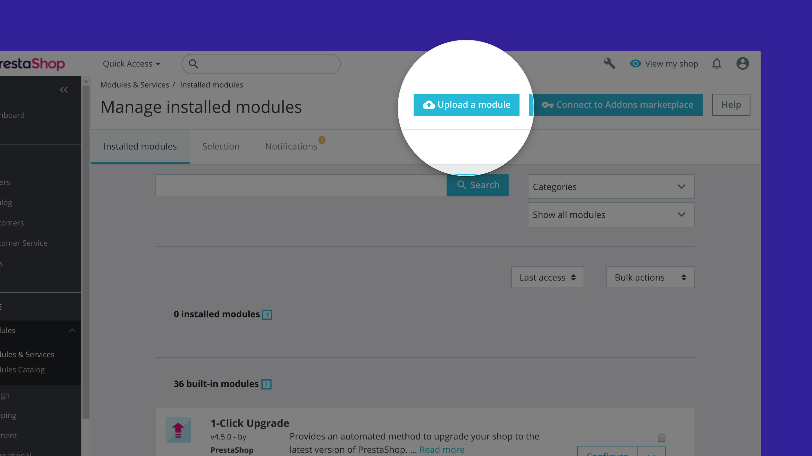
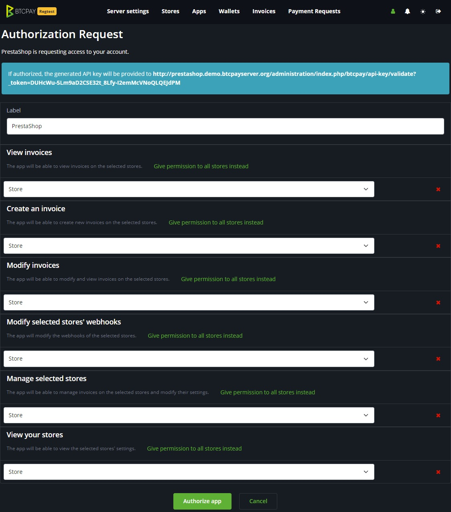
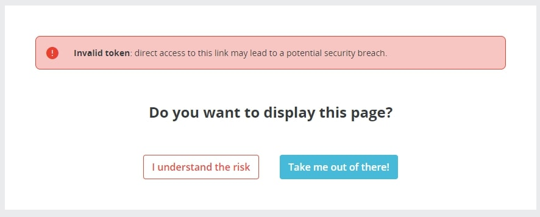
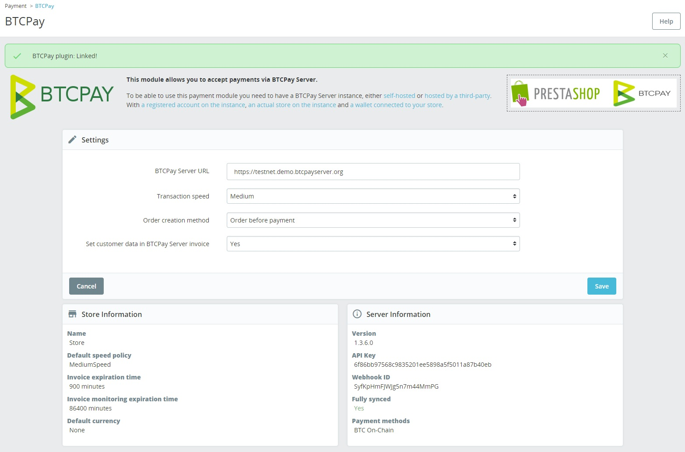

# Ushirikiano wa PrestaShop

Hati hii inaelezea jinsi ya **kuunganisha BTCPay Server kwenye duka lako la PrestaShop**.
Ikiwa huna duka bado, fuata [makala hii ya hatua kwa hatua](https://blog.templatetoaster.com/how-to-install-prestashop/) ili kuunda moja kutoka mwanzo.

Ili kuunganisha BTCPay Server kwenye duka lililopo la PrestaShop, fuata hatua zifuatazo.

:::tip
Hati hii inatumika tu kwa toleo la hivi karibuni la _v6_ la moduli. Matoleo mengine:
- [_v4_ hati za moduli](https://github.com/btcpayserver/btcpayserver-doc/blob/cba96292ceea9483711ab53c479a98357383f857/docs/PrestaShop.md)
- [_v5_ hati za moduli](https://github.com/btcpayserver/btcpayserver-doc/blob/b1432054e147836d7286e1bae2f98e62f2752363/docs/PrestaShop.md)
:::

## Mahitaji ya Seva

Tafadhali hakikisha kwamba unatimiza mahitaji yafuatayo kabla ya kusakinisha programu-jalizi hii.

- Unatumia PHP 8.0 au toleo jipya zaidi
- PrestaShop yako ni toleo la 8.0 au jipya zaidi.
  - Duka lako lazima liwe na HTTPS iliyowezeshwa na liweze kufikiwa kwa umma.
- BTCPay Server yako ni toleo la 1.7.0 au jipya zaidi
- Viendelezi vya PHP vya PDO, curl, gd, intl, json, na mbstring vinapatikana
- Una BTCPay Server, ama [iliyojisimamia mwenyewe](/Deployment/README.md) au [inayosimamiwa na mtu wa tatu](/Deployment/ThirdPartyHosting.md)
  - Kielelezo cha BTCPay Server lazima kiwe na HTTPS iliyowezeshwa na kiweze kufikiwa kwa umma.
- [Una akaunti iliyosajiliwa kwenye kielelezo](./RegisterAccount.md)
- [Una duka la BTCPay kwenye kielelezo](./CreateStore.md)
- [Una pochi iliyounganishwa na duka lako](./WalletSetup.md)

## Sakinisha Programu-jalizi ya BTCPay

1. [Pakua programu-jalizi ya hivi karibuni ya BTCPay Server](https://github.com/btcpayserver/prestashop-plugin/releases)
2. PrestaShop > Modules > Module Manager > Upload a module
3. Pakia faili ya `.zip` uliyopakua sasa hivi
4. Bonyeza `configure` ili kusanidi moduli

## Kuunganisha duka

Moduli ya BTCPay Server ya Prestashop ni **daraja kati ya seva yako (kichakataji malipo) na duka lako la biashara ya mtandaoni**.
Haijalishi kama unatumia suluhisho la kujisimamia mwenyewe au la mtu wa tatu kutoka hatua ya 2, mchakato wa usanidi ni sawa.

1. Katika sehemu ya `BTCPay Server URL`, weka URL kamili ya mwenyeji wako (ikijumuisha https) – kwa mfano https://testnet.demo.btcpayserver.org
2. Chagua kasi ya chaguo-msingi ya muamala (hii itabadilisha kiasi gani BTCPay inapendekeza kama ada ya muamala).
3. _Kwa hiari: Chagua modi ya agizo inayofaa kwa duka lako (agizo linaundwa kabla au baada ya malipo)._
   - Inafaa tu ikiwa unatumia toleo **kabla** ya v5.1.0 kwani mantiki hii imeondolewa.
4. Chagua ikiwa unataka kutuma metadata ya mteja kwenye kielelezo chako cha BTCPay Server kwa ajili ya uwekaji hesabu.
5. Bonyeza `Connect` ili kuhifadhi mipangilio yako na uelekezwe kwenye kielelezo chako cha BTCPay Server ili kuunda ufunguo wa API.
6. Wakati wa kuunda ufunguo wa API, hakikisha unatoa ruhusa kwa duka mahususi (maduka mengi hayatumiki).

7. Bonyeza kitufe cha `Authorize app` ambacho baada yake utaelekezwa tena kwenye duka lako la Prestashop. Ukipata dirisha ibukizi la "Invalid Token", tafadhali hakikisha kwamba PrestaShop na BTCPay Server zote zinatumia HTTPS na zina majina sahihi ya mwenyeji (angalia [Mahitaji ya Seva](#mahitaji-ya-seva)).

8. Prestashop itajaribu na kuunda muunganisho kwenye kielelezo chako cha BTCPay Server. 9. Ujumbe utaonyeshwa ikiwa muunganisho ulifanikiwa (lakini ni busara kufanya ununuzi wa majaribio).

:::tip
Kuelekezwa tena kutoka BTCPay Server wakati mwingine kunashindwa kutokana na utata wa PrestaShop. Ikiwa itashindwa, bado unaweza kutumia programu-jalizi hii kwa kunakili ufunguo wa API kutoka `/account/apikeys` na kuubandika kwenye fomu.
:::

### Unda ufunguo wa API mwenyewe

Ikiwa inapendelewa, unaweza pia kutengeneza ufunguo wa API mwenyewe kwa kuunda katika `/account/addapikey`. Ikiwa utatengeneza ufunguo wa API mwenyewe, hakikisha kwamba una ruhusa zifuatazo kwa duka _moja_:

- `btcpay.store.canmodifystoresettings`
- `btcpay.store.webhooks.canmodifywebhooks`
- `btcpay.store.canviewstoresettings`
- `btcpay.store.cancreateinvoice`
- `btcpay.store.canviewinvoices`
- `btcpay.store.canmodifyinvoices`

## 3. Changia

BTCPay inajengwa na kudumishwa kikamilifu na wachangiaji wa kujitolea kutoka kote mtandaoni. Tunakaribisha na kuthamini michango mipya.

Wachangiaji wanaotaka kusaidia, kabla ya kufungua ombi la kuvuta (pull request), tafadhali [tengeneza suala (issue)](https://github.com/btcpayserver/prestashop-plugin/issues/new/choose)
au jiunge na [mazungumzo ya jumuiya yetu](https://chat.btcpayserver.org) ili kupata maoni ya mapema, jadili njia bora za kushughulikia tatizo na kuhakikisha hakuna urudiaji wa kazi.

## Usaidizi wa PrestaShop

Usaidizi wa PrestaShop unaweza kupatikana kupitia njia zake rasmi.

- [Ukurasa wa Nyumbani](https://www.prestashop.com)
- [Hati](https://doc.prestashop.com)
- [Mabaraza ya Usaidizi](https://www.prestashop.com/forums)
