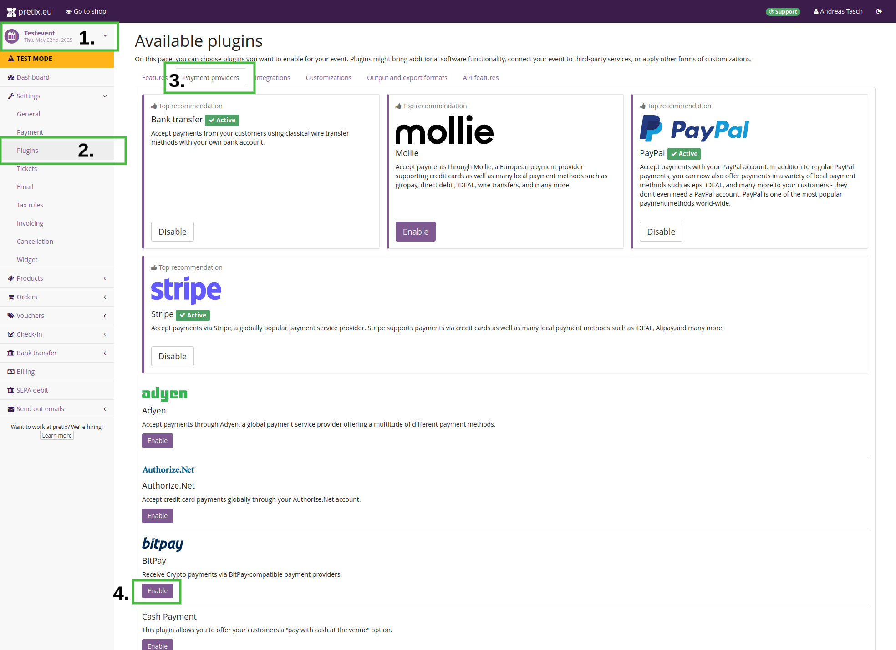
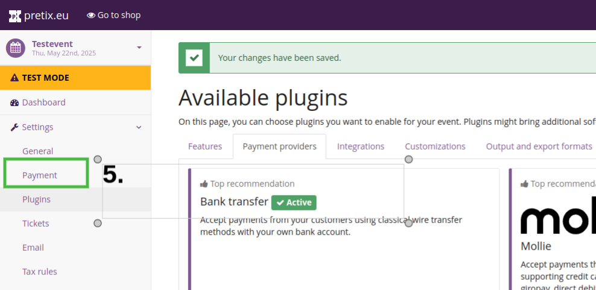
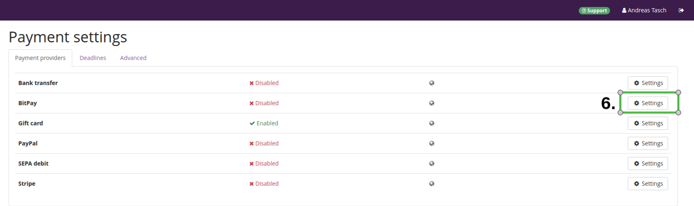
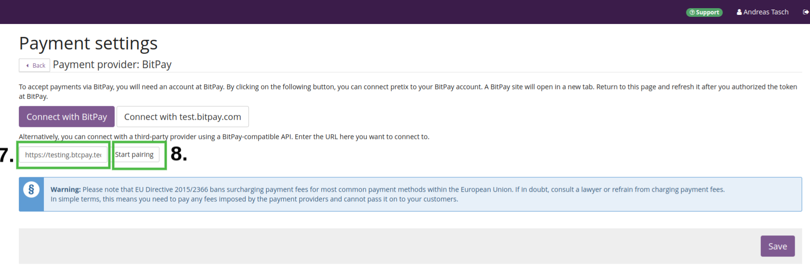
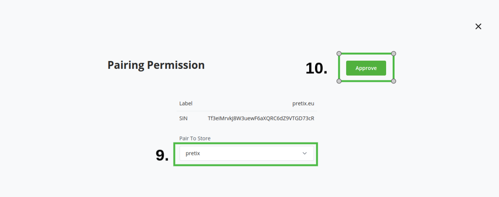
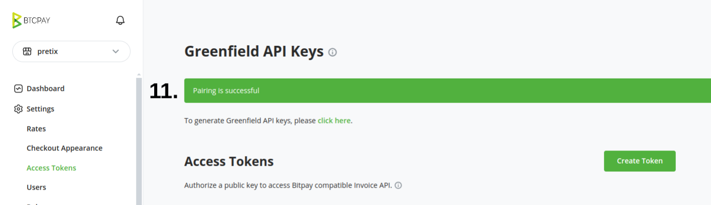
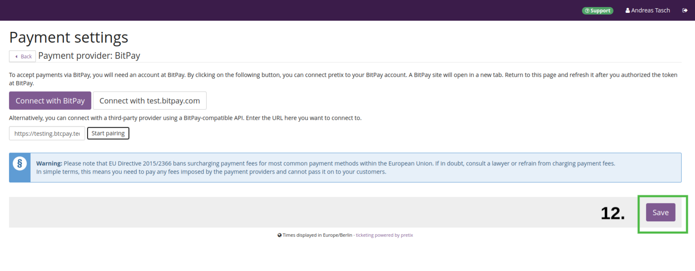
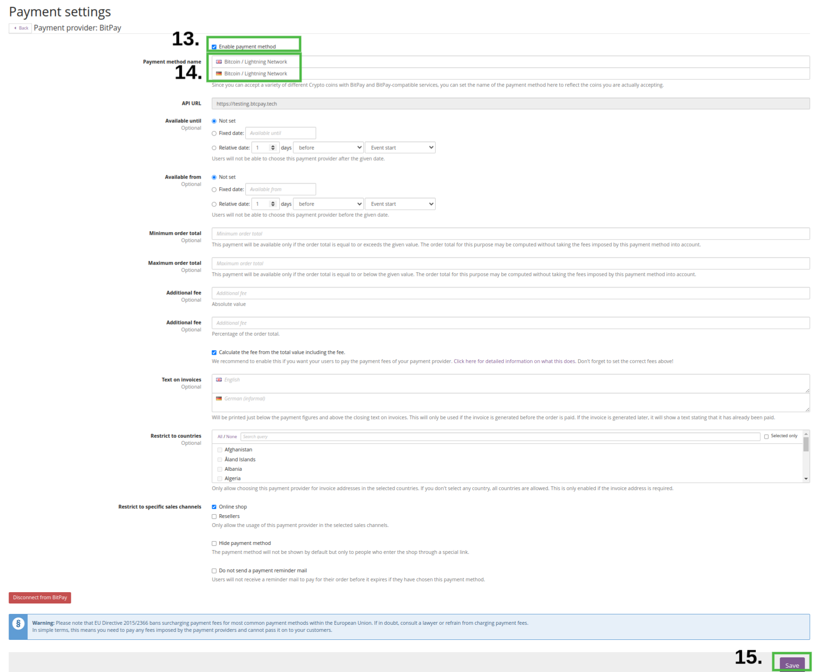

# Pretix - programu ya tiketi kwa matukio

[Pretix](https://pretix.eu/) ni [programu ya tiketi ya bure na yenye msimbo wazi](https://github.com/pretix/pretix) kwa mikutano, tamasha, maonyesho, warsha, na matukio mengine. Unaweza kuisambaza mwenyewe au kuanza na [toleo lao la wingu](https://pretix.eu/about/en/pricing) ambalo ni bure kwa hadi mauzo ya tiketi 2500.

:::tip
Ushirikiano huu unadumishwa na Pretix na sio sehemu ya mradi wa BTCPay Server.
:::

# Mahitaji
- Una [akaunti ya wingu ya Pretix](https://pretix.eu/signup/) au [kielelezo cha kujisimamia mwenyewe](https://docs.pretix.eu/en/latest/admin/installation/index.html)
- Ikiwa unajisimamia Pretix mwenyewe, unahitaji kusakinisha [programu-jalizi yao ya BitPay](https://github.com/pretix/pretix-bitpay) wewe mwenyewe
- Una BTCPay Server toleo la 1.15.0 au jipya zaidi, ama [iliyojisimamia mwenyewe](/Deployment/README.md) au [inayosimamiwa na mtu wa tatu](/Deployment/ThirdPartyHosting.md)
- [Una akaunti iliyosajiliwa kwenye kielelezo](./RegisterAccount.md)
- [Una duka la BTCPay kwenye kielelezo](./CreateStore.md)
- [Una pochi iliyounganishwa na duka lako](./WalletSetup.md)

## Kusakinisha na kusanidi programu-jalizi ya BitPay kwa Pretix

:::tip
Programu-jalizi inaitwa BitPay, lakini kwa kweli inaauni BTCPay Server pia kwani unaweza kuweka kikoa maalum kinachoelekeza kwenye kielelezo chako cha BTCPay Server.
:::

1. Katika dashibodi ya Pretix chagua tukio unalotaka kusanidi.
2. Kwenye upau wa kando wa kushoto, panua "Settings" na ubonyeze "Plugins".
3. Juu chagua kichupo cha "Payment providers".
4. Tafuta programu-jalizi ya "BitPay" na ubonyeze "Enable".

----
5. Kwenye upau wa kando wa kushoto, bonyeza "Payment".

----
6. Kwenye mstari wa "BitPay" bonyeza "Settings".

----
7. Jaza URL ya kielelezo chako cha BTCPay Server, kwa mfano `https://mainnet.demo.btcpayserver.org` (hapa ndipo umeunda duka lako la BTCPay Server, angalia [Mahitaji](#mahitaji) hapo juu).
8. Bonyeza "Start pairing".

----
9. Utaelekezwa kwenye ukurasa wa "pairing permission" wa BTCPay Server yako. Chagua duka unalotaka kuoanisha nalo.
10. Bonyeza "Approve".

----
11. Unapaswa kuona ujumbe "Pairing successful". Hautaelekezwa tena kwenye Pretix kiotomatiki, kwa hivyo unaweza kufunga kichupo sasa.

----
12. Rudi kwenye Pretix na ubonyeze "Save" chini kulia.

----
13. Sasa unaona ukurasa wa "Payment settings", unaona **Enable payment method** juu, tia alama kisanduku hiki
14. **Payment method name**: Weka jina la njia ya malipo, kwa mfano "Bitcoin / Lightning Network". Unaweza kuacha mengine kama yalivyo au kurekebisha kulingana na mahitaji yako.
15. Bonyeza "Save" chini kulia.

Hongera, umekamilisha usanidi.

Sasa unaweza kujaribu ununuzi wa majaribio na uhakikishe njia ya malipo inafanya kazi kama inavyotarajiwa.
