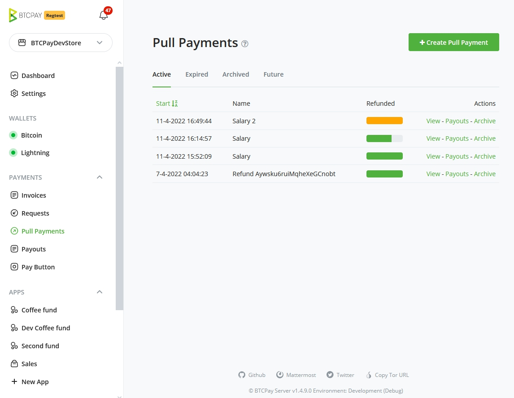
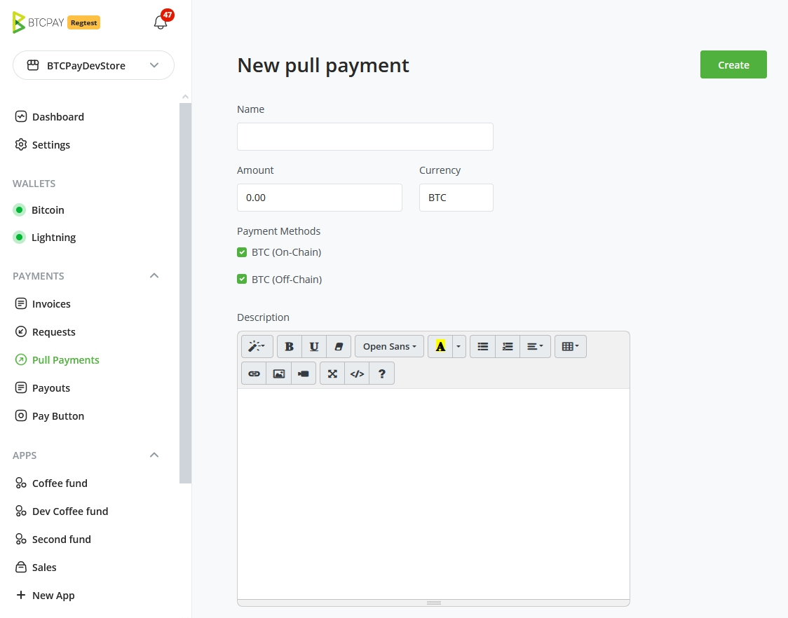
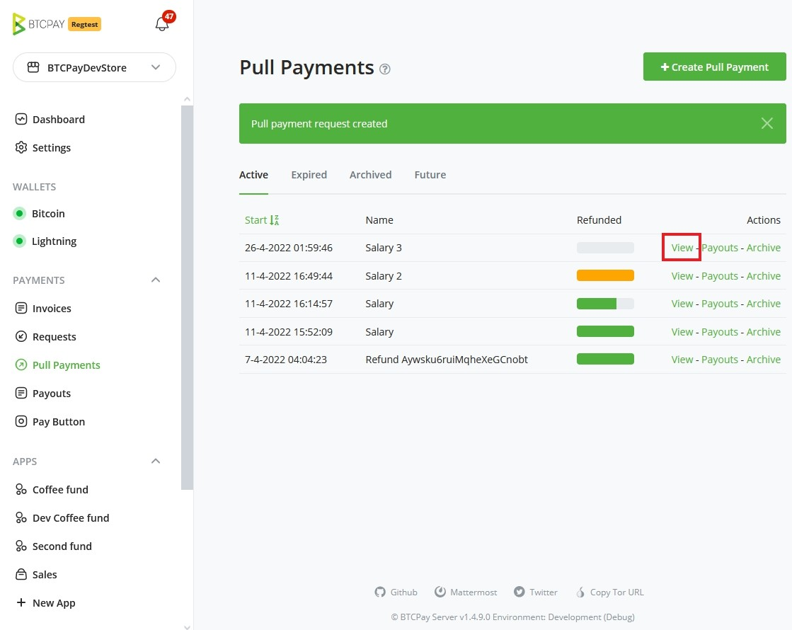
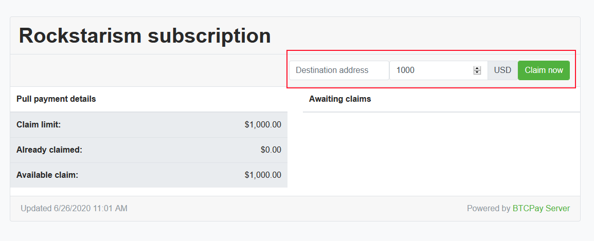
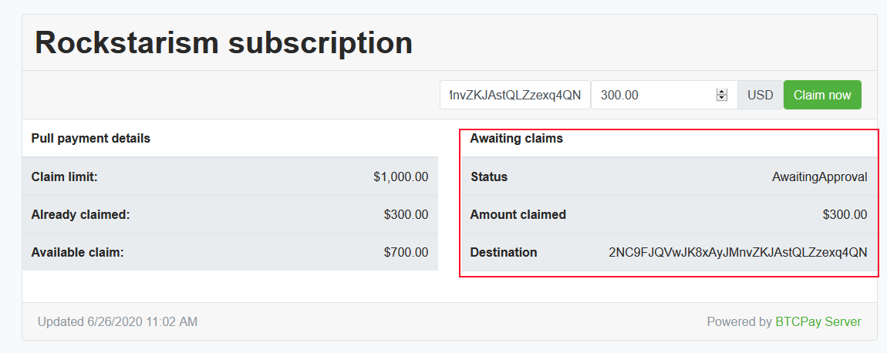
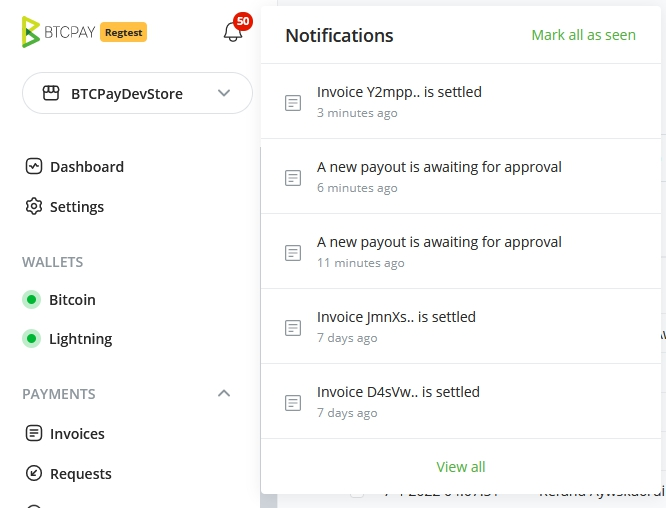
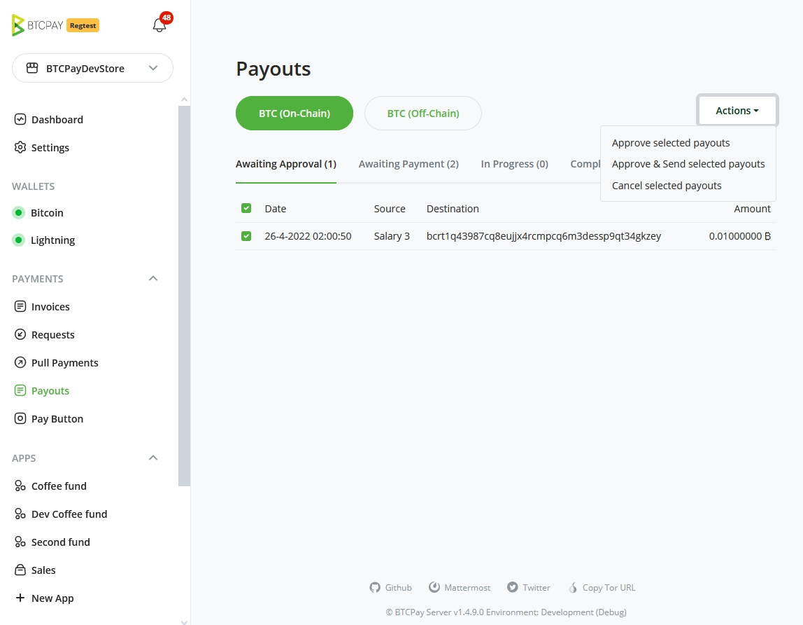
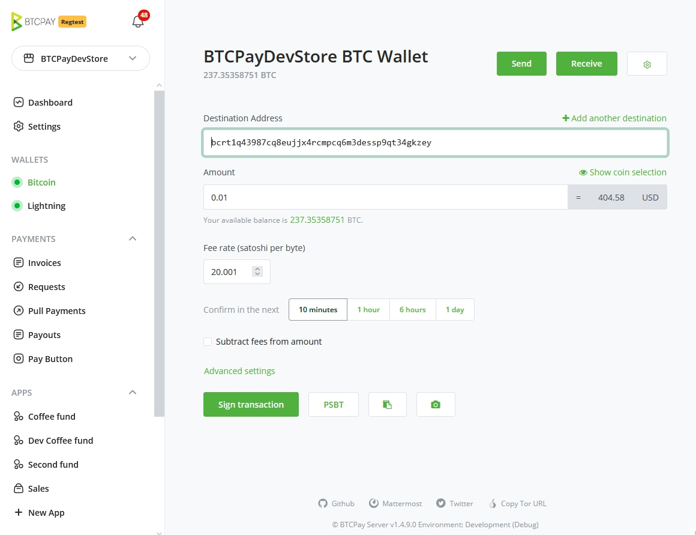

# Malipo ya kuvuta

## Utangulizi

Kijadi, kufanya malipo ya Bitcoin, mpokeaji anashiriki anwani yao ya bitcoin na mtumaji baadaye anatuma pesa kwenye anwani hii.
Mfumo kama huu unaitwa `Push payment` kwani mtumaji ndiye anaanzisha malipo wakati mpokeaji anaweza kuwa hayupo, kwa ufanisi `akikimbiza` malipo kwa mpokeaji.

Hata hivyo, vipi kuhusu kugeuza jukumu?

Je, ikiwa, badala ya mtumaji `kukimbiza` malipo, mtumaji anamruhusu mpokeaji `kuvuta` malipo wakati mpokeaji anaona inafaa?
Huu ni dhana ya `Pull payment`. Hii inaruhusu programu kadhaa mpya kama vile:

- Huduma ya usajili (ambapo msajili anaruhusu huduma kuvuta pesa kila baada ya muda x)
- Marejesho (ambapo mfanyabiashara anamruhusu mteja kuvuta pesa za kurejeshewa kwenye pochi yake wakati inapofaa)
- Bili inayotegemea muda kwa wafanyakazi huru (ambapo mtu anayeajiri anamruhusu mfanyakazi huru kuvuta pesa kwenye pochi yake kadri muda unavyoripotiwa)
- Ufadhili (ambapo mfadhili anamruhusu mpokeaji kuvuta pesa kila mwezi kuendelea kusaidia kazi zao)
- Uuzaji wa kiotomatiki (ambapo mteja wa soko la kubadilisha fedha angeruhusu soko kuvuta pesa kutoka kwenye pochi yao kuuza kiotomatiki kila mwezi)
- Mfumo wa kutoa salio (ambapo huduma yenye kiasi kikubwa inaruhusu watumiaji kuomba utoaji kutoka kwenye salio lao, huduma inaweza kisha kuunganisha kwa urahisi malipo yote kwa watumiaji wengi, kwa vipindi maalum)

Unaweza pia kufuata video hii:

[](https://www.youtube.com/watch?v=-e8lPd9NtPs)

## Dhana

Wakati mtumaji anaposanidi `Pull payment`, anaweza kusanidi idadi ya sifa:

- Tarehe ya kuanza
- Tarehe ya mwisho (si lazima)
- Kipindi (si lazima)
- Kiasi cha kikomo
- Kizio (kama vile USD, BTC, Masaa)
- Njia za malipo zinazopatikana

Baada ya hii, mtumaji anaweza **kushiriki malipo ya kuvuta** kwa kutumia kiungo na mpokeaji, akimruhusu mpokeaji `kuunda malipo`.
Mpokeaji atachagua kwa malipo yao:

- Njia gani ya malipo ya kutumia
- Wapi kutuma pesa

Mara malipo yanapoundwa, yatahesabiwa dhidi ya `Pull payment's limit` kwa `kipindi` cha sasa.
Mtumaji ataidhinisha malipo kwa kuweka `kiwango` ambamo malipo yatatumwa, na kuendelea na malipo.

Kwa mtumaji, tunatoa njia rahisi kutumia ya kuunganisha malipo ya malipo kadhaa kutoka kwenye [Pochi ya Ndani ya BTCPay](/sw/Wallet.md).

```

 +----------+           +-------------------+            +------------+
 |          |           |                   |            |            |
 |  Mtumaji |           |   BTCPay Server   |            |  Mpokeaji  |
 |          |           |                   |            |            |
 +----------+           +-------------------+            +------------+
      |                            |                            |
      |                            |                            |
      |          Unda              |                            |
      +--------------------------->+                            |
      |          Malipo ya kuvuta  |                            |
      |                            |                            |
      |                            |                            |
      |          Shiriki           |                            |
      +-------------------------------------------------------->+
      |          Malipo ya kuvuta  |                            |
      |                            |                            |
      |                            |           Unda             |
      |                            +<---------------------------+
      |                            |           Malipo           |
      |                            |                            |
      |         Idhinisha          |                            |
      +--------------------------->+                            v
      |         Malipo             |
      |                            |
      |         Lipa               |
      +--------------------------->+
      |         Malipo             |
      |                            |
      |                            |
      v                            v
```

Kumbuka kwamba BTCPay Server haidhinishi na kulipa malipo kiotomatiki. Katika matoleo yajayo, tutaangalia malipo ambayo yameidhinishwa kulipwa kiotomatiki chini ya masharti sahihi.
Badala yake, arifa itaonekana kwa mtumaji, ikimpa mtumaji chaguo la kuidhinisha na kulipa malipo.

## Greenfield API

Tunatoa API kamili kwa mtumaji na mpokeaji ambayo imenakiliwa kwenye ukurasa wa `/docs` wa mfano wako. (au kwenye [kiungo chetu cha umma](https://docs.btcpayserver.org/API/Greenfield/v1/))

Kwa kuwa API yetu inafunua uwezo kamili wa malipo ya kuvuta, mtumaji anaweza kufanya malipo kiotomatiki kwa hitaji lake mwenyewe.

## Kiolesura cha mtumiaji

Kiolesura cha mtumiaji kinaruhusu tu sehemu ndogo ya kile kinachowezekana.

### Unda malipo ya kuvuta

1. Nenda kwenye ukurasa wako wa pochi / malipo ya kuvuta
   
2. Bofya kwenye `Create a new pull payment`
   
3. Jaza taarifa ya malipo ya kuvuta, bofya `Create`
   
4. Nenda kwenye ukurasa wa malipo ya kuvuta kwa kubofya `View`
5. Shiriki ukurasa huu na mpokeaji malipo
   
6. Kama mpokeaji, jaza kiasi gani cha `USD` unachodai, na kwa anwani gani pesa zinapaswa kutumwa.
   

### Idhinisha na ulipe malipo

1. Mtumaji anaarifiwa wakati mpokeaji anavuta pesa
   
2. Kubofya arifa kunamleta mtumaji kwenye ukurasa unaoorodhesha malipo yote yanayosubiri
   
3. Angalia malipo ya kuidhinisha, lipa na uthibitishe
   
4. Kisha utaletwa kwenye kiolesura cha kawaida cha mtumiaji cha pochi cha BTCPay Server

:::warning
Kubofya Confirm selected payouts itatumia kiwango cha sasa cha ubadilishaji cha mipangilio ya duka la pochi yako. Kiwango basi kinakuwa kimewekwa, hata ikiwa hukamilishi malipo. Malipo yanayofanywa baadaye yatatumia kiwango hiki kilichothibitishwa hapo awali.
:::

## Kesi za ziada za matumizi ya kipengele cha Malipo ya Kuvuta

Kipengele cha **Malipo ya Kuvuta** kinaweza kutumika katika programu nyingi, ya kwanza ikiwa [Marejesho](./Refund.md).
