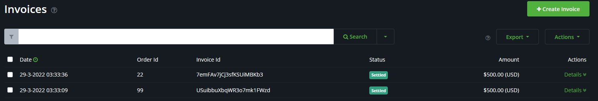
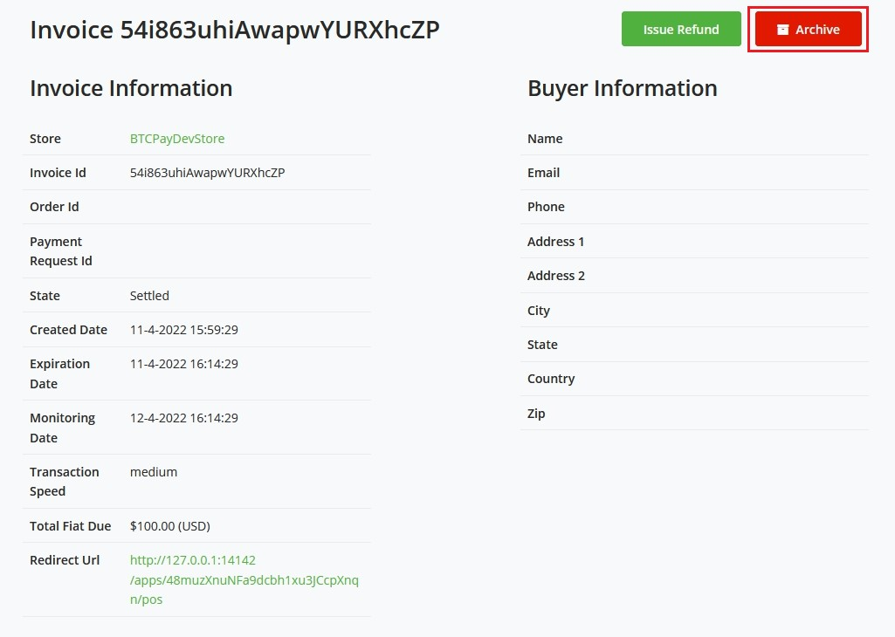
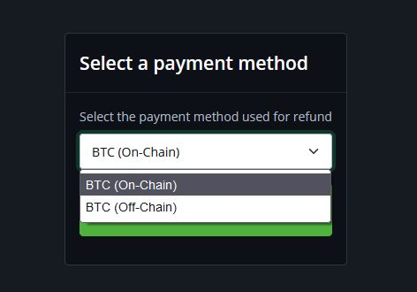
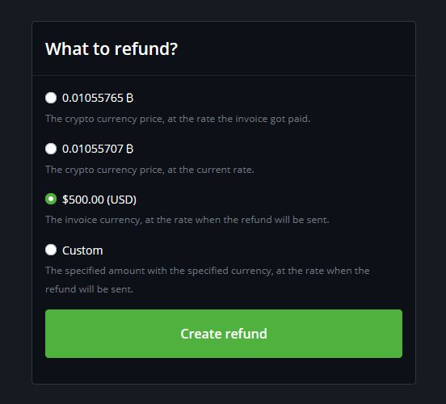
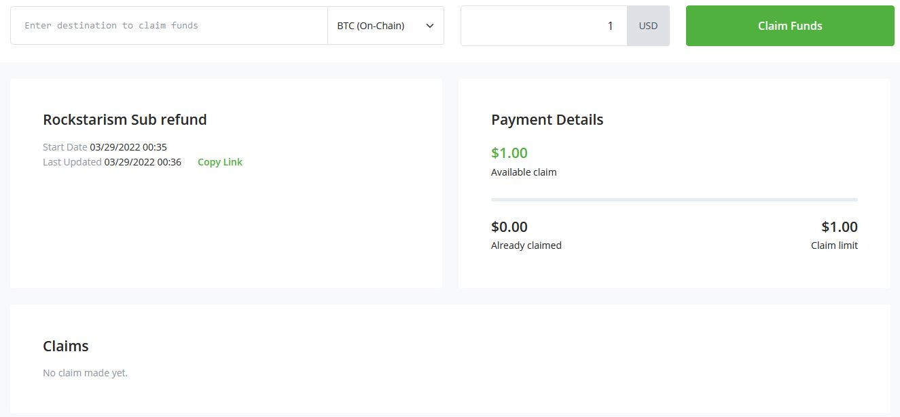
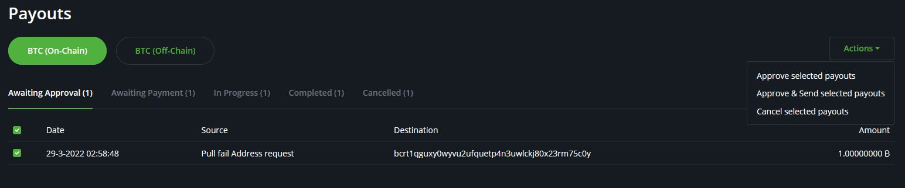
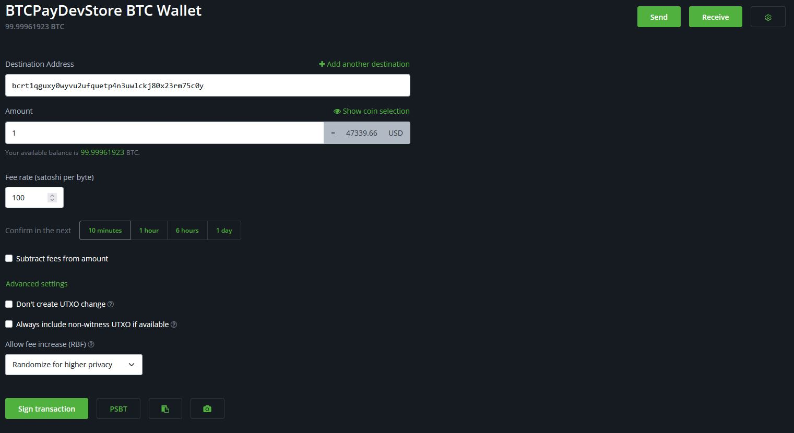
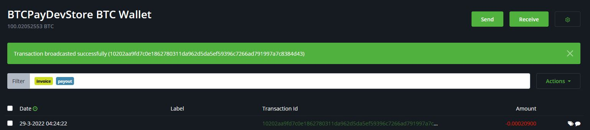
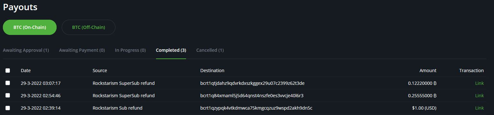
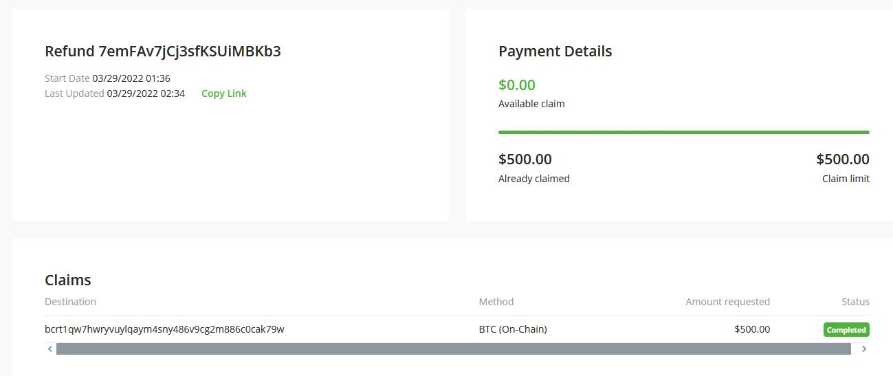

# Marejesho ya Pesa

:::tip
Ikiwa unatafuta maelezo kuhusu kuomba marejesho ya pesa kutoka kwa mfanyabiashara, tafadhali rejelea [Maswali Yanayoulizwa Mara kwa Mara](./FAQ/General.md#what-if-i-have-a-problem-with-a-paid-invoice)
:::

**Marejesho ya Pesa** ni mojawapo ya programu zilizojengwa juu ya kipengele cha [Malipo ya Kuvuta](./PullPayments.md).

Katika ukurasa huu, tutakuongoza kupitia mchakato wa kutoa marejesho ya pesa.
Kuna hatua chache fupi za kuunda marejesho ya pesa kwa mteja.

## Unda marejesho ya pesa

1. Ili kurejesha pesa kwa ankara, nenda kwenye ukurasa wa `Invoices` na ubofye `Details` kwenye ankara.

2. Bofya `Issue a refund`

3. Chagua njia ya malipo ya marejesho

4. Chagua `amount` unayotaka kurejesha

5. Shiriki kiungo cha ukurasa huu na mteja wako

## Kuchakata marejesho ya pesa

Mara mteja anapobofya kiungo ulichotoa, anaongeza anwani yao ya bitcoin ya marejesho na kudai ankara, hatua inayofuata ni kuchakata marejesho ya pesa.

1. Nenda kwenye kichupo cha `Payouts` kwenye utepe wa kando.

2. Chagua Malipo unayotaka kuchakata, nenda kwa vitendo na uchague `Approve and send`

3. Sahihi na tangaza miamala.

4. Malipo sasa yamesahihishwa na yanaendelea, yanasubiri uthibitisho kwenye blockchain. Hii inaonyeshwa kwa mdai katika mwonekano wao.

5. Baada ya muamala kuthibitishwa kwenye blockchain, hali ya malipo itakuwa `completed`.

Mwonekano wa mteja baada ya marejesho ya pesa kuchakatwa kwa mafanikio.

