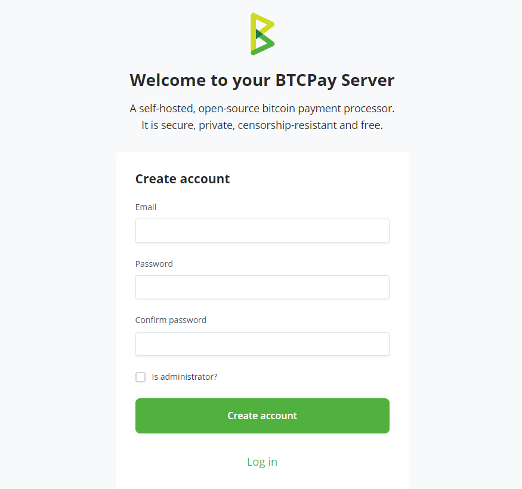

# (1) Sajili akaunti

Ukurasa huu unahusiana na kusajili akaunti kwenye kielelezo cha BTCPay Server cha kwako, au kwa kutumia mwenyeji wa mtu wa tatu.

Ili kusajili akaunti ya onyesho, tembelea [onyesho rasmi](https://mainnet.demo.btcpayserver.org/login).

Ili kusambaza kielelezo chako mwenyewe, ona [kuchagua njia ya usambazaji](/Deployment/).

Orodha isiyo kamili ya wenyeji wa mtu wa tatu inaweza kupatikana katika [saraka](https://directory.btcpayserver.org/#type=Hosted+BTCPay) ya BTCPay Server.

## Usajili wa Akaunti

Hatua ya kwanza katika kusanidi BTCPay Server yako ni kuunda akaunti ya mtumiaji. Akaunti ya **kwanza iliyoundwa** kwenye BTCPay Server mpya iliyosambazwa inakuwa - **mameneja (admin)** kiotomatiki.

Ili kusajili, tembelea URL ya BTCPay Server yako na ujaze fomu ya usajili upande wa kulia. Weka nenosiri lako, uthibitisho wa nenosiri, barua pepe na ubonyeze "Register". Utaingizwa kiotomatiki. Kama unatumia [mwenyeji wa mtu wa tatu](/Deployment/ThirdPartyHosting/), unaweza kuombwa kuthibitisha barua pepe yako ili kukamilisha usajili.

Hongera! Umefaulu kuunda akaunti yako kwenye BTCPay Server.

**Hatua Inayofuata:** [Unda Duka](/sw/CreateStore/) ili uanze kupokea malipo.

### Kusanidi barua pepe

Inapendekezwa kwamba mameneja wa seva [wasanidi mipangilio ya SMTP](/FAQ/ServerSettings/#how-to-configure-smtp-settings-in-btcpay). Usanidi wa barua pepe hurahishia kuweka upya nenosiri kwa watumiaji wa kielelezo endapo wamesahau siri zao.

Ili kuwaruhusu watumiaji wengine kufikia seva yako, unahitaji kuwezesha usajili katika Server Settings > Policies.

### Uthibitisho wa sababu mbili

Ili kuimarisha zaidi usalama na kulinda akaunti yako, inapendekezwa kuwezesha uthibitisho wa sababu mbili (2FA na U2F zote zinaungwa mkono). Ili kuwezesha 2FA au U2F, bonyeza ikoni ya mipangilio ya mtumiaji kwenye menyu ya kichwa.