# Pokea Bitcoin katika Shopify ukitumia BTCPay Server

Tunakuletea BTCPay Server kwa Shopify – lango la malipo la msimbo wazi linalokuwezesha kupokea malipo ya bitcoin moja kwa moja kwenye tovuti yako au maduka kutoka kwa wateja bila ada.

Ushirikiano wetu na Shopify unakuruhusu kuunganisha BTCPay Server yako inayojisimamia mwenyewe na [duka lako la Shopify](https://www.shopify.com/), kukuwezesha kupokea malipo ya Bitcoin kwa haraka na kwa usalama.


## Kile BTCPay inachotoa:

- **Ada sufuri**: Furahia lango la malipo bila ada. Ndiyo, Umesoma vizuri. Ada sufuri!
- **Malipo ya moja kwa moja, Hakuna wapatanishi au KYC**: Sema kwaheri kwa wapatanishi na makaratasi ya kuchosha, na pata pesa zako moja kwa moja kwenye pochi yako
- **Mfumo uliojiendesha kikamilifu**: BTCPay inashughulikia malipo, usimamizi wa ankara na marejesho kiotomatiki.
- **Onyesha msimbo wa QR wa Bitcoin wakati wa malipo**: Boresha uzoefu wa mteja kwa chaguo rahisi na salama la malipo.
- **Miundombinu inayojisimamia mwenyewe**: Dumisha udhibiti kamili juu ya lango lako la malipo.
- **Mtandao wa Lightning umeunganishwa**: Malipo na malipo ya papo hapo, haraka na ya gharama ndogo
- **Usafirishaji rahisi wa CSV**
- **Mfumo wa programu-jalizi wenye matumizi mengi**: Panua utendaji kulingana na mahitaji yako
- **Ushirikiano wa sehemu ya mauzo** – Pokea malipo katika maduka yako halisi
- **Tayari kwa lugha nyingi**: Hudumia watazamaji wa kimataifa moja kwa moja.
- **Usaidizi unaoendeshwa na jumuiya**: Pata usaidizi msikivu kutoka kwa jumuiya yetu iliyojitolea ([Mattermost](http://chat.btcpayserver.org/) au [Telegram](https://t.me/btcpayserver)).

:::warning
Hili ni toleo lililorahisishwa zaidi la hati za awali za Shopify V2 (zilizopatikana kutoka 30 Desemba 2024 hadi 23 Februari 2025) ambazo zilihitaji usambazaji wa programu ya shopify kwenye VPS tofauti. Sasa programu inasambazwa moja kwa moja kwenye BTCPay Server yako na programu-jalizi ya BTCPay Shopify imebadilishwa. Kila mtu anapaswa kubadili usanidi huu kwani ndio pekee tutakaodumisha siku zijazo.
:::

## Mahitaji ya Awali:

Kabla ya kuzama katika mchakato wa usanidi, hakikisha una yafuatayo:

- Akaunti ya [Shopify](https://www.shopify.com/) na usanidi wa duka
- Mpango unaotumika wa usajili wa Shopify (angalau mpango wa Basic Shopify)
- [Akaunti ya mshirika wa Shopify](https://www.shopify.com/partners) (ni bure kusajili)
- BTCPay Server - [inayojisimamia mwenyewe](Deployment.md) au inayoendeshwa na [mwenyeji wa mtu wa tatu](/Deployment/ThirdPartyHosting.md) * v2.0.6 au jipya zaidi.
- [Duka la BTCPay Server limeundwa](CreateStore.md) na [pochi imesanidiwa](WalletSetup.md)

* Tafadhali kumbuka kwamba ikiwa uko kwenye mwenyeji wa mtu wa tatu, wanahitaji kuwa wameamilisha kipande cha shopify na kuwezesha programu-jalizi ya Shopify v2 kwako. Vinginevyo haitapatikana katika BTCPay Server yako.

## Sanidi programu ya Shopify

Kwanza tutaunda programu mpya katika lango la mshirika la Shopify. Hakikisha umesajiliwa kama [mshirika wa Shopify](https://www.shopify.com/partners) (ni bure kusajili).

1. Kwenye [dashibodi](https://partners.shopify.com) ya Mshirika wa Shopify, bonyeza `App distribution`, kwenye ukurasa unaofuata bonyeza `View Dev Dashboard` ambayo itafungua ukurasa kwenye kichupo kipya cha kivinjari. Katika ukurasa huu, bonyeza `Create app` > `Start from Dev Dashboard`, weka jina unalotaka kuita programu (k.m. BTCPay Server) na ubonyeze `Create`.

   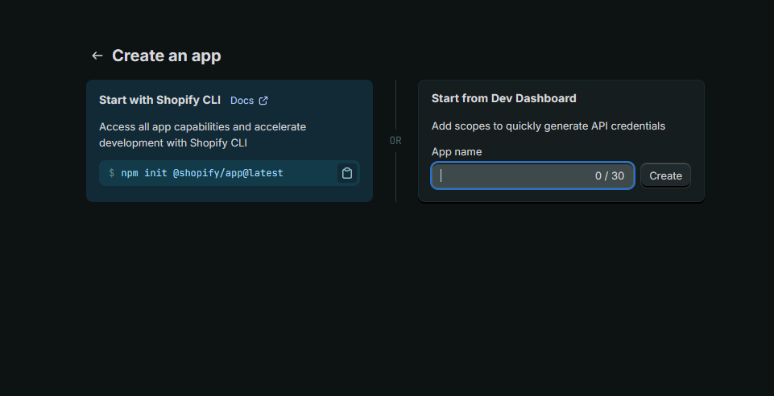

2. Mara baada ya kuundwa, bonyeza `Settings`, hapo "Client ID" yako na "Client secret" yako zinaonyeshwa, ambazo tunazihitaji baadaye kidogo. Tafadhali zikumbuke au rudi kwenye ukurasa huu baadaye.
   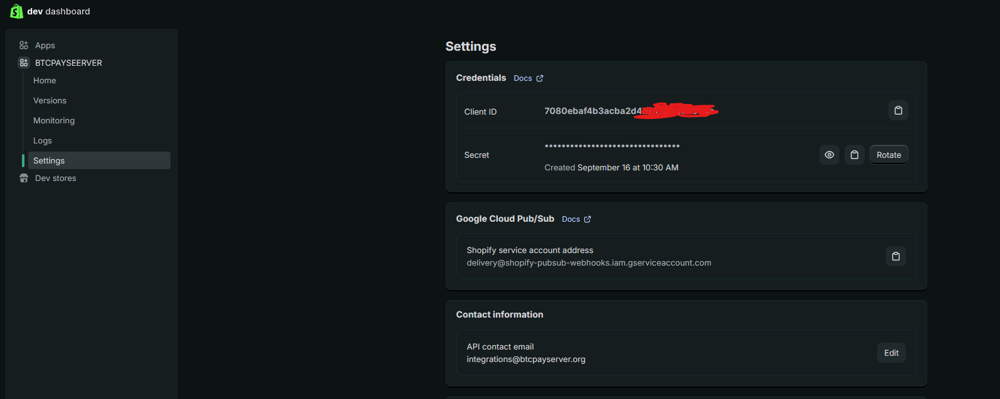


3. Tunahitaji kupata tokeni ya CLI. Bado kwenye dashibodi ya msanidi, katika mipangilio, katika sehemu ya `App automation token`, bonyeza `Create token`, chagua kipindi chako cha kumalizika kinachopendelewa kwa tokeni, bonyeza `Generate token`. Nakili tokeni na uiandike kando ya kitambulisho cha mteja na siri ya mteja kutoka hapo juu.
   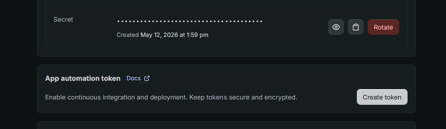
   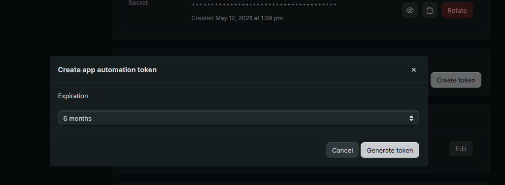
   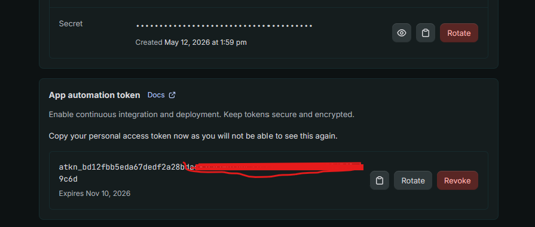


4. Rudi kwenye dashibodi ya mshirika wako, pakia upya ukurasa ili orodha ya programu sasa ijumuishe programu mpya iliyoundwa. Mara baada ya kufanya hivyo, bonyeza `All Apps`, bonyeza programu yako iliyoundwa sasa hivi, chagua `API access requests` kwenye menyu ya kushoto, songa chini hadi `Allow network access in checkout and account UI extensions` na utoe ufikiaji wa mtandao. Unapaswa kuona skrini ifuatayo mara ufikiaji wa mtandao umetolewa
   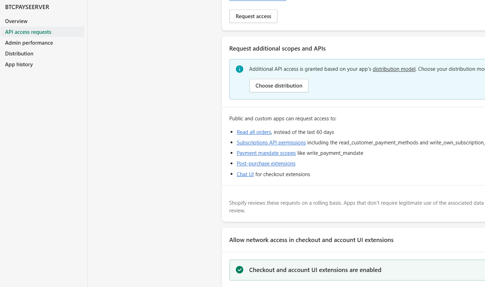

:::tip
Ikiwa utakutana na hitilafu: "Could not grant checkout ui extension scope 'read_checkout_external_data'" wakati wa kutoa ufikiaji wa mtandao, hitilafu hii inatokea wakati hujaweka jina lako la kwanza na la mwisho katika wasifu wa akaunti ya mshirika. Ili kutatua hili, sasisha wasifu wako na maelezo yanayohitajika, kisha jaribu kutoa ufikiaji wa mtandao tena.
:::

## Sambaza programu ya Shopify-BTCPay kwenye BTCPay Server yako

:::tip
Ili maagizo hapa chini yafanye kazi unahitaji kuwa msimamizi (admin) wa kielelezo chako cha BTCPay Server. Ikiwa uko kwenye mwenyeji wa mtu wa tatu basi msimamizi wao anahitaji kuwa ameamilisha kipande cha shopify na kuwezesha programu-jalizi ya Shopify v2 kwako, vinginevyo haitapatikana kwako.
:::

### Sambaza kipande cha Shopify

1. Ingia kwenye BTCPay Server yako kupitia SSH
2. Endesha amri zifuatazo:

```bash
# ikiwa wewe sio mtumiaji root, badilisha kuwa root
sudo su -

# nenda kwenye saraka ya docker ya BTCPay Server
cd $BTCPAY_BASE_DIRECTORY
cd btcpayserver-docker

# hakikisha una ahadi za hivi karibuni za btcpayserver-docker
git pull

# ongeza kipande cha shopify kwenye BTCPay Server yako
export BTCPAYGEN_ADDITIONAL_FRAGMENTS="$BTCPAYGEN_ADDITIONAL_FRAGMENTS;opt-add-shopify"

# endesha hati ya usanidi
. ./btcpay-setup.sh -i
```

Hati ya usanidi inachukua [programu ya BTCPay Shopify](https://github.com/btcpayserver/shopify-app) na kuisambaza kwenye kontena la docker. Ikiwa unataka kuwa na uhakika ilifanya kazi unaweza kuangalia na:

```bash
docker ps | grep shopify
```

Sasa tunaweza kuendelea na kusakinisha programu-jalizi ya BTCPay Server Shopify.

### Sakinisha programu-jalizi ya BTCPay Server Shopify v2

1. Kwenye BTCPay Server yako, bonyeza "Manage Plugins" kwenye upau wa kando, tafuta na usakinishe "BTCPay Server Shopify plugin v2" na btcpayserver.
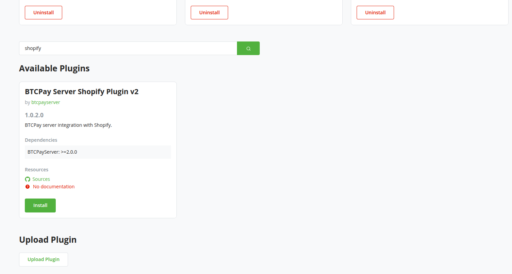
2. Baada ya hapo, songa juu na ubonyeze kiungo cha "Restart now" ili kuanzisha upya BTCPay.
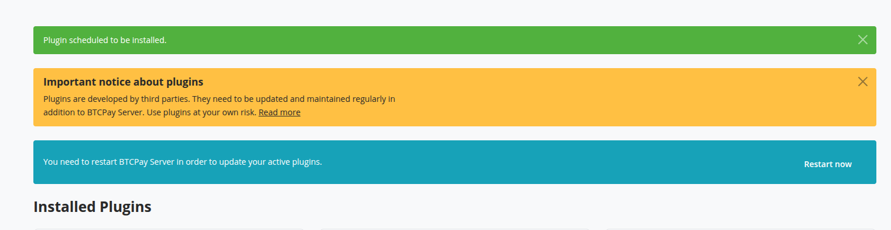

BTCPay Server itaanza upya jambo ambalo linaweza kuchukua dakika kadhaa.

### Sanidi programu-jalizi ya BTCPay Server Shopify
1. Hakikisha duka lako limechaguliwa juu, kisha kwenye upau wa kando wa kushoto bonyeza `Shopify v2`
2. Katika sehemu ya kwanza kati ya 3 utahitaji kuingiza `Client ID`, `Client Secret` kutoka [usanidi wa programu ya Shopify](#sanidi-programu-ya-shopify) hapo juu. Bonyeza "Save"
   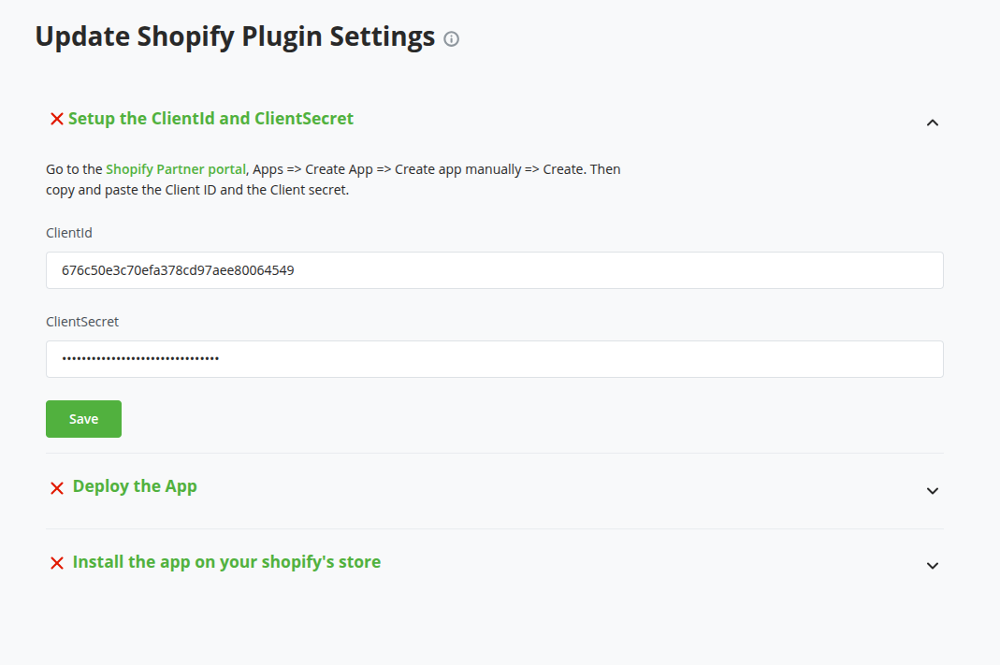
3. Katika sehemu inayofuata "Deploy the app" unahitaji kuingiza `App name`, bora kutumia jina lilelile kama kwenye [usanidi wa programu ya Shopify](#sanidi-programu-ya-shopify). Katika sehemu ya `CLI token` ingiza pia "CLI Token" iliyobainishwa hapo awali kutoka kwenye usanidi wa programu.
   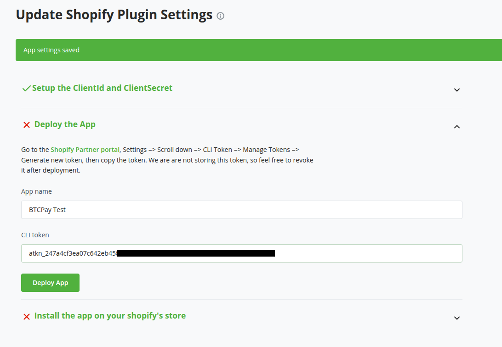
4. Bonyeza "Deploy App"
   Sasa utaona matokeo fulani ya koni na kwamba programu itasambazwa kwenye shopify. Ikiwa kila kitu kitaenda vizuri sehemu itafungwa na sehemu ya mwisho itafunguliwa.
   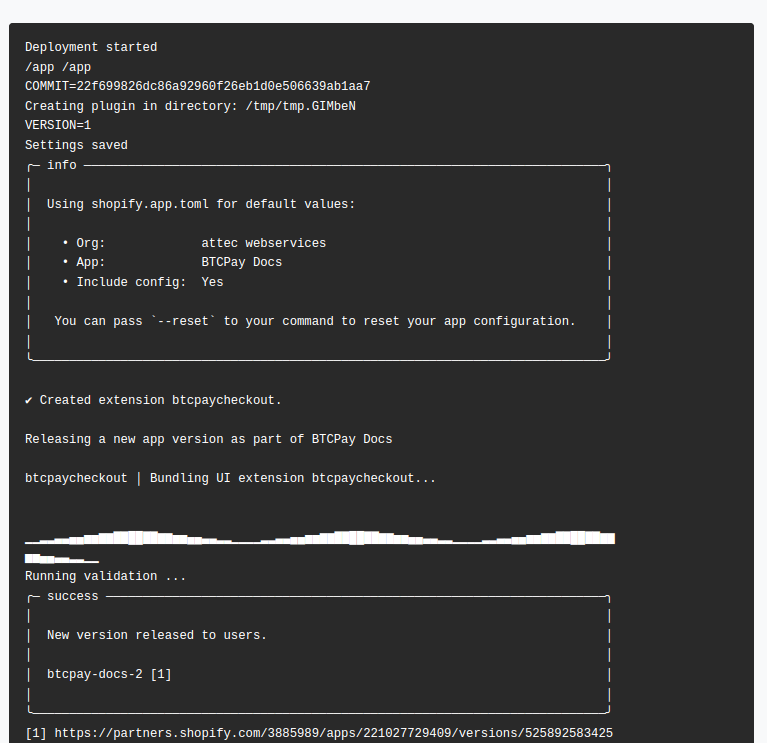
5. Katika sehemu ya mwisho "Install the app on your Shopify store" hakuna cha kufanya, itaangalia tu ikiwa programu imesakinishwa kwenye duka. Tutafanya hivyo katika hatua zinazofuata hapo chini.
   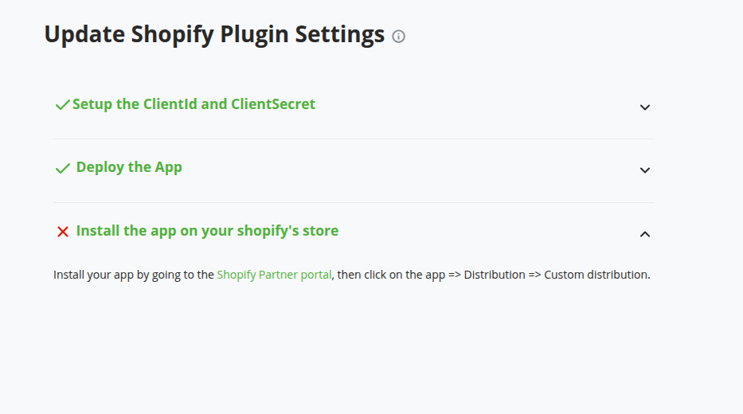


## Sakinisha programu ya BTCPay-Shopify kwenye duka lako la Shopify

Sasa ni wakati wa kusakinisha programu yako ya Shopify kwenye duka la Shopify (ambalo litaunganisha duka lako na BTCPay Server yako).

1. Kwenye muhtasari wa programu ya [akaunti yako ya mshirika](https://partners.shopify.com/), chagua programu uliyounda sasa hivi, bonyeza `Choose Distribution` na uchague `Custom distribution`. Thibitisha uteuzi.
    :::tip
    Tafadhali kumbuka kwamba kuchagua usambazaji maalum kunamaanisha kwamba unaweza kutumia programu kwenye duka moja la Shopify. Hili haliwezi kutenduliwa. Unaweza kusambaza programu nyingi ingawa ikiwa una maduka zaidi ya moja.
    :::
    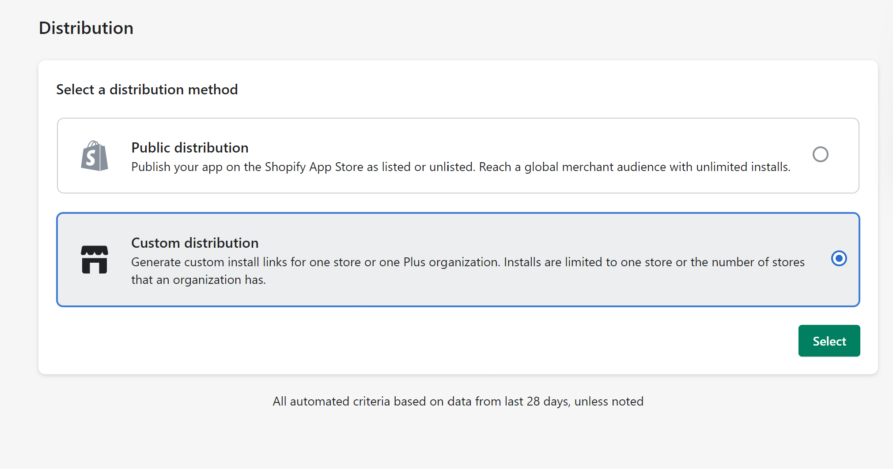
    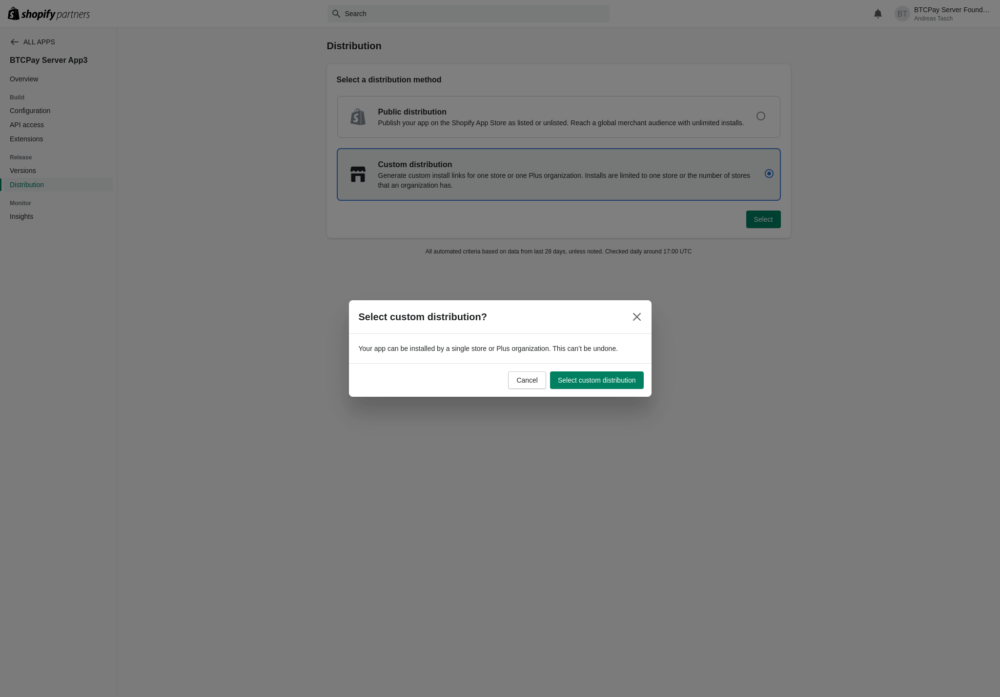

2. Kwenye skrini inayofuata weka URL ya duka la Shopify ambalo unataka kuunganisha programu nalo. Hii kwa kawaida ni URL ya ndani ya duka unayoiona wakati wa kusanidi duka, k.m. `your-store.myshopify.com`.  
   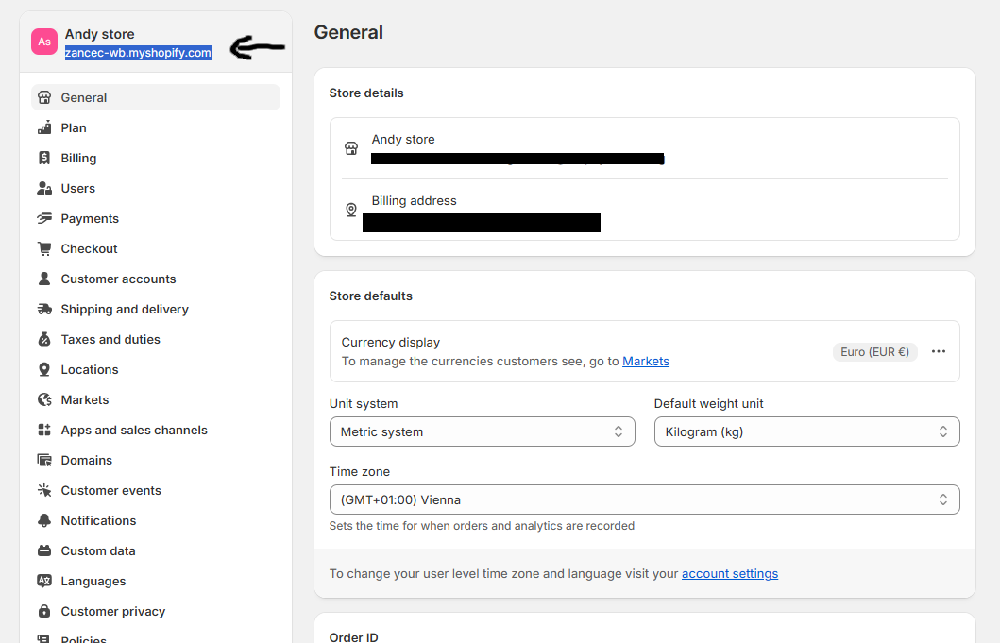
   Hakikisha kufuta tiki "Allow multi-store install for one Plus organization"   
   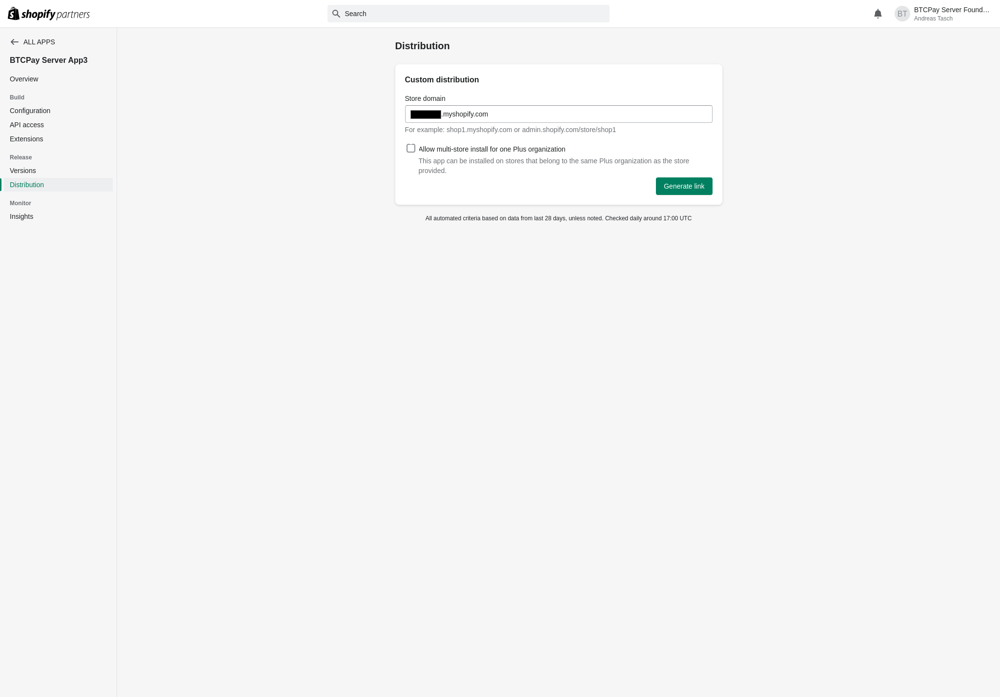
3. Bonyeza `Generate link` na utaona kiungo kimezalishwa. Nakili kiungo hicho na ukiweke kwenye kivinjari chako ili kuanza usakinishaji.
   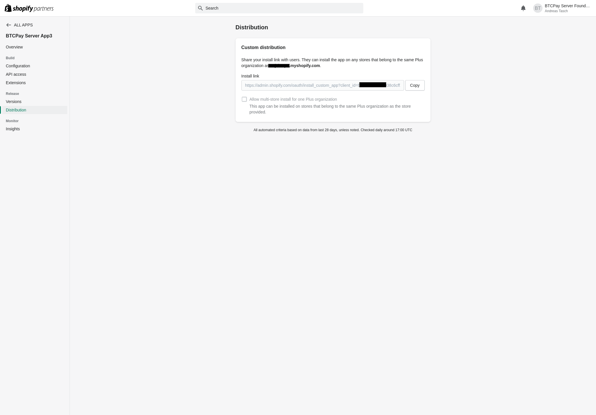
4. Utaona programu yako imeorodheshwa na sasa unaweza kuisakinisha kwa kubonyeza `Install`. (Ikiwa haujaingia unahitaji kuingia kwanza)
   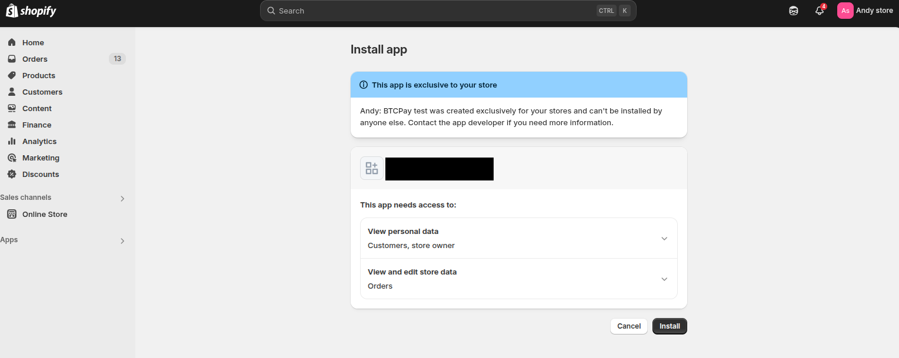
:::tip
Ingawa programu inaorodhesha ufikiaji wa data ya mteja na mmiliki wa duka, haifikii data yoyote kati ya hiyo. Programu inatumia tu kitambulisho cha malipo (checkout ID) na kitambulisho cha agizo (order ID) ili kusasisha hali ya agizo. Hakuna wakati wowote data yoyote ya kibinafsi ya mteja au msimamizi inayosafirishwa kwenda kwenye BTCPay Server yako.
:::
5. Mara baada ya kusakinishwa, utaona ukurasa wa programu na ujumbe "Shopify plugin successfully configured"
   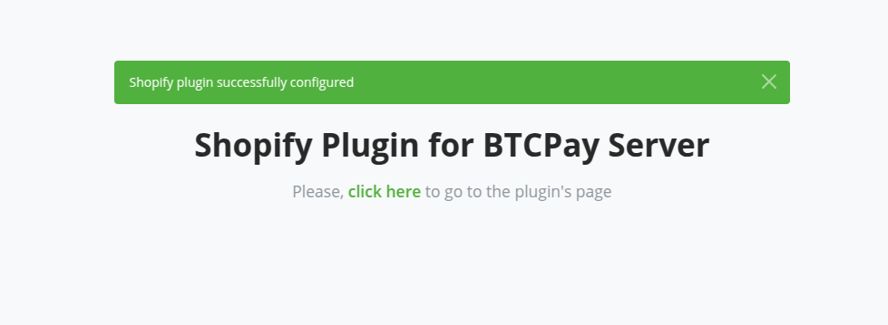
6. (Kwa hiari) Unaweza kubonyeza kiungo kilicho chini ya mstari "You can navigate to your plugin's settings page by clicking here." ili kuangalia mara mbili kwamba programu imeunganishwa vizuri kwenye BTCPay Server yako. (Sehemu ya mwisho sasa pia ina alama ya kijani ya kuteua)
   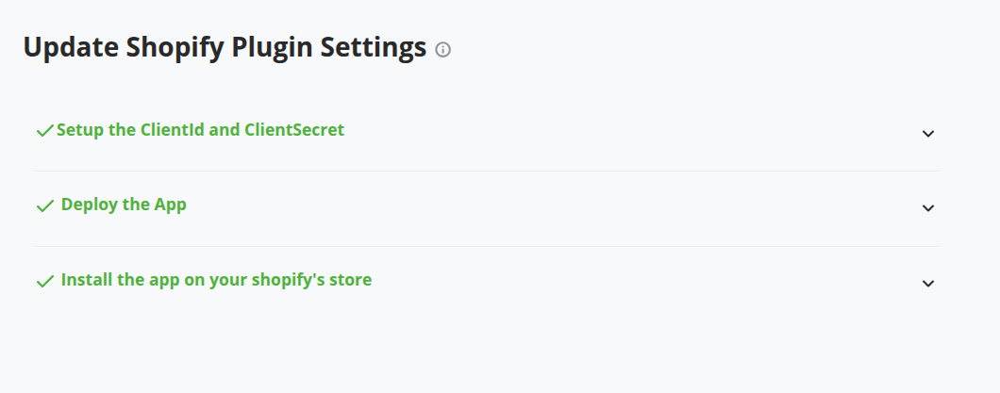

## Geuza ukurasa wa "Thank you" kulingana na mahitaji yako

1. Kwenye dashibodi yako ya shopify, bonyeza `Settings`, ambayo iko chini ya paneli ya kusogeza ya kushoto, chagua `Checkout` na kisha `Customize`.   
   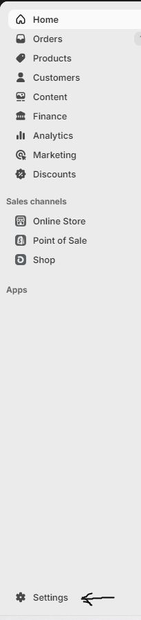
   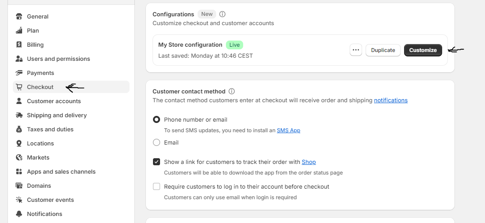
2. Katika kihariri badilisha ukurasa uliochaguliwa kuwa ukurasa wa "Thank you".   
   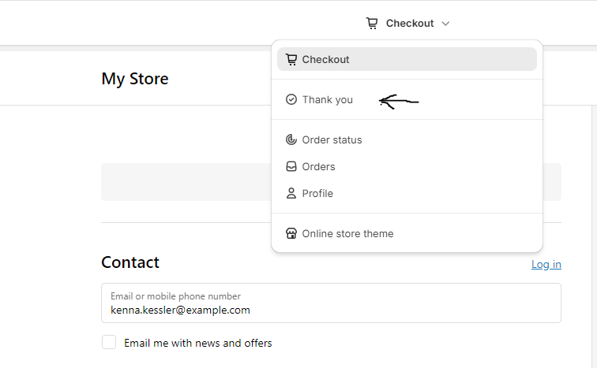   
   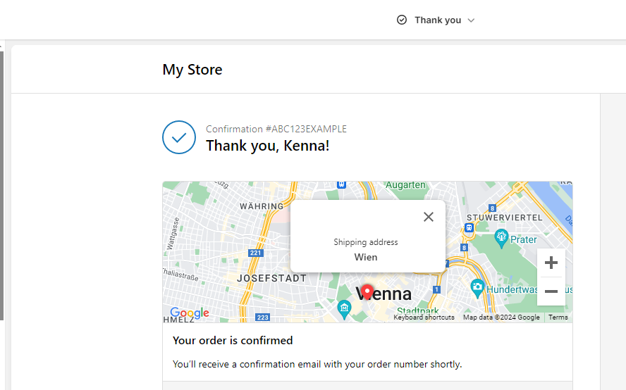
3. Bonyeza ikoni ya `Apps` kwenye paneli ya kushoto
   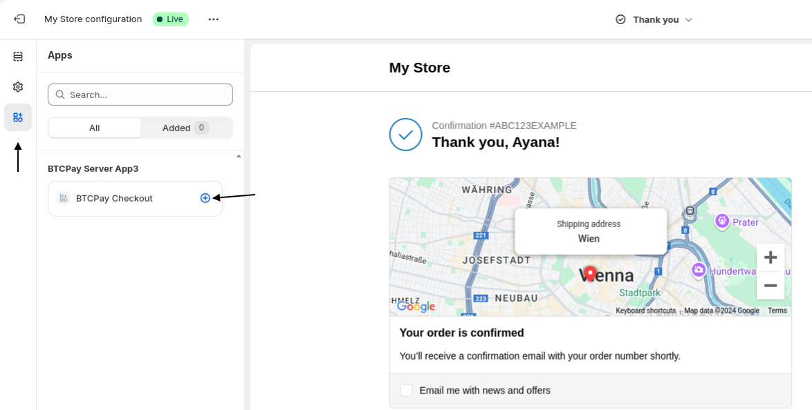
4. Bonyeza ishara ya (+) kwenye programu iliyoorodheshwa ya "BTCPay Checkout" na kisha kwenye ukurasa wa "Thank you" ulioorodheshwa.
   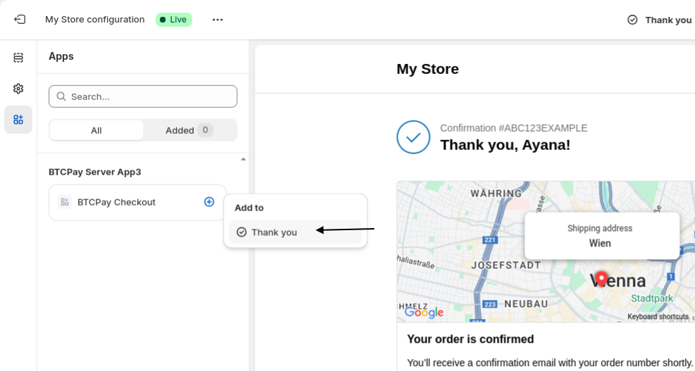
5. Sasa utaona kiendelezi kimeongezwa kwenye ukurasa wako wa "Thank you". **Muhimu**: Bonyeza "Save" kwenye kona ya juu kulia.
   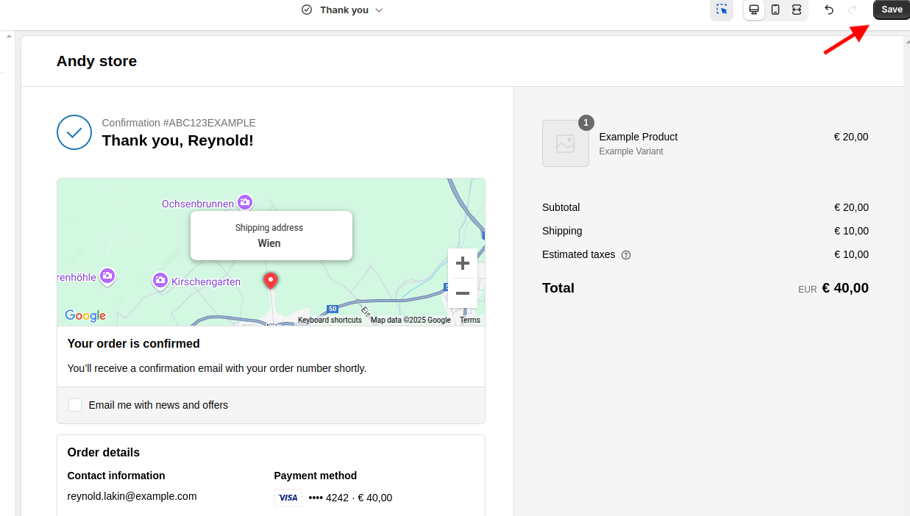
6. Ili kuangalia mara mbili kila kitu kinafanya kazi, bonyeza mshale wa kushoto `<` karibu na "BTCPay Checkout" na uthibitishe imeorodheshwa katika sehemu ya "Order details section".
   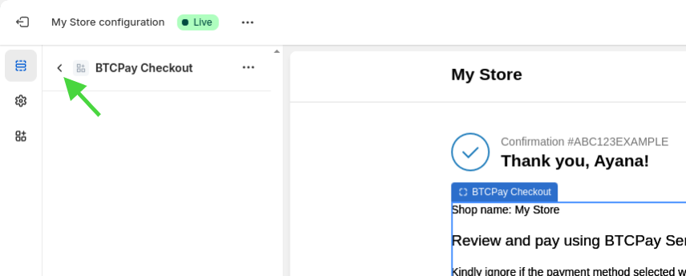
   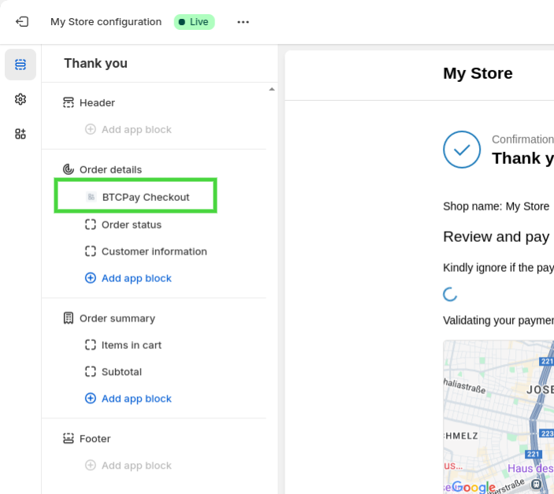

## Sanidi njia maalum ya malipo katika Shopify

Hatua moja ya mwisho ni kusanidi njia maalum ya malipo katika Shopify ili kuonyesha chaguo la malipo ya Bitcoin kwa wateja wako.

1. Rudi kwenye dashibodi yako, bonyeza `Settings` >> `Payments` kwenye upau wa kando wa kushoto, songa chini hadi "Manual payment methods", bonyeza `(+) Manual payment method` na uchague `Create custom payment method` kwenye orodha kunjuzi.
   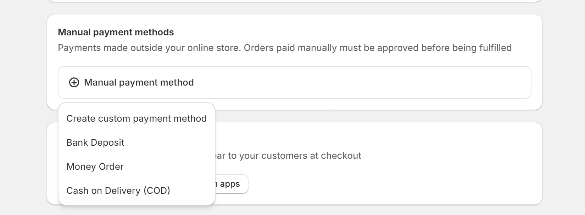
2. Katika `Custom payment method name` jaza kitu kama `Pay with Bitcoin (BTCPay Server)` (pia angalia kisanduku cha TIP hapo chini), kwa hiari unaweza kujaza sehemu zingine, lakini haihitajiki.
   Hata hivyo, utahitaji kuwajulisha wateja wako kwamba malipo na Bitcoin yanakuja kwenye skrini inayofuata baada ya malipo kwenye ukurasa wa "Thank you". Kwa kweli utawajulisha wateja wako katika sehemu ya `Additional details`.
   Chaguo la malipo linaweza kuwa na ucheleweshaji kidogo kabla ya kuonekana kwenye ukurasa wa "Thank you", tunashauri kuwasiliana hilo kwa wateja. Maandishi yaliyopendekezwa: `Please note that the Bitcoin payment button "Complete payment" will be displayed on the "Thank you"-page. Please click on it to complete the payment.`
   :::tip
   "Custom Payment method name" **lazima** iwe na angalau moja ya maneno yafuatayo (bila kujali herufi kubwa au ndogo): `bitcoin`, `btcpayserver`, `btcpay server` au `btc` ili ifanye kazi.
   :::
3. Bonyeza `Activate` na umesanidi Shopify na njia ya malipo ya BTCPay Server kwa mafanikio.
   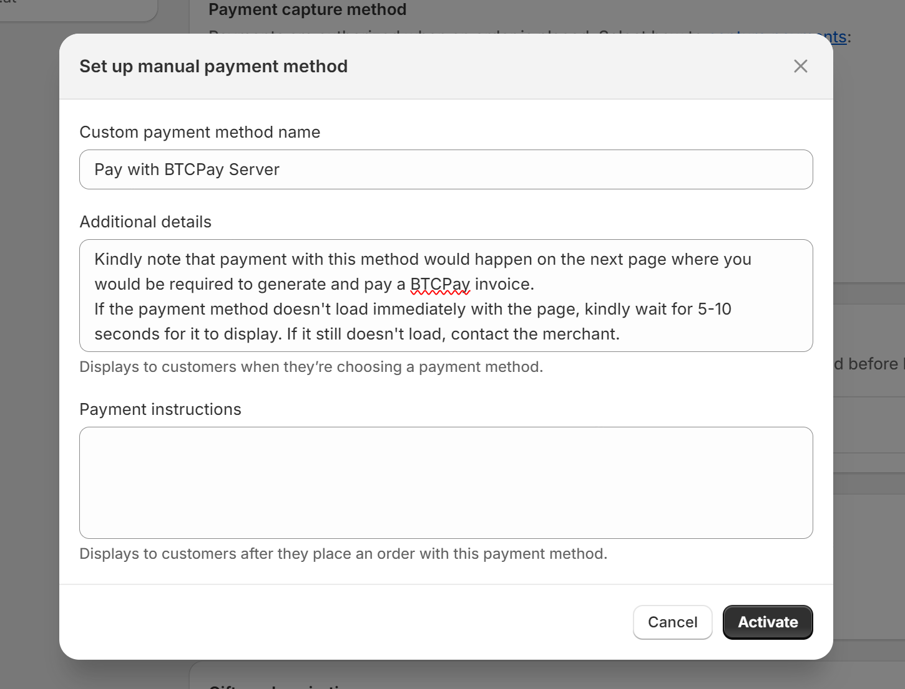

Hongera! Umefanikiwa kusakinisha programu ya BTCPay-Shopify na kusanidi njia ya malipo kwenye duka lako la Shopify. Uko tayari kwenda. Angalia mtiririko wa malipo ya onyesho hapo chini.


## Mtiririko wa Malipo ya Onyesho baada ya kila kitu kusanidiwa

Mteja anachagua chaguo la malipo kwenye ukurasa wa malipo:
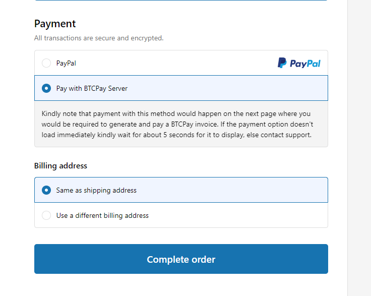

Mteja anaelekezwa kwenye ukurasa wa "Thank you" ambapo kitufe cha malipo kinaonyeshwa:
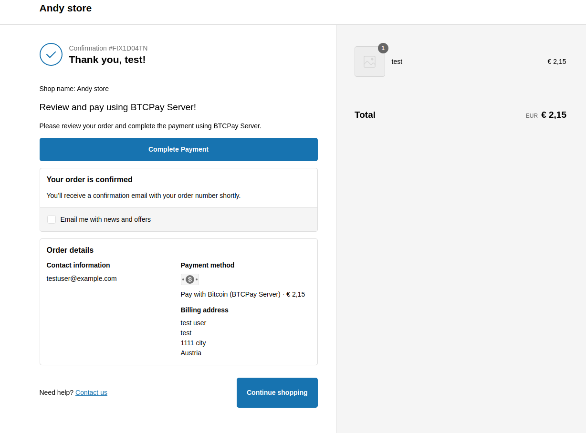

Mteja anabonyeza "Complete payment" na anaelekezwa kwenye ukurasa wa malipo wa BTCPay:
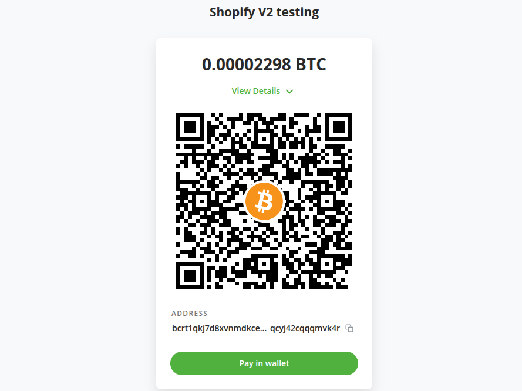

Mteja analipa ankara na anabonyeza return to merchant:
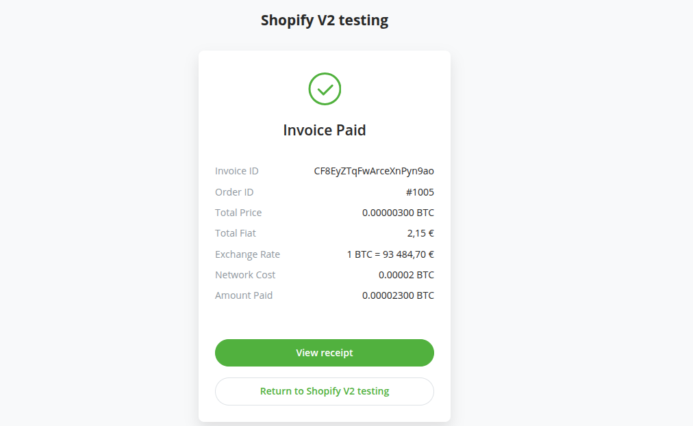

Mteja anaelekezwa kwenye ukurasa wa hali ya agizo la Shopify:
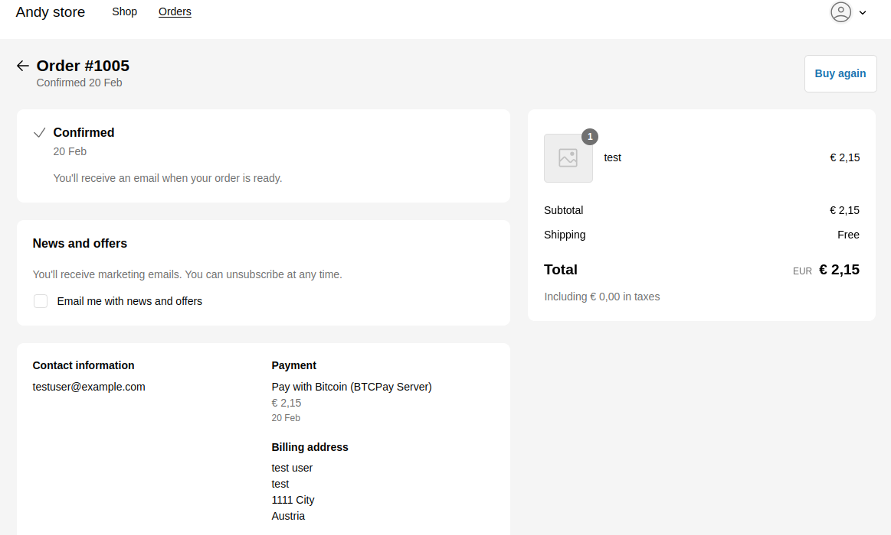

---

Katika duka lako la BTCPay Server unaweza kuona ankara iliyolipwa:
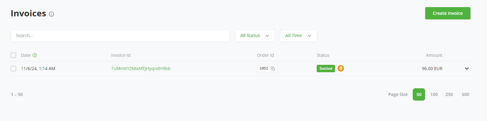

Unapoibonyeza unaweza kuona maelezo ya malipo:
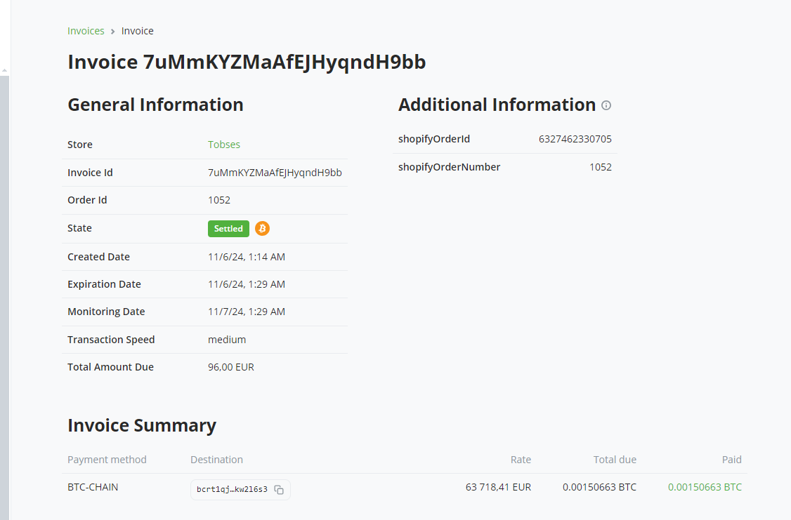


## Marejesho ya Shopify

BTCPay Server huchakata marejesho kwa maagizo ya Shopify yaliyolipwa kwa Bitcoin kupitia BTCPay Server pekee.
Marejesho ya maagizo yaliyolipwa kwa kutumia njia zingine za malipo hayatumiki.
Wakati marejesho yametolewa katika Shopify, BTCPay Server inashughulikia marejesho kwa kumtumia mteja kiungo cha kudai marejesho kwa kiasi kilichorejeshwa.

:::warning
Ili uweze kufanya marejesho, vipande vyako vya Shopify na programu yako ya Shopify vinahitaji kuwa v1.6 na juu zaidi. Kwa hivyo kwa watumiaji wa zamani wa programu-jalizi ya Shopify, inahitajika kusasisha kipande chako cha Shopify hadi cha hivi karibuni, na kusambaza upya programu ya Shopify.

Bonyeza hapa kujifunza kuona jinsi ya [kusasisha programu na kipande cha BTCPay Shopify](#jinsi-ya-kusasisha-programu-ya-btcpay-shopify)
:::

Kabla hatujaendelea, unahitaji kuwa na SMTP ya Barua pepe iliyosanidiwa kwa duka lako ili uweze kuendelea na marejesho katika Shopify.
Ili kusanidi SMTP ya barua pepe kwenye duka lako la BTCPay Server, kwenye menyu ya usogezaji ya kushoto bonyeza `Settings` -> `Emails` na usanidi mipangilio ya SMTP ya barua pepe kwa duka.

Mara baada ya kumaliza, bado katika mipangilio ya barua pepe, bonyeza `Go to email rules` -> `Create Email Rule`. Bonyeza orodha kunjuzi ya `Trigger` na uchague `Shopify: Refund Created`. Unaweza kugeuza mwili wa kanuni ya barua pepe kulingana na mahitaji, lakini hakikisha kitufe cha `Claim Refund` kipo ili kumwezesha mteja kudai marejesho yake. Mara ukiwa umemaliza bonyeza Save.

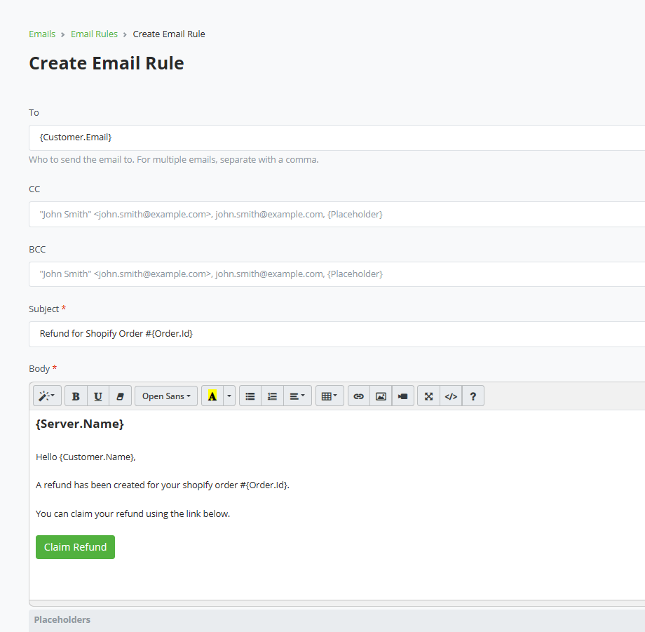

Nenda kwenye mipangilio ya marejesho ya Shopify kwa kubonyeza `Shopify V2` -> `Refund Settings`.
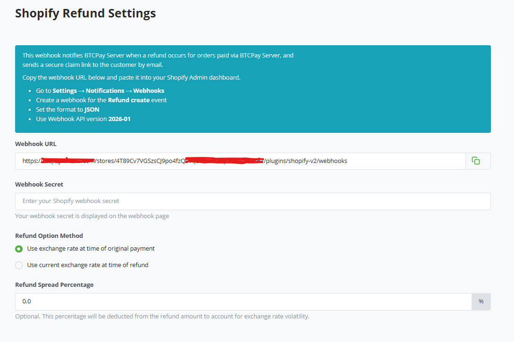

Nakili URL ya webhook katika ukurasa wa mipangilio na uende kwenye ukurasa wa msimamizi wa duka lako la Shopify. Bonyeza `Settings` -> `Notifications` -> bonyeza `Webhooks`

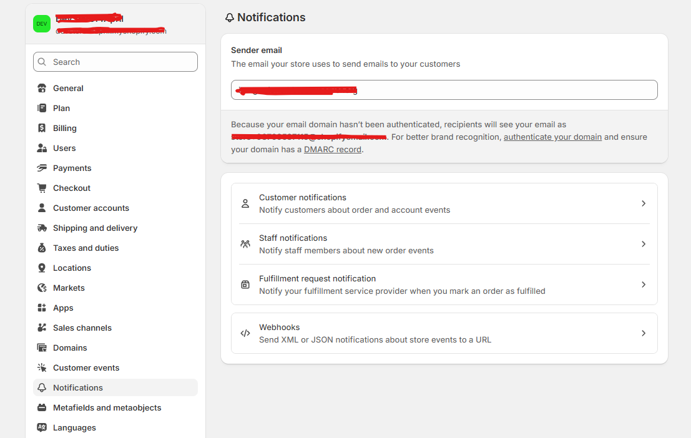

Katika mipangilio ya webhook, bonyeza `Create webhook`, na katika modal chagua yafuatayo:
- Kwa tukio (event), chagua Refund create
- Muundo unapaswa kuwa JSON
- URL ni URL ya webhook uliyonakili kutoka kwenye mipangilio ya marejesho ya Shopify kwenye ukurasa wa BTCPay Server
- Toleo la API ya Webhook chagua 2026-01

Mara ukiwa umemaliza bonyeza save. Kwenye ukurasa uleule wa webhooks wa Shopify, utaona pia saini ya webhook (webhook signature), inakili, rudi kwenye mipangilio ya marejesho ya Shopify ya BTCPay Server na uibandike katika sehemu ya `Webhook Secret`.

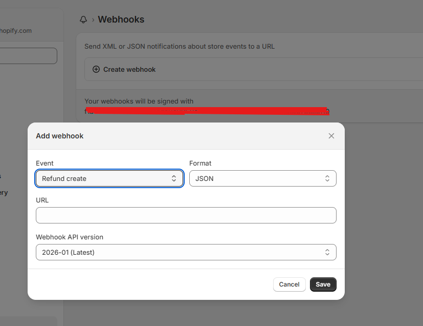

Bado katika ukurasa uleule wa mipangilio ya marejesho, unaweza pia kuchagua chaguo zako za marejesho unazopendelea ikiwa unataka marejesho yafanyike kwa kiwango cha sasa cha ubadilishaji, au ikiwa unataka marejesho yachakatwe kwa kiwango kilekile ambacho malipo ya awali yalifanywa.
Unaweza pia kubainisha asilimia ya kueneza marejesho (refund spread percentage) ili kukabiliana na mabadiliko ya kiwango cha ubadilishaji.

Mara ukiwa umemaliza, bonyeza kitufe cha `Save Settings`.

Hongera, sasa unaweza kuchakata marejesho kwa maagizo ya Shopify yaliyolipwa kwa kutumia BTCPay Server.

## Maswali Yanayoulizwa Mara kwa Mara (FAQ)

- Je ninaweza kutumia Shopify V1 na Shopify V2 pamoja? Hapana, Shopify V1 na Shopify V2 hazipaswi kutumiwa pamoja. Kutumia matoleo yote kwa wakati mmoja kunaweza kusababisha tabia zisizotarajiwa, kama vile rekodi rudufu za agizo kwenye Shopify. Tunapendekeza uzime Shopify V1 na ushikamane na Shopify V2 pekee

- Nini kinatokea wakati ankara ni Batili (Invalid)? Jumla ya malipo yaliyothibitishwa hadi mwisho wa muda inaonyeshwa kwenye Shopify

- Je ikiwa nitaweka ankara kama batili (invalid) katika BTCPay Server yangu? BTCPay haifanyi chochote, kwa hivyo agizo la Shopify linabaki linasubiri.

- Nini kinatokea wakati ankara inakamilishwa (settled) kwa mkono kwenye BTCPay Server? Agizo la Shopify linawekwa alama kama limelipwa kikamilifu katika Shopify.

- Nini kinatokea ikiwa mteja hakulipa? Wakati ankara ya BTCPay inaisha muda, agizo la Shopify linabatilishwa (voided), na hisa inarejeshwa.

- Nini kinatokea ikiwa mteja alilipa, lakini kwa ada zisizotosha kwa uthibitisho katika muda unaokubalika? Ankara ya BTCPay inakuwa Batili (Invalid), na agizo la Shopify linabaki Payment Pending.

- Je ikiwa mteja alilipa kwa kiasi? Ankara ya BTCPay inaisha muda. Agizo la Shopify linabaki Payment Pending au linawekwa alama kama Limelipwa Kwa Kiasi (Partially Paid) kulingana na malipo yaliyothibitishwa mwishoni mwa muda.

- Jinsi ya kuepuka malipo ya kiasi? Malipo ya kiasi mara nyingi hutokea wakati wateja wanalipa kutoka kwa ubadilishanaji wa sarafu (exchanges) ambao hukata ada. Unaweza kuweka [uvumilivu mdogo wa malipo pungufu (underpayment tolerance)](https://docs.btcpayserver.org/FAQ/Stores/#consider-the-invoice-paid-even-if-the-paid-amount-is-less-than-expected) katika mipangilio ya duka lako ili kuepuka hili.

- Ninawezaje kushiriki tena kiungo cha ankara ikiwa mteja hakukamilisha malipo? BTCPay Server inahifadhi kiungo cha ankara katika metafields za agizo la Shopify wakati BTCPay ndiyo njia ya malipo iliyochaguliwa.

Pata metafields kwa kutumia API ya Shopify:
```pwsh
https://{SHOPNAME}.myshopify.com/admin/api/{VERSION}/orders/{ORDER-ID}/metafields.json
```
Maelezo zaidi:
1. [Shopify GraphQL API - Metafields za Agizo](https://shopify.dev/docs/api/admin-graphql/latest/objects/Order#fields-metafields)
2. [Shopify REST API - Metafields za Agizo](https://shopify.dev/docs/api/admin-rest/2025-01/resources/metafield#get-orders-order-id-metafields).


## Utatuzi wa Matatizo

### Usakinishaji wa Programu-jalizi unashindwa?

Ulijaribu kusakinisha programu-jalizi kwenye BTCPay Server na unapata hitilafu "This app has been migrated to the new Next-Gen Dev platform"? Ikiwa wewe ni msimamizi wa seva wa kielelezo cha BTCPay, unachohitaji kufanya ni kusasisha BTCPay Server yako kwa kufuata mwongozo wa `Sambaza kipande cha Shopify` uliojadiliwa hapo awali. Ikiwa wewe sio msimamizi wa seva, tafadhali wasiliana na msimamizi na uombe wasasishe kipande chao cha shopify. Mara hii ikifanyika, unapaswa kuweza kuunganisha kwa mafanikio BTCPay Server yako na Shopify kwa kufuata mwongozo wa usakinishaji.

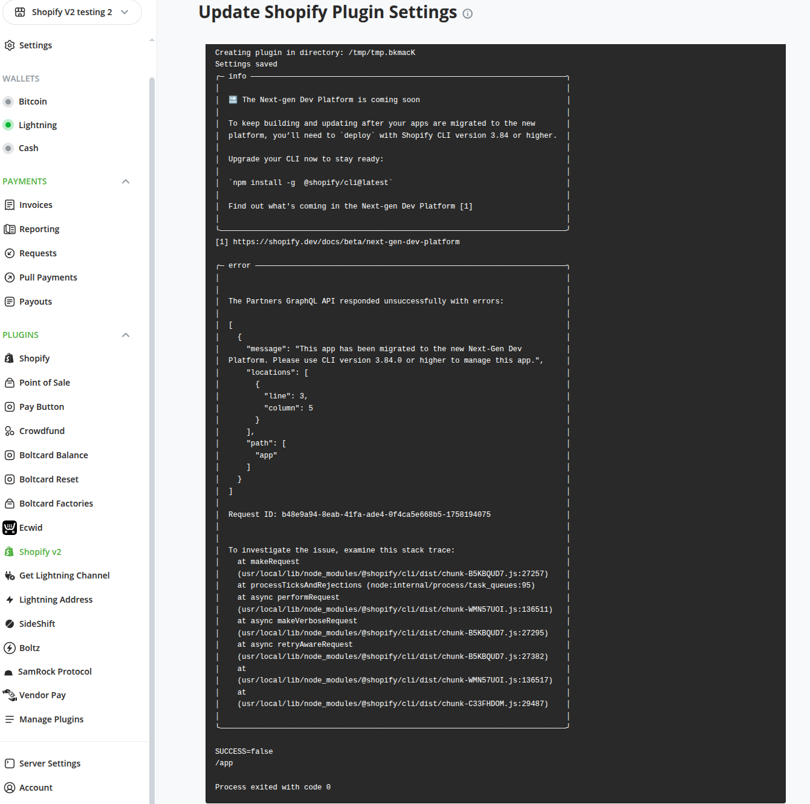


### Usasishaji wa programu unashindwa na hitilafu?

Ikiwa ulisakinisha programu yako kabla ya 15 Septemba 2025 na unapata hitilafu "Your app has extensions which need to be assigned 'uid' identifiers" unapojaribu kusasisha programu kupitia usambazaji upya - unahitaji kuondoa na kufuta programu kutokana na [sasisho kuu la programu ya Shopify](https://shopify.dev/docs/apps/build/dev-dashboard/migrate-from-partners) na kusakinisha mpya kwa kufuata hatua zifuatazo:

 - Ondoa programu kwenye duka lako la shopify
 - Futa programu katika washirika wa Shopify (kwa hiari)
 - Rudi kwenye ukurasa wako wa programu-jalizi ya Shopify kwenye BTCPay Server na ubonyeze kitufe cha `Reset`
 - Hakikisha unatumia kipande cha hivi karibuni cha shopify (>= 1.5) kwa kuendesha ./btcpay-update.sh kutoka saraka yako ya btcpayserver-docker
 - Fuata maagizo ya usakinishaji na anza upya

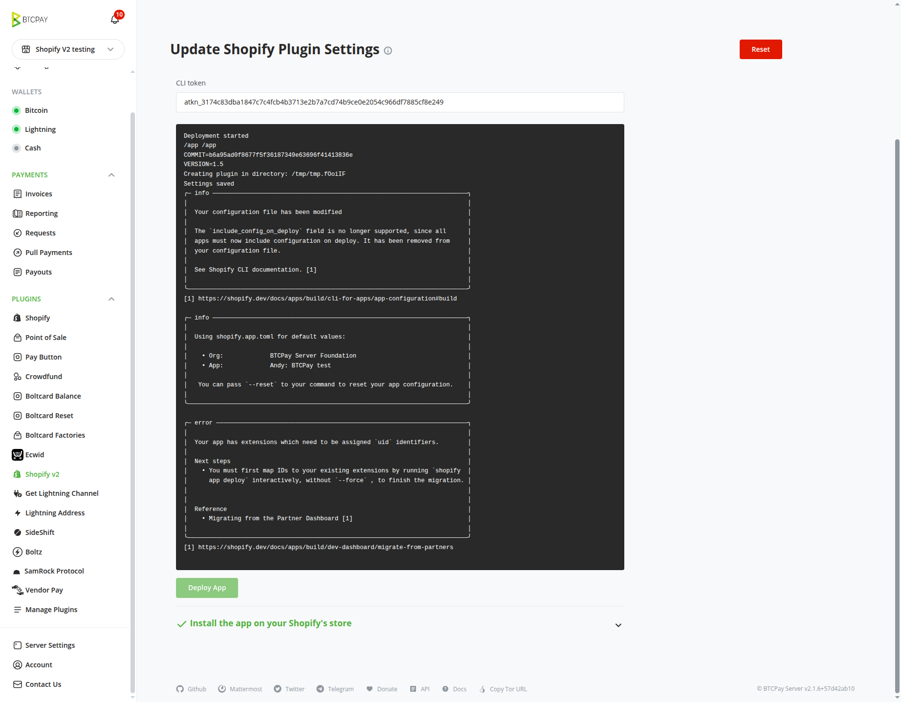


### Jinsi ya kusasisha programu ya BTCPay Shopify?

Unapoona au kusikia kwamba [programu ya BTCPay Shopify](https://github.com/btcpayserver/shopify-app) imesasishwa, unaweza kusukuma toleo jipya kwenye duka lako kwa kufuata hatua hizi:

Kwanza tunahitaji kupata tokeni mpya ya CLI (iwayo huna tena, au imekwisha muda) kutoka [langoni la mshirika la Shopify](https://partners.shopify.com).

#### Pata tokeni mpya ya CLI
1. Ingia kwenye Lango la Mshirika la Shopify, kisha nenda kwenye dashibodi ya msanidi
2. Chagua programu husika na ubonyeze `Settings`   
3. Katika mipangilio, chini ya `App automation token`, utaona vitendo vya tokeni yako. Unaweza kuchagua kuunda tokeni mpya, kubatilisha au kuzungusha tokeni ikiwa uliwahi kuunda tokeni hapo awali.
   
   
   

#### SSH kwenye BTCPay Server yako

Sasa tunaingia kwenye BTCPay Server yetu na kuendesha hati ya kusasisha ili picha zote za hivi karibuni za docker (ikiwemo programu ya BTCPay Shopify) zipakuliwe.

```bash
# ikiwa wewe sio mtumiaji root, badilisha kuwa root
sudo su -

# nenda kwenye saraka ya docker ya BTCPay Server
cd $BTCPAY_BASE_DIRECTORY
cd btcpayserver-docker

# endesha hati ya kusasisha
./btcpay-update.sh
```

#### Sasisha programu ya BTCPay Shopify

1. Ingia kwenye BTCPay Server yako
2. Chagua duka lako lililounganishwa na Shopify
3. Kwenye upau wa kando wa kushoto bonyeza `Shopify v2`
4. Panua sehemu ya pili "Deploy the app"
5. Bandika tokeni ya CLI na ubonyeze "Deploy App"
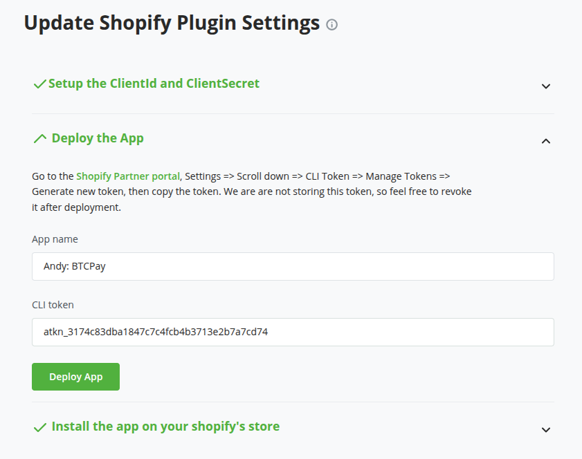
6. Utaona matokeo fulani ya koni na sehemu itafungwa ikiwa kila kitu kilienda vizuri
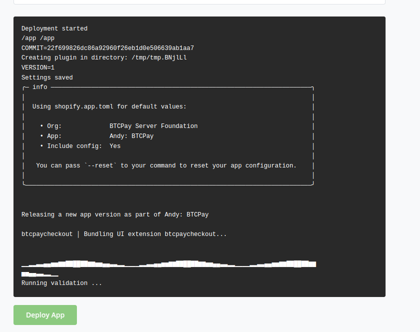
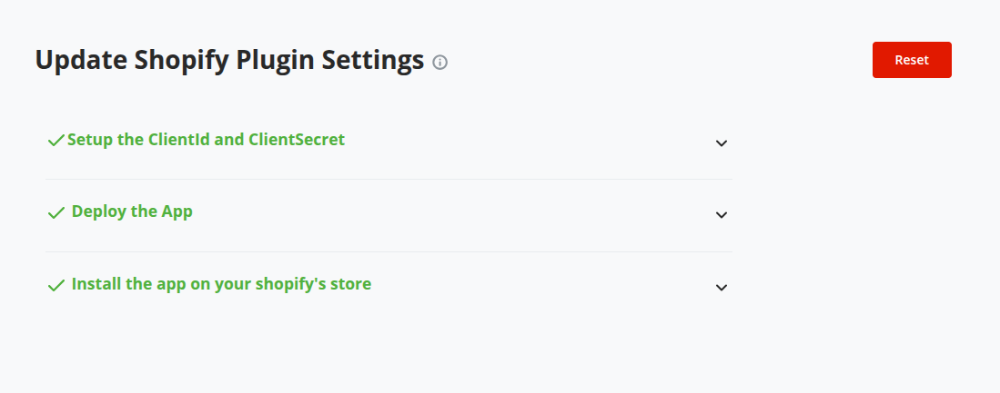
7. Rudi kwenye ukurasa wako wa msimamizi wa shopify, na kwenye programu, na ikiwa kuna modal ya kusasisha programu yako ya shopify, endelea na usasishe
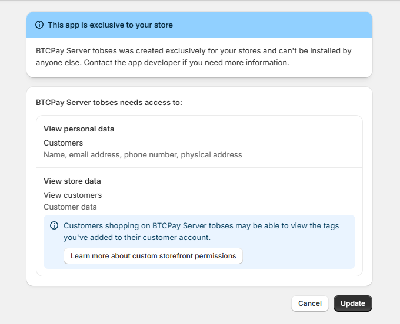

Hongera, sasa umesasisha programu ya BTCPay Shopify.

### Siwezi kuunda programu mpya katika lango la mshirika la Shopify
Angalia ikiwa wasifu wako juu kulia unasema "null null". Hii inamaanisha hukuweka jina lako la kwanza na la mwisho katika wasifu. Unahitaji kujaza sehemu hizo na inapaswa kufanya kazi.
1. Bonyeza wasifu wako juu kulia
2. Chagua "Your profile"
3. Weka "First name" na "Last name"
4. Rudi kwenye washirika wa shopify na inapaswa kufanya kazi sasa

## Usaidizi na jumuiya

Jisikie huru kujiunga na kituo chetu cha usaidizi kupitia [Mattermost](https://chat.btcpayserver.org/) au [Telegram](https://t.me/btcpayserver) ikiwa unahitaji usaidizi au una maswali yoyote zaidi.
