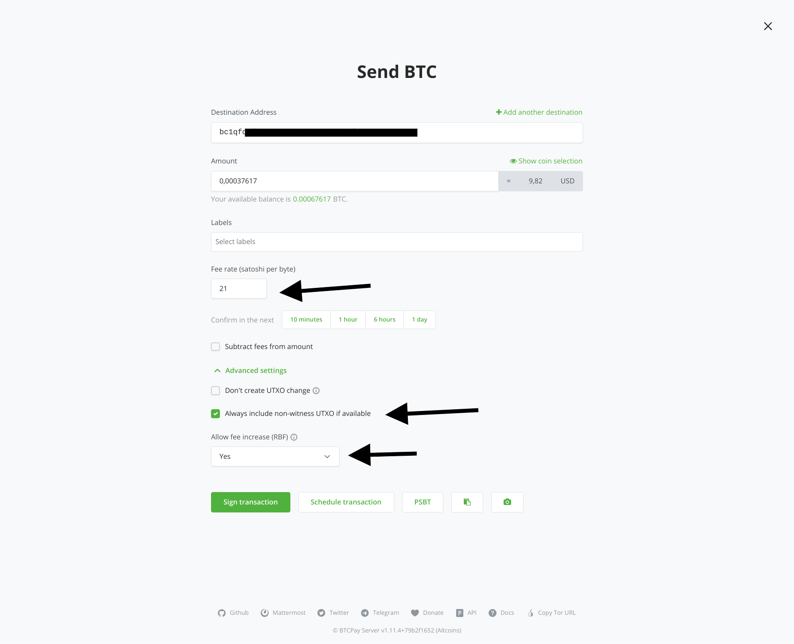
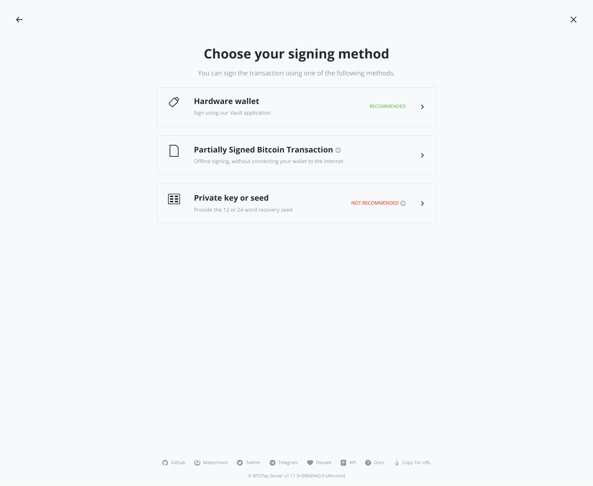
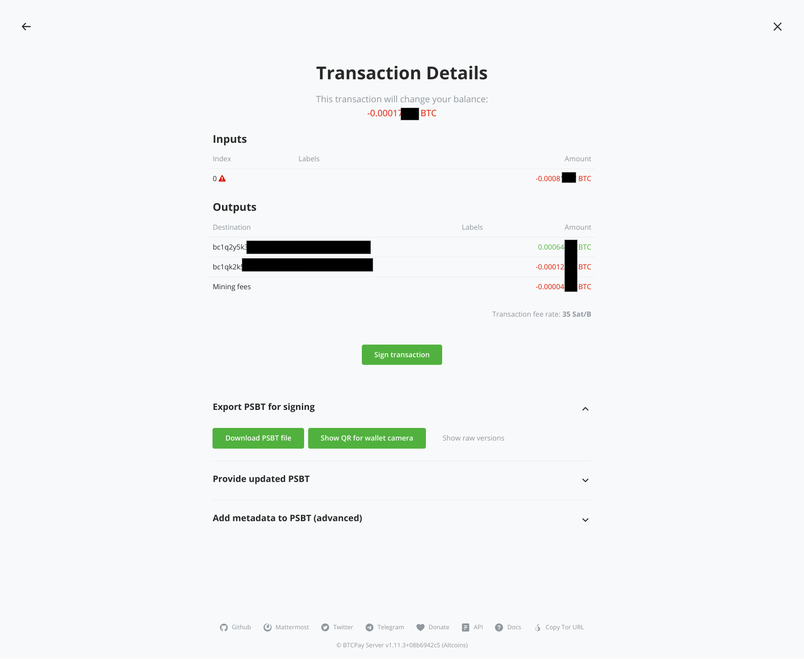
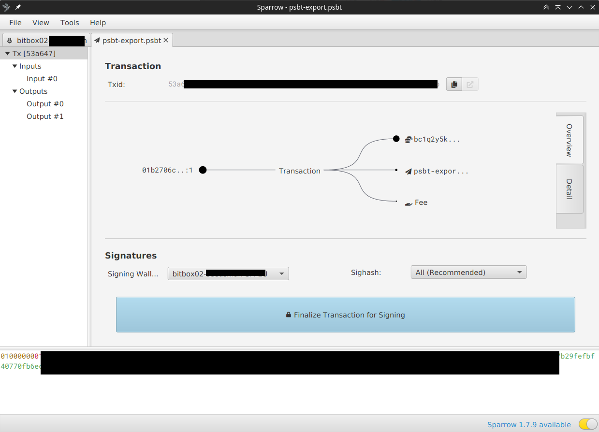
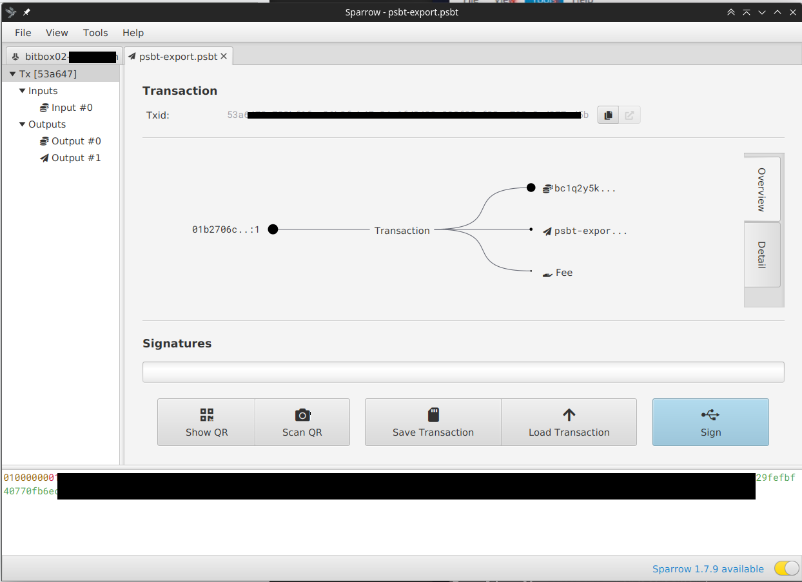
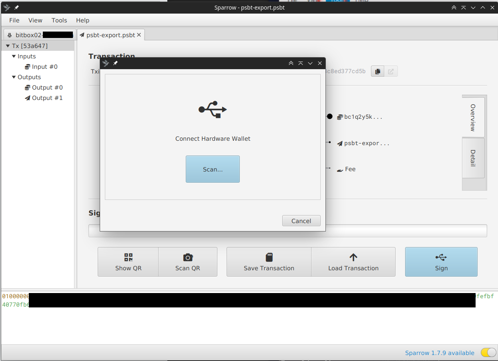
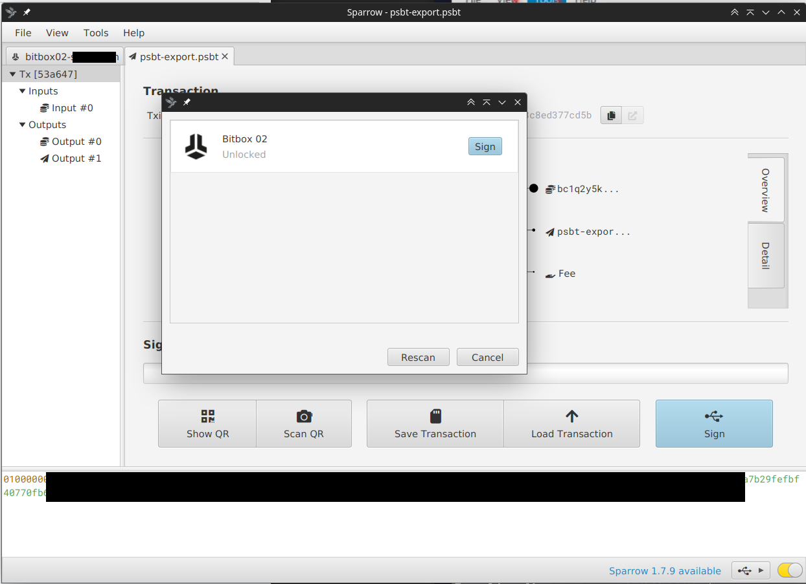
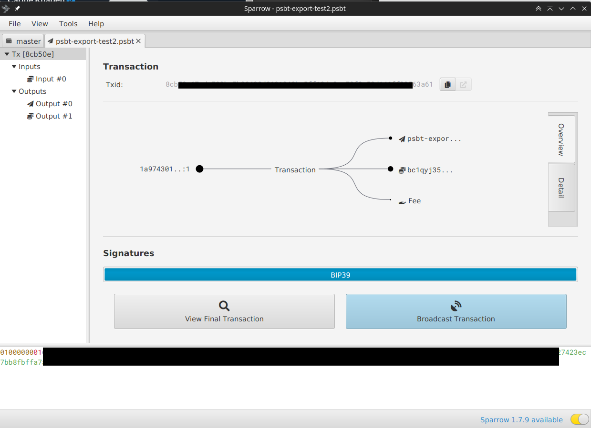

# Kuunda PSBT na BTCPay Server na Sparrow wallet

Mwongozo huu unaelezea jinsi unavyoweza kuunda muamala wa bitcoin uliosainiwa kwa sehemu (PSBT) kwenye BTCPay Server na kuusaini na kuutangaza kwa [Sparrow wallet](https://www.sparrowwallet.com/). Tunatumia [BitBox02](https://bitbox.swiss/) hardware wallet katika mfano huu, lakini itafanya kazi na hardware wallet yoyote nyingine inayoungwa mkono. Hii inaweza kuwa muhimu kama una usanidi wa airgapped au watu wanaounda muamala na wanaousaini ni watu tofauti.

[[toc]]

## 1. Kuunda muamala (kwenye BTCPay Server):

* Ingia kwenye BTCPay Server yako na uchague duka unalotaka kutuma kutoka
* Chini ya "Wallets" chagua "Bitcoin"
* Bonyeza kitufe cha **[Send]**

### Kwenye skrini ya kutuma:

* Ingiza anwani ya bitcoin ya mpokeaji
* Ingiza kiasi
* Kwa hiari: Badilisha kiwango cha ada (pata kiwango cha sasa cha ada kwenye [mempool.space](https://mempool.space) kutegemea jinsi unavyotaka muamala uthibitishwe kwa haraka)
* **Muhimu**: bonyeza "Advanced Settings" ili ipanuke na weka tiki kwenye "**Always include non-witness UTXO if available**" (hii inahitajika ili hardware wallets kama BitBox02 ziweze kusaini muamala)
* Kwa hiari: kwenye "Allow fee increase (RBF)", weka "Yes" (hii ni muhimu kama ukichagua ada ndogo sana unaweza kuongeza ada ili muamala wako usikwame na uthibitishwe)
* Bonyeza kitufe cha **[Sign transaction]**

### Kwenye skrini ya kuchagua njia ya kusaini:

* Chagua "Partially Signed Bitcoin Transaction"

### Kwenye skrini ya PSBT:

* Fungua kiboreshaji cha "Export PSBT for signing" bonyeza kitufe cha **[Download PSBT file]**
* Hifadhi faili kwenye diski kuu (unaweza kuitumia kusaini PSBT mwenyewe, au unaweza kumtumia mtu atakayesaini kwenye Sparrow wallet, tazama hapa chini); k.m. psbt-export.psbt

## 2. Kusaini na kutuma PSBT (kwenye Sparrow wallet)

* Fungua programu yako ya Sparrow wallet na wallet inayolingana inayoshikilia data ya xPub iliyotumika katika duka lako
* Kisha, ingiza faili ya PSBT uliyounda kwenye BTCPay Server
* Katika menyu: File -> Open Transaction -> File...
* Chagua faili uliyohifadhi (au uliyotumiwa kutoka kwa uhasibu) k.m. psbt-export.psbt

### Kwenye kuonyesha muamala wa PSBT ulioingizwa:

* Hakikisha chini ya kichwa cha habari "Signatures:" "signing wallet" inalingana na wallet unayotaka kutuma kutoka
* Bonyeza **[Finalize Transaction for Signing]**

### Kusaini muamala:

* Bonyeza **[Sign]**

### Dirisha ibukizi la kuunganisha Hardware wallet:

* Unganisha hardware wallet yako (BitBox02 katika mfano wetu)
* Ingiza nambari ya siri ya hardware wallet yako (kwa BitBox02 inaonyesha kwenye skrini fungua programu ya BitBox lakini huhitaji, subiri hadi uweze kuingiza nambari ya siri)
* Baada ya BitBox02 kufunguliwa, bonyeza **[Scan...]**, hardware wallet yako itajitokeza

### Wallet imeunganishwa kwa mafanikio:

* Bonyeza **[Sign]**
* Muhtasari wa muamala utaonyeshwa kwenye kifaa cha BitBox02, unahitaji kuuthibitisha hapo

### Kutangaza muamala:

* Baada ya kusaini kufanikiwa unahitaji kutangaza muamala kwenye mtandao wa Bitcoin
* Bonyeza **[Broadcast Transaction]**

:::tip
Kwa njia mbadala, badala ya kutangaza muamala kutoka kwa Sparrow wallet (k.m. kama una usanidi wa airgapped) unaweza pia kunakili na kubandika muamala wa PSBT uliosainiwa kutoka kwenye kisanduku cha maandiko na kuupakia kwenye BTCPay Server yako na kuiruhusu itangaze muamala kwenye mtandao.
:::

**Hongera, imekamilika!**
