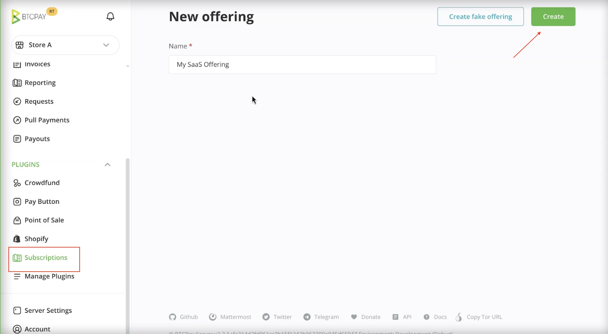
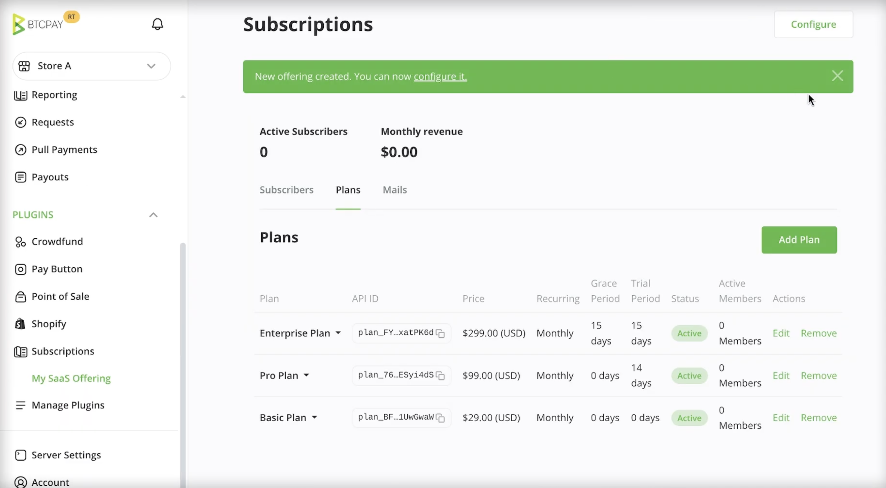
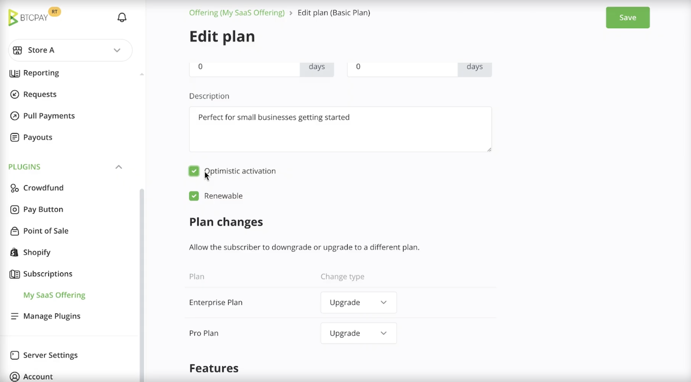
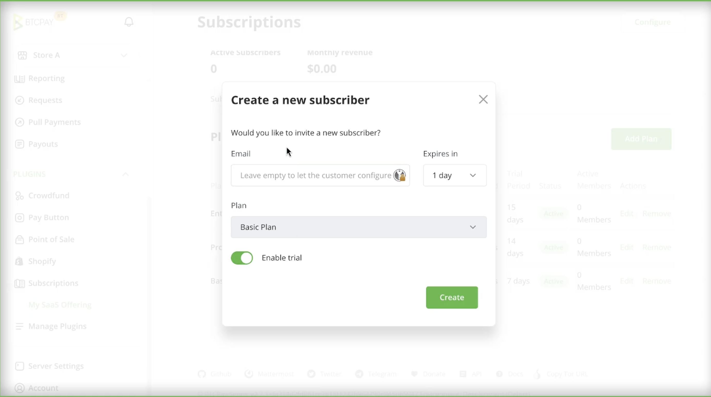
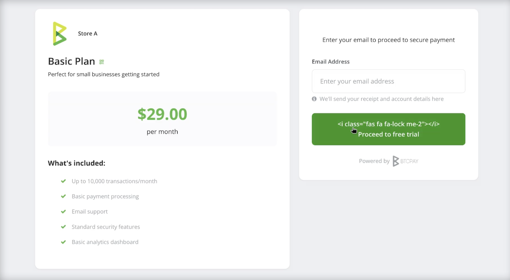
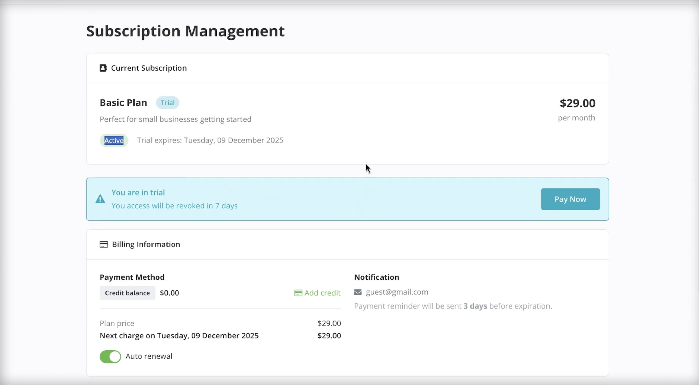

# Usajili

Usajili unakuwezesha kusimamia malipo ya mara kwa mara kwa huduma unazotoa, kama vile jarida, bidhaa za SaaS, uanachama au michango ya mara kwa mara.

Kwa sababu Bitcoin haitoi njia iliyounganishwa ya kuwatoza wateja kiotomatiki kwa ratiba, na kwa sababu BTCPay Server inasaidia njia nyingi za malipo, usajili hauwezi kutegemea utaratibu mmoja wa "kutoa kiotomatiki". Badala yake, BTCPay Server inatoa mfumo wa usajili uliounganishwa unaosaidia malipo ya mara kwa mara kwa njia mbili:

1. **Malipo ya mara kwa mara kwa mkono**, ambapo mteja hulipa kila kipindi cha bili baada ya kupokea kikumbusho.  
2. **Malipo ya mara kwa mara kiotomatiki**, kwa kutumia **mfano wa salio la mkopo** ambapo wateja hulipa mapema na upyaishaji hukatwa kiotomatiki.

Njia zote mbili zinatumia usanidi ule ule wa usajili na mpango, kuwawezesha wafanyabiashara kutoa bili ya mara kwa mara inayotabirika huku wakiwapa wateja unyumbufu katika jinsi wanavyochagua kulipa na kusimamia usajili wao.

## **Jinsi inavyofanya kazi**

Usajili umejengwa kutoka kwenye seti ndogo ya vipengele vya msingi vinavyofanya kazi pamoja:

* **Toleo**: inawakilisha kile unachouza, kama vile ufikiaji wa jarida, ufikiaji wa SaaS, au mchango wa mara kwa mara.  
* **Mpango**: daraja chini ya toleo, kwa mfano Msingi, Pro, au Biashara. Mpango unafafanua bei, muda wa bili, tabia ya upyaishaji, na sheria za ufikiaji  
* **Msajili**: mteja mahususi aliyejiandikisha kwenye mpango. Wafanyabiashara wanaweza kusimamia wasajili kwa kusimamisha ufikiaji, kuongeza mikopo, kutoza kwa mkono, au kuwaweka alama kama watumiaji wa majaribio.  
* **Tovuti ya mteja**: ukurasa unaoonekana na umma ambapo wasajili wanaweza kusimamia usajili wao, kuongeza mikopo, kupandisha au kushusha hadhi mipango, na kuona historia ya bili na muamala.  
* **Malipo ya Mpango:** Ukurasa unaoonekana na mteja unaotumika kuanzisha au kusasisha usajili  
* **Barua pepe (si lazima)**: barua pepe zinazotegemea kanuni kama vile vikumbusho vya malipo na arifa za hali ya usajili, zinapatikana wakati barua pepe ya seva imesanidiwa.

### 1. Kuunda toleo

**Toleo** linawakilisha huduma au bidhaa unayouza kwa msingi wa mara kwa mara. Ni kifaa cha juu cha kuhifadhia mpango mmoja au zaidi ya usajili. Inaweka pamoja mipango inayohusiana chini ya bidhaa moja na kufafanua metadata iliyoshirikiwa, kama vile:

* Jina linaloonyeshwa kwa wateja  
* URL ya hiari ya kuelekeza baada ya malipo  
* Seti ya vipengele vinavyoweza kukabidhiwa kwa mipango binafsi

Kuunda toleo lako la kwanza:

1. Kuunda toleo, kwenye upau wa pembeni bofya **Subscriptions**.   
2. Weka jina kwa toleo lako mf. My Product 
3. Bofya kitufe cha Create kwenye kona ya juu kulia.

Mara toleo linapoundwa, unaongeza mpango mmoja au zaidi kwake ili kufafanua bei, muda wa bili, na tabia ya usajili.

### 2. Kuunda mpango

**Mpango** unafafanua jinsi usajili unavyofanya. Unadhibiti bei, marudio ya bili, sheria za ufikiaji, na jinsi wasajili wanavyopitia mzunguko wa maisha wa usajili.

Mipango inakuwezesha kugawa watumiaji wako, kwa mfano katika daraja za Msingi, Pro, au Biashara, huku ikikupa udhibiti wa kina juu ya bili na ufikiaji. Kila toleo linaweza kuwa na mipango mingi.

Kuunda mpango:

1. Bofya kwenye **Subscriptions** > **Offering**  
2. Nenda kwenye kichupo cha **Plans**  
3. Bofya kitufe cha **Add Plan**

### Usanidi wa mpango

Wakati wa kuunda au kuhariri mpango, unaweza kusanidi chaguo zifuatazo:

#### Bei na sarafu

Inafafanua ni kiasi gani mpango unagharimu kwa kila kipindi cha bili na sarafu gani inatumika.

#### Muda wa kujirudia

Inafafanua mara ngapi mpango unafanywa upya. Vipindi vinavyoauniwa ni pamoja na:

* Kila siku  
* Kila wiki  
* Kila mwezi  
* Maisha

Mpango wa maisha hulipwa mara moja na haufanyiwi upya.

#### Kipindi cha majaribio

Kipindi cha majaribio kinawapa wasajili ufikiaji bila malipo wa mpango kwa idadi fulani ya siku.

Wakati wa majaribio:

* Hakuna malipo yanayohitajika  
* Msajili anachukuliwa kama amilifu  
* Bili inaanza tu baada ya majaribio kumalizika

#### Kipindi cha neema

Kipindi cha neema kinafafanua muda gani msajili anaendelea na ufikiaji baada ya mpango kumalizika.

Ikiwa msajili hana fedha za kutosha wakati wa upyaishaji:

* Usajili unaingia katika kipindi cha neema  
* Ufikiaji unaweza kuendelea wakati huu  
* Msajili anaweza kulipa au kuongeza fedha bila kupoteza ufikiaji mara moja

Mara kipindi cha neema kinapomalizika, usajili unaisha na ufikiaji unafutwa.

#### Uanzishaji wa matumaini

Uanzishaji wa matumaini unaruhusu malipo ya on-chain kuamilisha usajili mara moja, kabla ya uthibitisho kukamilika.

Hii inaboresha uzoefu wa mtumiaji lakini inaleta hatari:

* Ikiwa malipo yatashindwa baadaye au kughairiwa, usajili unazimwa  
* Uingiliaji wa kibinadamu unaweza kuhitajika

Chaguo hili linapaswa kuwezeshwa tu ikiwa unaelewa mabadilishano.

#### Inaweza kufanywa upya

Mipango inaweza kuwekwa alama kama haiwezi kufanywa upya.

Hii ni muhimu kwa:

* Mipango ya utangulizi au matangazo  
* Ufikiaji wa muda maalum  
* Mipango ya kuanzisha mara moja

Mara mpango usioweza kufanywa upya unapomalizika, hauwezi kufanywa upya.

#### Kupandisha na kushusha hadhi

Unaweza kudhibiti ikiwa wasajili wanaruhusiwa kupandisha au kushusha hadhi kati ya mipango.

Hii inakuwezesha:

* Kufafanua mabadiliko ya mpango yanayoruhusiwa  
* Kuzuia kushusha hadhi kusikosaidiwa  
* Kuongoza watumiaji kupitia njia za kupandisha hadhi zilizoainishwa mapema

#### Vipengele

Mipango inaweza kufafanua **vipengele** vinavyoeleza ufikiaji au uwezo gani msajili anapokea.

BTCPay Server inahifadhi thamani hizi lakini haizitekelezi. Programu au huduma yako ina jukumu la kutafsiri na kutumia vipengele.

Mifano ni pamoja na vikomo vya matumizi, moduli zilizowezeshwa, au daraja za usaidizi.

### 3. Kuunda msajili

**Msajili** anawakilisha mteja aliyejiandikisha katika mojawapo ya mipango yako ya usajili. Wasajili huundwa kupitia malipo ya mpango, ambayo inamruhusu mteja kukamilisha malipo na kuanza usajili wao.

Kuunda msajili:

1. Fungua **Offering** yako.  
2. Nenda kwenye kichupo cha **Subscribers**.  
3. Bofya **Create** kwenye kona ya juu kulia.  
4. Chagua mpango unataka msajili ajiandikishe.  
5. Kwa hiari weka anwani ya barua pepe ya msajili.  
   * Ikiachwa wazi, mteja ataombwa kuitoa wakati wa malipo.  
6. Ikiwa mpango unajumuisha kipindi cha majaribio, chagua ikiwa utakiwezesha.  
7. Bofya **Create**.

BTCPay Server inazalisha **ukurasa wa malipo ya mpango**. Msajili anaundwa tu baada ya malipo kukamilika.

Unaweza kushiriki kiungo cha malipo na mteja au kukiunganisha kwenye programu yako.

### 4. Ukurasa wa Malipo ya Mpango

**Malipo ya mpango** ni ukurasa wa malipo unaotumika kuanzisha au kusasisha usajili.  
Inaweza kuundwa kupitia UI au kwa kiprogramu kupitia API. Wakati malipo ya mpango inapoundwa, msajili anaundwa tu baada ya malipo kukamilika.

### 5. Usimamizi wa usajili kupitia tovuti ya mteja

Kila msajili ana ufikiaji wa **tovuti ya usimamizi wa usajili**, ukurasa unaoonekana na umma ambapo wateja wanaweza kusimamia usajili wao bila kuhusisha mfanyabiashara.

Tovuti ya mteja inawaruhusu wasajili:

* Kuona mpango wao wa sasa na hali ya usajili  
* Kuona upyaishaji unaokuja na tarehe za kumalizika  
* Kuongeza salio lao la mkopo  
* Kulipia vipindi vya bili vinavyokuja  
* Kupandisha au kushusha hadhi mpango wao, ikiruhusiwa  
* Kuona historia ya bili na maelezo ya muamala

Tovuti inatoa mahali kwa wateja kusimamia malipo ya mara kwa mara na kuelewa hali ya usajili wao.

Ufikiaji wa tovuti kwa kawaida hutolewa na programu au huduma yako, kwa mfano kupitia kiungo cha **Manage subscription** au **Billing**. Kiungo kinaweza kushirikiwa moja kwa moja na msajili au kuzalishwa kwa kiprogramu.

### 6. Usimamizi wa msajili

BTCPay Server inatoa zana kwa wafanyabiashara kusimamia wasajili na kushughulikia kesi za kipekee bila kurekebisha mipango.

Kutoka kwenye mwonekano wa maelezo ya msajili, unaweza kufanya vitendo vifuatavyo.

#### Simamisha na rudisha wasajili

Unaweza kumsimamisha msajili ili kuzima kwa muda ufikiaji wa huduma.

* Kusimamisha mara moja huzuia ufikiaji, bila kujali hali ya usajili  
* Unaweza kutoa sababu ya kusimamisha kwa hiari (Sababu inaweza kuonyeshwa kwa msajili kwenye tovuti ya mteja)  
* Usajili uliosimamishwa unaweza kurejeshwa wakati wowote

#### Ongeza mikopo

Unaweza kuongeza mikopo kwa mkono kwenye salio la msajili.

Hii ni muhimu kwa:

* Ishara za usaidizi kwa mteja  
* Mikopo ya huduma  
* Marekebisho ya salio kwa mkono

Mikopo iliyoongezwa inapatikana mara moja kwa upyaishaji.

#### Toza kwa mkono

Unaweza kumtoza msajili kwa mkono kwa matumizi ya ziada au ada za mara moja.

Malipo ya mkono hukata kutoka kwenye salio la mkopo la msajili na huonekana katika historia ya usajili.

#### Wasajili wa majaribio

Wasajili wanaweza kuwekwa alama kama wasajili wa majaribio.

Wasajili wa majaribio hufanya kama wasajili wa kawaida lakini wanalengwa kwa maendeleo na majaribio, kukuwezesha kuthibitisha uingizaji bila kuathiri data ya uzalishaji.

### 7. Barua pepe za kiotomatiki

BTCPay Server inaweza kutuma barua pepe za kiotomatiki kwa wasajili kulingana na matukio ya usajili, ikiwa barua pepe ya seva imesanidiwa.

Kanuni za barua pepe zinakuwezesha kuarifu wasajili kuhusu mabadiliko muhimu na vitendo vinavyokuja bila uingiliaji wa kibinadamu.

#### Kanuni za barua pepe

Unaweza kufafanua kanuni za barua pepe zinazochochea kwenye matukio kama vile:

* Kumalizika kwa usajili kunakokuja  
* Majaribio kumalizika  
* Mabadiliko ya hali ya usajili  
* Arifa za malipo yanayohitajika

Kanuni zinatathminiwa kiotomatiki na barua pepe hutumwa wakati masharti yaliyosanidiwa yanapotimizwa.

Violezo vya barua pepe vinasaidia vigezo, kukuwezesha kujumuisha taarifa mahususi za usajili kama vile:

* Jina la mpango  
* Tarehe ya kumalizika  
* Maelezo ya msajili

Hii inakuwezesha kuunda ujumbe uliobinafsishwa sana unaofanana na huduma yako na mtindo wa mawasiliano.

Kesi ya matumizi ya kawaida ni kutuma kikumbusho cha malipo kwa msajili **siku 3 kabla ya mpango kumalizika**, ikiwapa muda wa kuongeza mikopo au kulipia kipindi kinachofuata cha bili.

### 8. Ufikiaji wa API ya Usajili

Usajili unaweza kusimamiwa kwa kiprogramu kwa kutumia **Greenfield API** ya BTCPay Server.

Ikiwa mfano wako wa BTCPay Server unaendesha **v2.3.0 au baadaye**, unaweza kuchunguza na kuingiliana na vituo vya usajili kwa njia mbili:

* Nyaraka za umma:  
  [https://docs.btcpayserver.org/API/Greenfield/v1/](https://docs.btcpayserver.org/API/Greenfield/v1/)  
* Nyaraka za mfano wako mwenyewe:  
  Tembelea `/docs` kwenye mfano wako wa BTCPay Server (kwa mfano `https://yourbtcpayserver.com/docs`)
