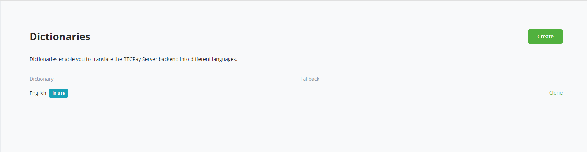
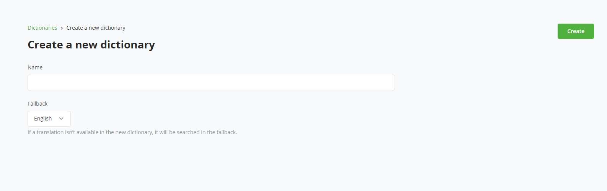
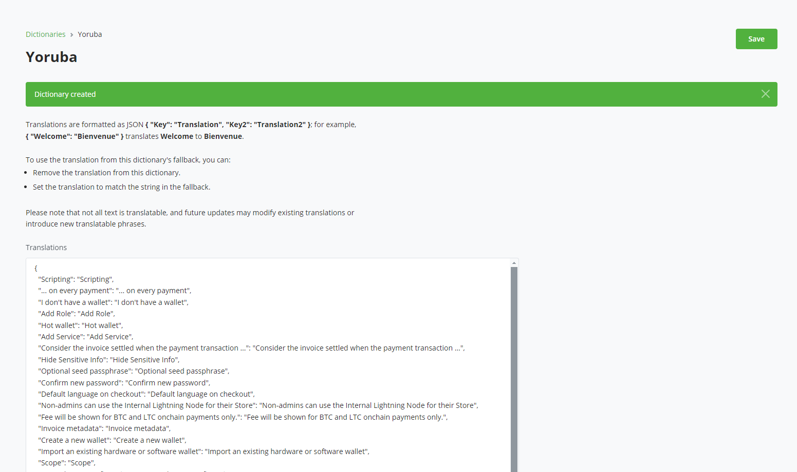
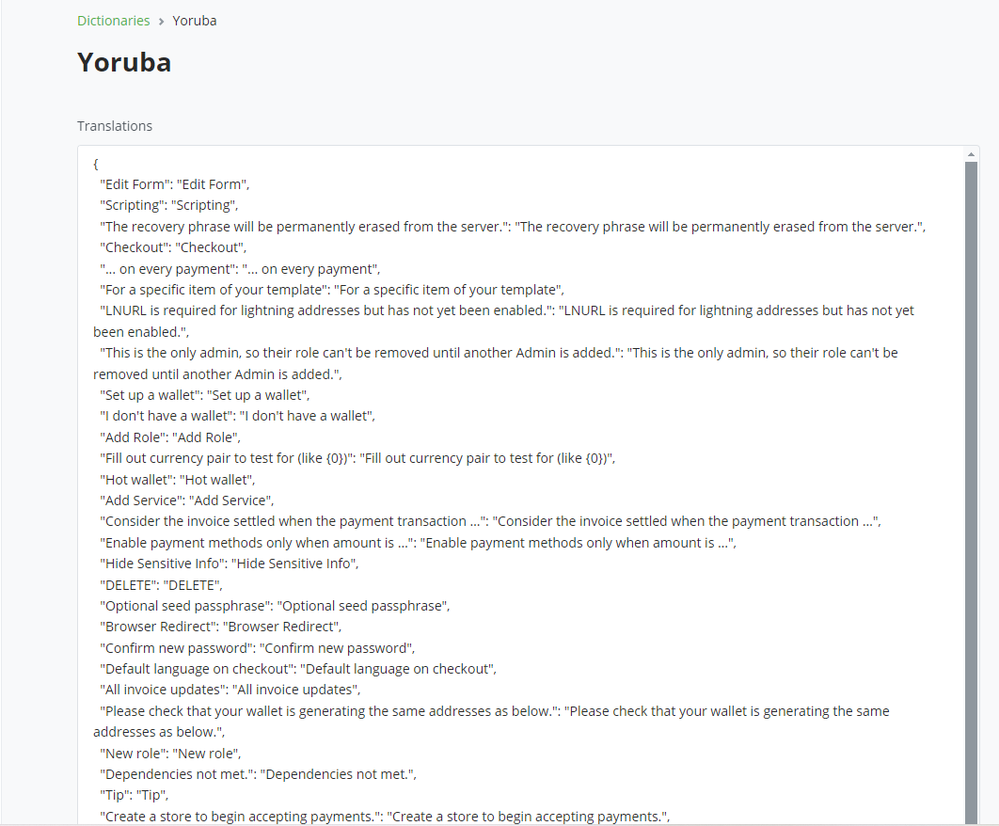
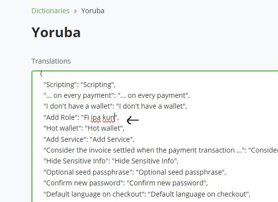
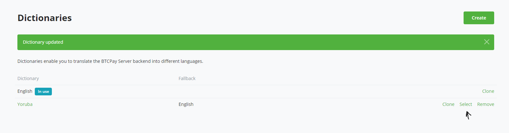
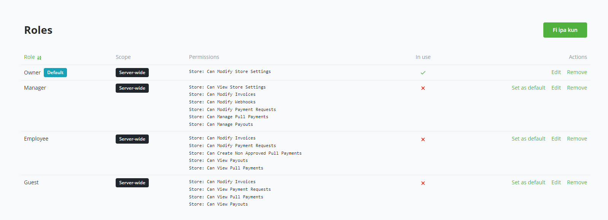

# Kutumia Kipengele cha Tafsiri cha BTCPay Kubinafsisha Lugha ya Mfano Wako wa BTCPay Server

Tangu toleo la 2.0 BTCPay Server inajumuisha kipengele cha tafsiri kinachowezesha wasimamizi kuweka lugha chaguo-msingi kwa watumiaji wanaofikia mfano wao.

Kwa kipengele hiki, unaweza kubadilisha maandishi chaguo-msingi ya Kiingereza katika ofisi ya nyuma yote na lugha uliyochagua.

Hivi ndivyo unavyoweza kuunda na kusimamia tafsiri ili kufanya seva ya BTCPay iwe rahisi kutumia.

## Vifurushi vya lugha

Kuanzia na BTCPay Server 2.3, wasimamizi wanaweza pia kupakua vifurushi vya lugha vilivyowasilishwa na jamii badala ya kuunda tafsiri kutoka mwanzo. Vifurushi vya lugha vinakuwezesha kubinafsisha lugha haraka seva nzima ya nyuma kwa kutumia tafsiri zilizochangiwa na jamii.

### Kupakua kifurushi cha lugha

- Nenda kwa Mipangilio ya Seva >> `Translation`
- Bofya `Download language pack`
- Chagua lugha kutoka kwenye menyu kunjuzi
- Bofya `Download`
Mara baada ya kupakuliwa, kifurushi cha lugha kitaonekana katika orodha yako ya kamusi.

#### Kutumia kifurushi cha lugha

- Bofya `Select` kufanya kifurushi cha lugha kilichopakuliwa kuwa lugha chaguo-msingi kwa seva yako

#### Kuhariri kifurushi cha lugha kilichopakuliwa

Ikiwa unataka kubinafsisha kifurushi cha lugha kilichopakuliwa, inapendekezwa kunakili kamusi kwanza.
Tumia mabadiliko yako kwenye toleo lililonakiliwa na ulichague kama kamusi inayotumika. Hii inazuia mabadiliko yako maalum yasifutwe ikiwa kifurushi cha lugha halisi kitasasishwa baadaye.

Ikiwa lugha yako haipatikani, bado unaweza kuunda kamusi mpya kwa mkono na [kuwasilisha tafsiri yako](https://github.com/btcpayserver/btcpayserver-translator) ili wengine waweze kufaidika nayo.

## Kutafsiri BTCPay Server

1. Ingia kwenye mfano wako wa BTCPay Server.
2. Nenda kwa Tafsiri kwenye **Mipangilio ya Seva** >> **Tafsiri**.

3. Bofya kitufe cha **Unda** kuzalisha kamusi mpya ya lugha.

4. Ingiza jina la kamusi unayotaka kuhifadhi mkusanyiko wa lugha nayo kisha ubofye kitufe cha **Unda** kuunda kamusi.

Katika picha hapo juu, unaweza kuona kamusi ya maneno ambayo yanaweza kutafsiriwa kwenye BTCPay Server yako.

Kamusi kwa kawaida imepangwa kama jozi za `"key": "value"`, ambapo:

**Key:** Maandishi au kirai halisi cha Kiingereza katika mfano wako wa BTCPay.

**Value:** Maandishi yaliyotafsiriwa unayotaka kuonyesha.

Kwa kila neno la Kiingereza, ingiza sawa lake katika lugha uliyochagua katika maandishi yanayohusika. Hakikisha unakagua kwa usahihi na uwazi.

Kwa mfano, tufasiri "Add Role" kwenda Kiyoruba. Kwa kuwa nimeunda kamusi ya Kiyoruba, nitatoa tafsiri katika Kiyoruba.

Badilisha maandishi na ubofye kitufe cha **Hifadhi**. Ujumbe wa uthibitisho utaonekana ukionyesha kuwa tafsiri zako zimehifadhiwa kwa ufanisi. Kisha, bofya kitufe cha **Chagua** kwa kamusi mpya kuiweka kama chaguo-msingi la mfumo.

Sasa tujaribu tafsiri. Nenda kwa **Majukumu** chini ya **Mipangilio ya Seva**, na ikiwa tutaangalia kitufe kilicho juu kulia cha mwonekano, tunaweza kuona kuwa maandishi yametafsiriwa kutoka "Add Roles" hadi "Fi ipa kun".

Unaweza pia kutafuta maeneo mengine katika programu ya BTCPay ambapo "Add Role" inaonekana, na kuthibitisha kuwa imetafsiriwa kwa ufanisi katika lugha uliyochagua.

Kwa tafsiri moja imefanyika, endelea na kutafsiri maandishi mengine katika kamusi. Matukio yote ya maandishi ya Kiingereza yatabadilishwa na matoleo yako yaliyotafsiriwa, na sasa unaweza kufurahia uzoefu wako mpya wa kubinafsisha lugha.

:::tip
Mistari yote ya tafsiri iko katika kisanduku kimoja cha maandishi, rahisi kunakili. Jisikie huru kutumia hii kwa kuibandika kwenye zana za AI za tafsiri kama vile ChatGPT, ukijipa mahali pazuri pa kuanzia. Tunapendekeza sana kwamba ukague mistari yote kwa mkono baadaye, kuhakikisha usahihi wa kimuktadha, ambao wakati mwingine hupotea wakati wa kutegemea AI.
:::

## Vidokezo vya Tafsiri Zenye Ufanisi

- **Uthabiti ni Muhimu:** Hakikisha kuwa maneno yanayofanana yanatafsiriwa kwa uthabiti kote.
- **Muktadha ni muhimu:** Zingatia muktadha wakati wa kutafsiri virai kudumisha maana.
- **Kagua mara kwa mara:** Sasisha tafsiri mara kwa mara kadri vipengele vipya vinavyoongezwa.
