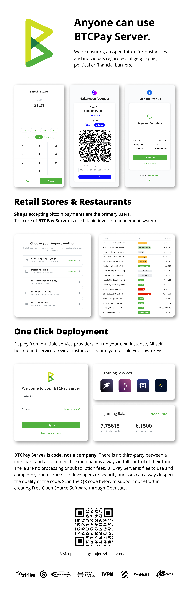

# Nani anaweza kutumia BTCPay Server?

Unyumbufu wa BTCPay Server unavutia aina tofauti za watumiaji. **Mtu yeyote** anaweza kutumia BTCPay Server.

Tunahakikisha mustakabali wazi kwa biashara na watu binafsi bila kujali vizuizi vya kijiografia, kisiasa au kifedha.

Hapo chini ni matumizi ya kawaida zaidi ya BTCPay Server:

- **Wafanyabiashara** wanaouza bidhaa na huduma mtandaoni au ana kwa ana
- Watu binafsi **wajitawala** wanaotaka kulinda mali zao na kusimamia fedha zao na nodi kamili ya bitcoin
- **Mashirika ya hisani na yasiyo ya faida** yanayotaka kupokea michango au kufadhili mradi wao wa ndoto
- **Watengenezaji** wanaojenga juu ya bitcoin na miundombinu ya malipo ya kisasa
- Wanachama wa **jamii za mitaa** walio tayari kuwashughulikia watu kwenye kielelezo chao cha BTCPay na kutoa usindikaji wa malipo kama huduma au bure, kuunda uchumi wa duara.
- **Mabadilishano (exchanges)** yanayotoa ubadilishaji wa papo hapo kwa watumiaji wa BTCPay Server
- **Watoa huduma za kukodisha** wanaotoa BTCPay kama huduma ya wingu au maunzi tayari kutumika.

Matumizi ya programu hayana ukomo kwa makundi ya watumiaji yaliyotajwa kwenye waraka huu.

## Wafanyabiashara

Wafanyabiashara wanaokubali malipo ya bitcoin mtandaoni au ana kwa ana ndio kundi kuu la watumiaji wa BTCPay Server.

Kwa kuchagua BTCPay Server kusindika malipo, wafanyabiashara:

- Kuokoa pesa (BTCPay ni bure na haina ada au usajili)
- Kuondoa wakala (Ikiwa malipo ya kujisimamia yanaenda moja kwa moja kwenye pochi zao)
- Kuimarisha faragha kwa wateja wao (hakuna matumizi ya anwani ya mara kwa mara, hakuna uvujaji wa taarifa kwa seva za wahusika wa tatu wakisimamia BTCPay Server wenyewe)
- Kuokoa muda (ushirikiano rahisi na majukwaa maarufu ya biashara ya mtandaoni)
- Kujilinda kutokana na kuingiliwa katika biashara zao (kujitawala)

### Maduka ya mtandaoni

Wafanyabiashara wanaouza bidhaa au huduma kupitia mtandao, kwa kawaida huchagua plugin ya biashara ya mtandaoni tunayotoa kwa majukwaa mengi maarufu ya biashara ya mtandaoni [WooCommerce](/WooCommerce/), [Shopify](/Shopify/), [PrestaShop](/PrestaShop/), [Magento](/Magento/) au nyingine. Angalia pia [ushirikiano wa Shopware](https://github.com/lampsolutions/LampSBtcPayShopware). Sakinisha plugin kwa CMS ya uchaguzi wako, na uiunganishe kwa BTCPay ya kujisimamia au moja inayosimamiwa na mtu wa tatu.

Malipo ya BTCPay Server si tofauti na lango lingine lolote la malipo. Mteja anapata ankara. Analipa kwa kuskana QR code au kwa kuandika-kunakili kiasi na anwani ya bitcoin. Malipo yake yanapothibitishwa, unaarifiwa kupitia programu ya biashara ya mtandaoni na unaweza kusafirisha bidhaa.

### Maduka ya kimwili

Kwa wauzaji wa ana kwa ana, BTCPay Server ina [Sehemu ya Mauzo ya msingi ya web](/Apps/#point-of-sale-app). Sawa na duka la mtandaoni, mteja huonyeshwa ankara ambayo anaweza kulipa papo hapo. **Programu ya POS** inaweza kuendeshwa kwenye kifaa chochote kilichounganishwa kwenye mtandao.

Angalia [programu yetu ya onyesho ya POS](https://mainnet.demo.btcpayserver.org/apps/3utBTfSKkW4gK7aQMd2hW5Bh9Fpa/pos).

## Watu binafsi wajitawala

**Watu wanaojali faragha** wanaweza kutumia pochi ya ndani ya BTCPay Server kwa miamala yao ya kila siku ya bitcoin bila kutoa funguo ya siri. Kwa seva za kujisimamia, [pochi ya ndani](/Wallet/) inategemea nodi kamili, ikiboresha faragha kwa kiasi kikubwa. [Ushirikiano wa pochi ya maunzi](/HardwareWalletIntegration/) unaruhusu matumizi ya pochi ya maunzi na [nodi kamili](https://en.bitcoin.it/wiki/Full_node) na huepuka uvujaji kwa seva ya mtu wa tatu.

## Wafanyakazi huru & malipo ya bili

**Wafanyakazi huru** wanaweza _kuomba_ malipo kwa kushiriki [Ombi la Malipo](/PaymentRequests/). Maudhui na muonekano wa ombi la malipo vinaweza kubinafsishwa. Iwe na au bila muda wa kuisha, wateja wanaweza kulipa ombi wakati wowote. BTCPay Server huweka sasisho la bei ya kubadilisha kiotomatiki wakati mteja analipa ombi la malipo wakati unapofaa kwake. Wafanyabiashara au wafanyakazi huru wanaweza kutumia maombi ya malipo kwa huduma ya malipo ya bili. Maombi ya malipo yanaweza hata kutumika kuomba pesa kutoka kwa marafiki kwa haraka.

Wafanyabiashara wanaweza _kutoa_ malipo kwa kushiriki [Pull Payment](/PullPayments/). Hiki ni toleo la malipo la muda mrefu ambalo mfanyabiashara anaweza kuvuta fedha wakati upendavyo. Mfanyabiashara anaweza kubainisha jumla ya kiasi na kuidhinisha ombi la sehemu au kamili la malipo.

## Mashirika ya hisani & yasiyo ya faida

Mashirika ya hisani, yasiyo ya faida, waundaji wa maudhui, na mashirika mengine yanayotaka kukubali michango ya bitcoin kwa njia ya faragha zaidi kuliko njia ya jadi ya anwani tuli ya bitcoin yanaweza kutumia [Kitufe cha Malipo](/sw/WhatsNext/#creating-the-pay-button), [programu ya POS](/sw/WhatsNext/#creating-the-point-of-sale-app) au [programu ya Ufadhili wa Umma](/Apps/#crowdfunding-app) kwa uzoefu bora wa mtumiaji.

Faida za kutumia BTCPay kukubali michango:

- Kuokoa pesa (hakuna ada, hakuna usajili)
- Kuondoa wakala (Malipo yanaenda moja kwa moja kwenye pochi zao)
- Kuimarisha faragha kwao na wafadhili wao (hakuna matumizi ya anwani ya mara kwa mara, hakuna uvujaji wa IP kwa wahusika wa tatu)

Ni muhimu kutaja kwamba BTCPay Server huzuia matumizi ya anwani ya mara kwa mara, kwani watu wengi wamekuwa wakitumia tena anwani kwa michango hapo zamani. Hapa kuna kwa nini HUUPASWI kutumia tena anwani ya Bitcoin:

- Faragha: kutumia anwani ileile kwa michango sio tu kwamba inafanya iwe rahisi sana kuiunganisha na utambulisho wako, bali pia inaathiri faragha ya wafadhili wako na kila mtu anayehusiana nawe
- Usalama: kwa kuathiri faragha yako, matumizi ya anwani ya mara kwa mara huongeza upeo wako wa mashambulizi, kwani watu wanaotaka kukuibia au kukuumiza wangekuwa na taarifa NYINGI kuhusu wewe na wafadhili wako
- Ada kubwa: ada za miamala ya Bitcoin huhesabiwa kulingana na "ukubwa" wa miamala (ambao hauhusiani na kiasi kinachotumwa). Kwa kutumia tena anwani, unajenga miamala mikubwa inayojumuisha miingilio mingi, ambayo itakugharimu sana katika ada unapotaka kuihamisha

Unaweza kusoma zaidi kuhusu matumizi ya anwani ya mara kwa mara kwenye [Bitcoin Wiki](https://en.bitcoin.it/wiki/Address_reuse).

## Watengenezaji

Kwa kusambaza kielelezo, watengenezaji hupata mkusanyiko kamili wa teknolojia wa kujenga juu ya Bitcoin. Wanaweza kujenga vitu kwa kutumia [Greenfield API](https://docs.btcpayserver.org/API/Greenfield/v1/) au kujenga plugins za bure au za kulipwa kwa watumiaji wa BTCPay. Kwa kuwa BTCPay ni shirika la chanzo-wazi, wanaweza pia kujihusisha na [kuchangia](/Contribute/) na kutusaidia kuboresha programu.

## Jamii za mitaa

Watu wanaojisimamia kielelezo cha BTCPay Server, wanaweza kuwezesha usajili kwa watumiaji wengine na kuwa [mwenyeji wa mtu wa tatu](/Deployment/ThirdPartyHosting/) kwa familia, marafiki au jamii yao ya mitaa na kuwaruhusu kukubali Bitcoin kwa ku-borrow kwenye kielelezo cha mwenyeji. Hii inaruhusu wanajamii wenye ari kuondoa jukumu la jamii za mitaa na kuendeleza hyperbitcoinization kimitaa.

## Mabadilishano ya sarafu ya kidijitali

[Idadi ya wafanyabiashara](https://directory.btcpayserver.org) wanaotumia BTCPay Server inakua kila siku, na mabadilishano ya sarafu ya kidijitali yanaweza kufaidika nayo kwa kuendeleza ushirikiano na BTCPay na kuruhusu ubadilishaji wa papo hapo wa malipo kwa fiat za mitaa.

## Watoa huduma za kukodisha

Watoa huduma za kukodisha wanaweza (na baadhi tayari wamefanya) kuunda suluhisho rahisi za usambazaji wa BTCPay kwa kubofya-moja kwa wateja wao. Kwa kuongezeka kwa hamu ya BTCPay Server, makampuni ya kukodisha yanaweza kutumia chanzo hiki cha wateja wapya na kupata pesa kwa kukodisha kielelezo rahisi-kusambaza cha BTCPay kwa wafanyabiashara.

---

Haya ni baadhi ya njia nyingi ambazo unaweza kutumia BTCPay. Fungua ubunifu wako na uhisi huru kujenga suluhisho zako mwenyewe kutatua matatizo.