# Ushirikiano wa Joomla VirtueMart

Hati hii inaelezea jinsi ya **kuunganisha BTCPay Server kwenye duka lako la Joomla VirtueMart**.
Tazama video hapa chini kufuata hati |

[](https://youtu.be/k7XfybLAky0)

## Mahitaji

Tafadhali hakikisha kwamba unatimiza mahitaji yafuatayo kabla ya kusakinisha programu-jalizi hii.

- Toleo la PHP 7.4 au jipya zaidi
- Viendelezi vya PHP vya curl, gd, intl, json, na mbstring vinapatikana
- Duka la VirtueMart 3 / 4 ([Maagizo ya upakuaji na usakinishaji](https://www.virtuemart.net/downloads))
- Una BTCPay Server toleo la 1.3.0 au jipya zaidi, ama [iliyojisimamia mwenyewe](/Deployment/README.md) au [inayosimamiwa na mtu wa tatu](/Deployment/ThirdPartyHosting.md)
- [Una akaunti iliyosajiliwa kwenye kielelezo](./RegisterAccount.md)
- [Una duka la BTCPay kwenye kielelezo](./CreateStore.md)
- [Una pochi iliyounganishwa na duka lako](./WalletSetup.md)

## 1. Sakinisha Programu-jalizi ya BTCPay

Kuna njia tatu za **kupakua BTCPay kwa programu-jalizi ya VirtueMart**:

- Kupitia Dashibodi ya Msimamizi (inapendekezwa, angalia hapa chini)
- [Saraka ya Viendelezi vya Joomla (JED)](https://extensions.joomla.org/extension/vm-payment-btcpay-for-virtuemart/)
- [Hazina ya GitHub](https://github.com/btcpayserver/joomla-virtuemart/releases)

### 1.1 Sakinisha programu-jalizi kutoka Dashibodi ya Msimamizi wa Joomla (inapendekezwa)

1. Menyu: Extensions > Manage > Install
2. Kwenye kichupo cha "Install from Web" tafuta "btcpay"
3. Bonyeza BTCPay for VirtueMart na kitufe cha [Install]
4. Endelea na hatua ya 1.3

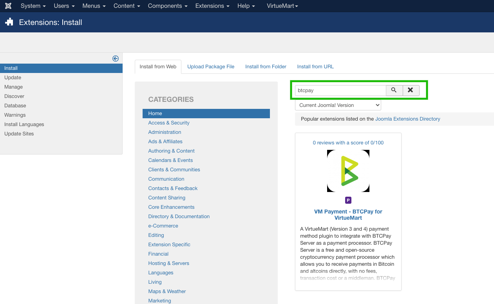

### 1.2 Pakua na usakinishe programu-jalizi kutoka JED au GitHub

1. Pakua programu-jalizi ya hivi karibuni ya BTCPay kutoka [Github](https://github.com/btcpayserver/joomla-virtuemart/releases) au [JED](https://extensions.joomla.org/extension/vm-payment-btcpay-for-virtuemart/)
2. Menyu: Extensions -> Manage -> Install
3. Kwenye kichupo cha "Upload Package File" pakia `btcpayvm.zip`

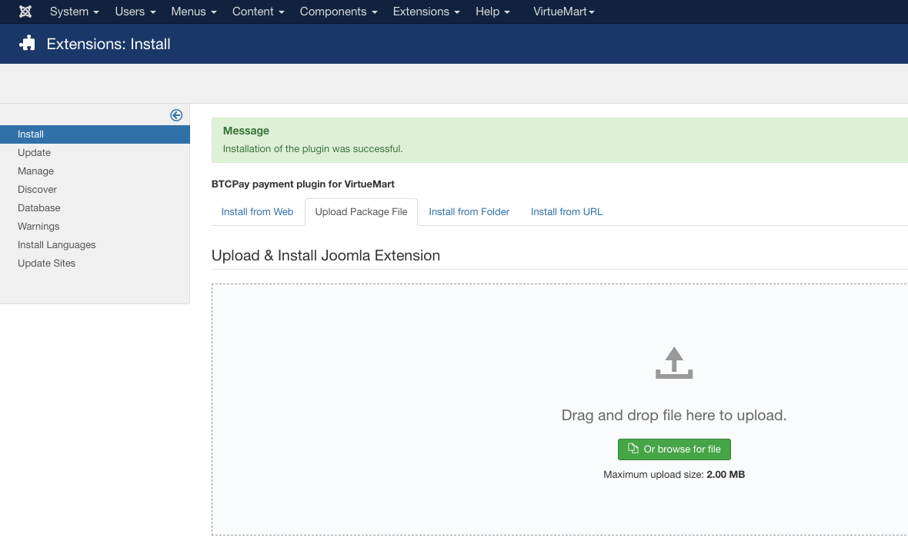

### 1.3 Wezesha programu-jalizi

1. Menyu: Extensions -> Plugins
2. Tafuta "btcpay"
3. Kwenye safu ya "Status" bonyeza duara jekundu ili kuwezesha programu-jalizi

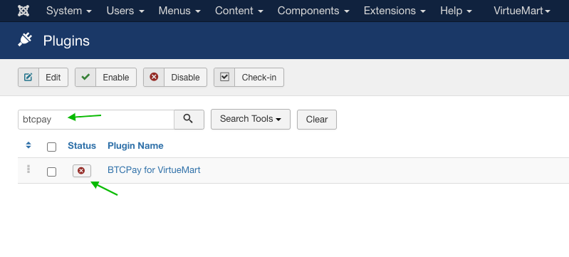

## 2. Kuunganisha VirtueMart na BTCPay Server

Programu-jalizi ya BTCPay ya Virtuemart ni **daraja kati ya BTCPay Server yako (kichakataji malipo) na duka lako la biashara ya mtandaoni**.
Haijalishi kama unatumia suluhisho la kujisimamia mwenyewe au la mtu wa tatu, mchakato wa muunganisho ni sawa.

### 2.1 Ongeza lango la malipo la BTCPay katika VirtueMart

1. Menyu: VirtueMart -> Payment Methods
2. Bonyeza kitufe **[New]**
   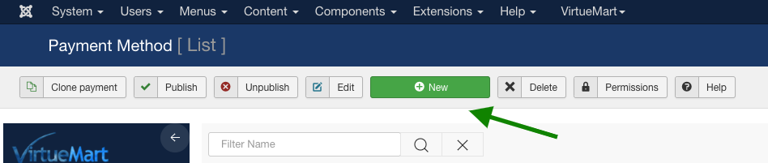
3. Sanidi njia ya malipo kulingana na mahitaji yako. Hakikisha kwenye orodha kunjuzi ya "Payment Method" umechagua "BTCPay for VirtueMart" na njia ya malipo imechapishwa 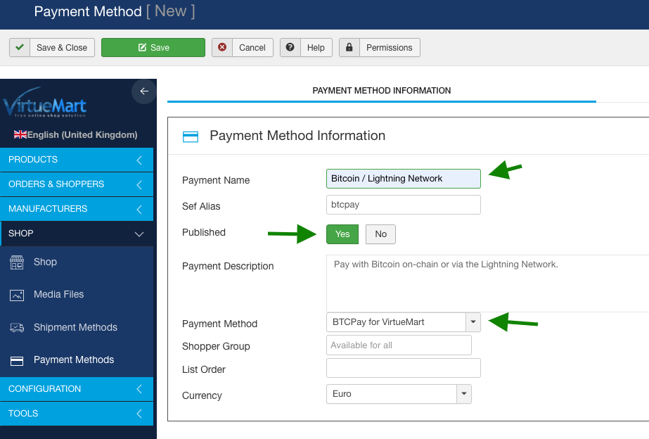
4. Bonyeza kitufe cha **[Save]** (meza ya programu-jalizi itaundwa)

Sasa unaweza kubadilisha kwenda kwenye kichupo cha "Configuration" ambapo tunaweza kuunganisha kwenye kielelezo chetu cha BTCPay Server. Kwanza tunahitaji kuunda ufunguo wa API.

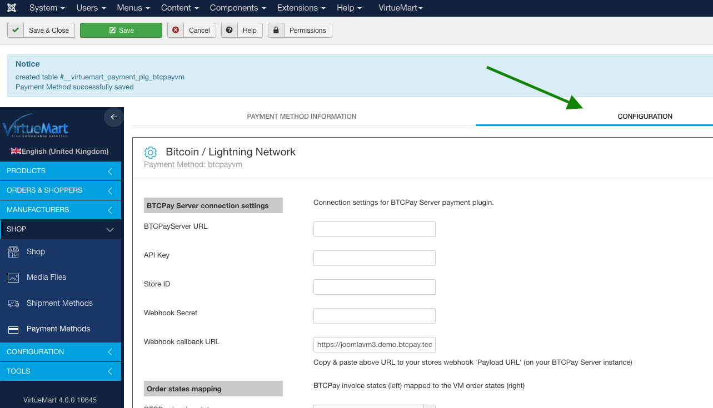

### 2.2 Unda ufunguo wa API na usanidi ruhusa

Kwenye kielelezo cha BTCPay Server:

1. Bonyeza _[Account]_
2. Bonyeza _[Manage Account]_
   
3. Nenda kwenye kichupo cha _"API Keys"_
4. Bonyeza _[Generate Key]_ ili kuchagua ruhusa.
   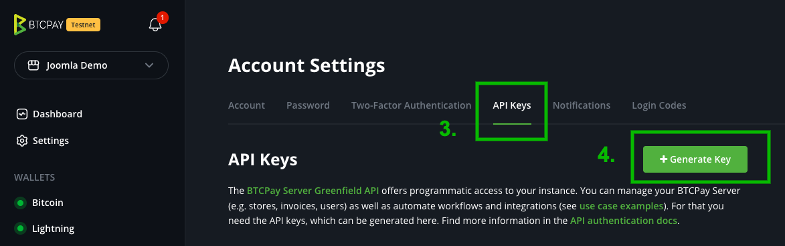
5. Ongeza lebo. **Muhimu:** bonyeza kiungo cha _"Select specific stores"_ kwa ruhusa zifuatazo: `View invoices`, `Create invoice`, `Modify invoices`, `Modify stores webhooks`, `View your stores` na uchague duka mahususi ulilounda kwa tovuti yako ya VirtueMart. Inapaswa kuonekana kama hivi wakati kila kitu kimewekwa:
   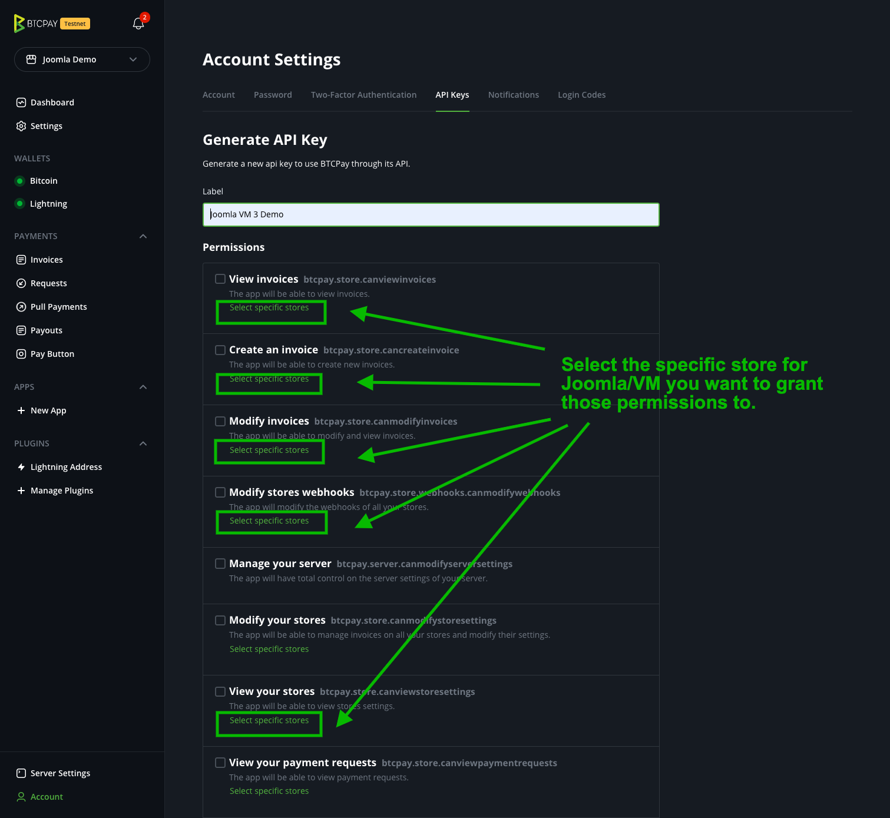
6. Bonyeza _[Generate API Key]_
   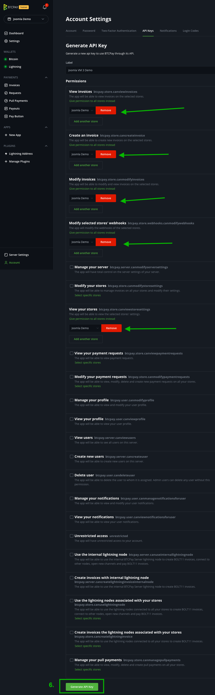
7. Nakili Ufunguo wa API uliozalishwa kwenye fomu yako ya _VirtueMart BTCPay Payment Method Settings_
   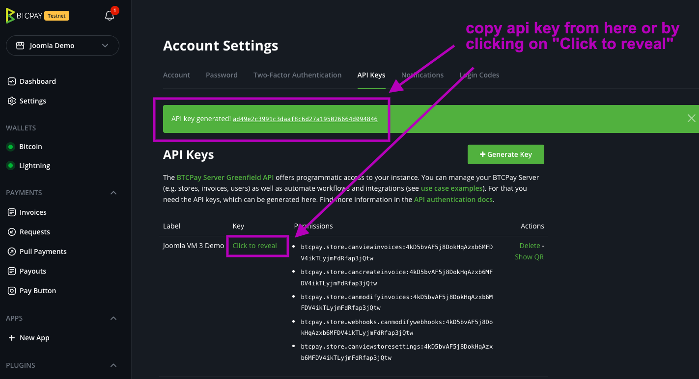
8. Nenda kwenye Mipangilio na unakili kitambulisho cha duka (store ID) kwenye fomu yako ya _VirtueMart BTCPay Payment Method Settings_
   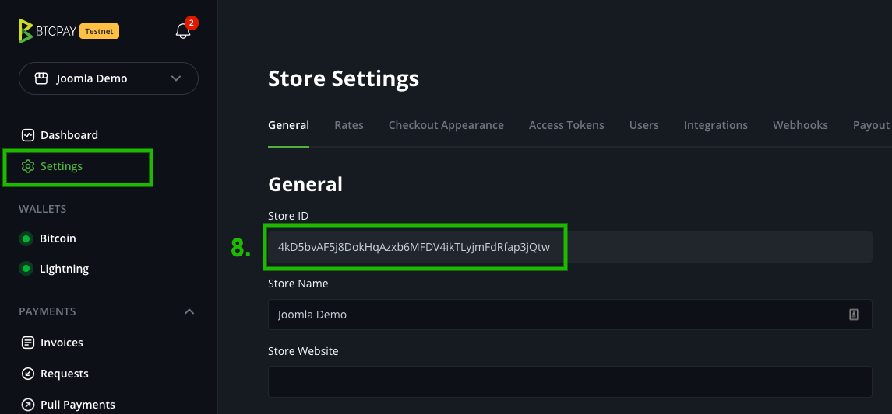
9. Kwenye fomu ya _VirtueMart BTCPay Payment Method Settings_ hakikisha **BTPCay Server URL**, **API Key** na **Store ID** zimewekwa na ubonyeze **[Save]**
   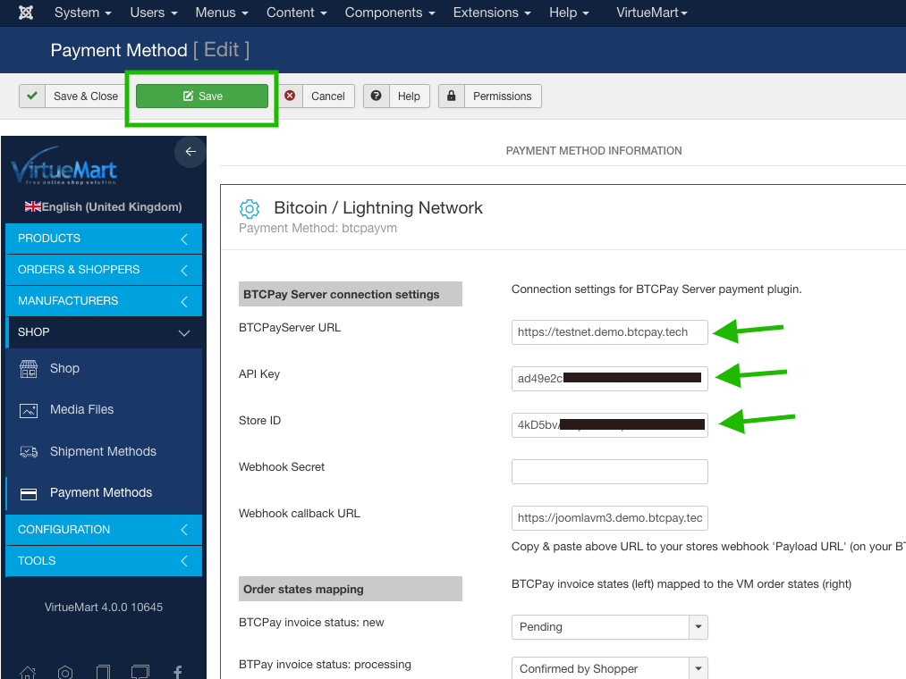

### 2.3 Unda webhook kwenye BTCPay Server

Kusanidi webhook ni muhimu ili duka lako lipate masasisho ya mabadiliko ya hali ya ankara kutoka BTCPay Server.

1. Kwenye kielelezo cha BTCPay Server nenda kwenye mipangilio ya duka lako, kichupo cha **[Webhooks]**, bonyeza **[Create Webhook]**
   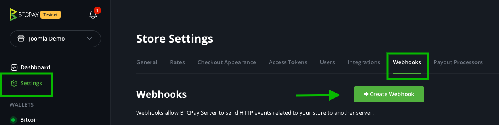
2. Kutoka _VirtueMart BTCPay Payment Method Settings_ nakili **Webhook callback URL** kwenye mipangilio ya webhook **Payload URL**.
   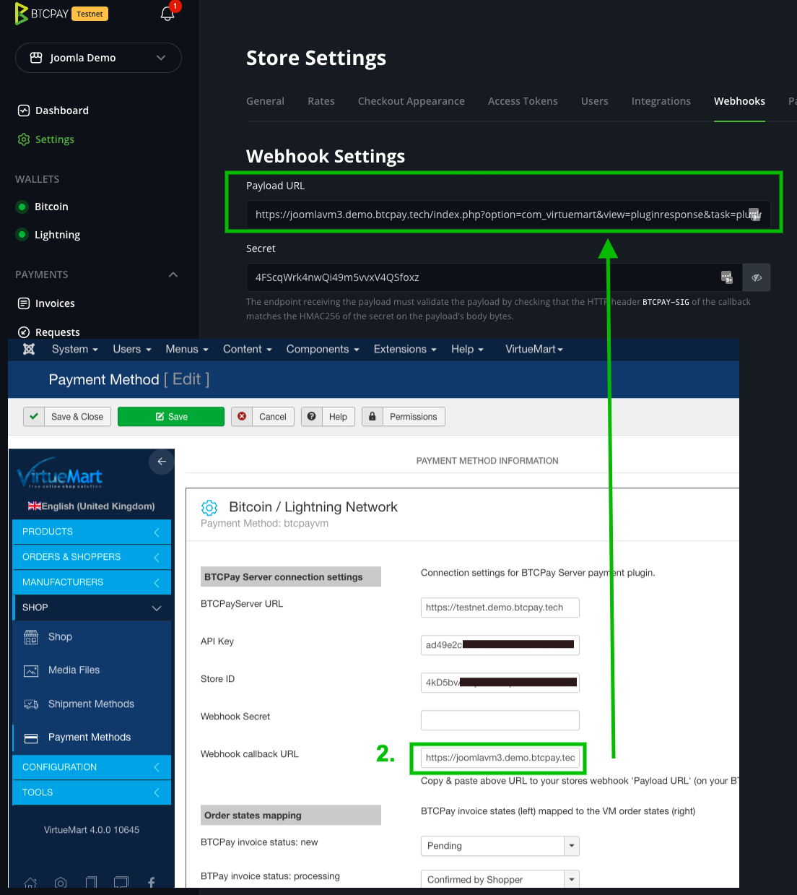
3. Kwenye mipangilio ya webhook bonyeza jicho ili kufichua siri ya webhook. Nakili siri hiyo kwenye fomu yako ya _VirtueMart BTCPay Payment Method Settings_ sehemu ya **Webhook Secret** na **[Save]** usanidi wa VirtueMart tena.
   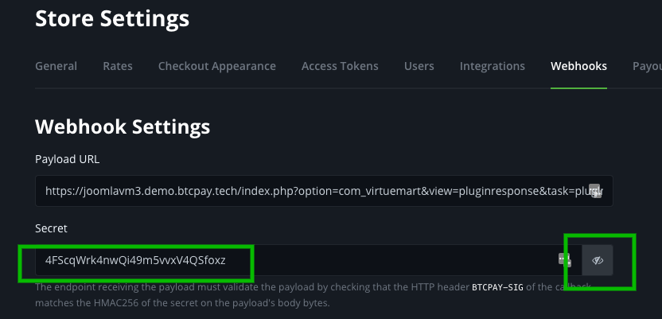
   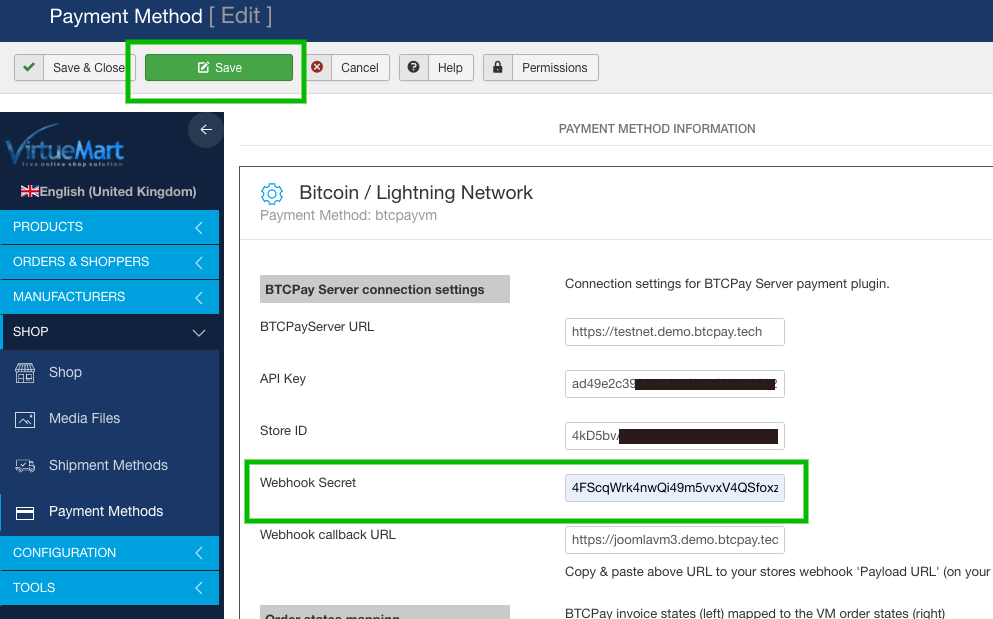

4. Rudi kwenye mipangilio ya webhook, wezesha **Automatic redelivery** na ubonyeze **[Add webhook]** ili kuhifadhi webhook.
   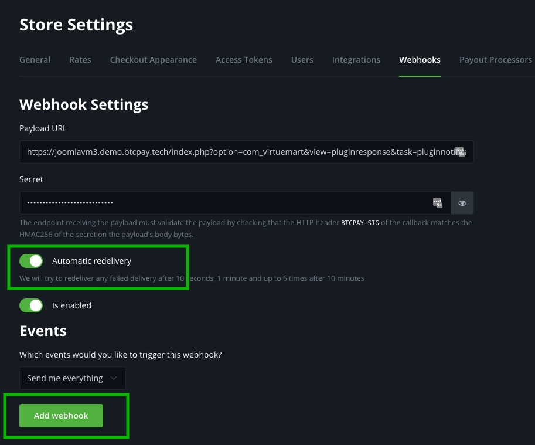

## 3. Jaribu malipo

Kila kitu kiko tayari sasa. Fanya ununuzi mdogo wa majaribio na uhakikishe hali ya agizo inasasishwa kulingana na hali ya ankara ya BTCPay. Kwenye maelezo ya ankara ya BTCPay Server unaweza kuona ikiwa matukio ya webhook yalichomwa kwa mafanikio.

## Kubinafsisha mipangilio ya njia ya malipo ya BTCPay ya VirtueMart

Mipangilio yako ya njia ya malipo ya BTCPay ya VirtueMart inaweza kupatikana katika menyu: VirtueMart -> Payment Methods. Bonyeza njia ya malipo ya aina "btcpayvm" uliyounda.

### Sehemu: Mipangilio ya muunganisho wa BTCPay Server

Hii ndiyo sehemu muhimu zaidi ya usanidi. Data iliyoingizwa hapa itaunganisha duka lako la VirtueMart na duka lako mwenza lililosanidiwa kwenye BTCPay Server.

**BTCPay Server URL**

URL kwenye kielelezo chako cha BTCPay Server, ikijumuisha itifaki k.m. `https://btcpay.yourdomain.com`.

**API Key**

Ufunguo wako wa API wa BTCPay kama ilivyotajwa [hapa](#22-unda-ufunguo-wa-api-na-usanidi-ruhusa).

**Store ID**

Kitambulisho cha duka cha duka lako la BTCPay Server. Kinapatikana kwenye ukurasa wa mipangilio ya duka. Angalia 8. [hapa](#22-unda-ufunguo-wa-api-na-usanidi-ruhusa)

**Webhook Secret**

Siri ya webhook ambayo ilizalishwa wakati wa uundaji wa webhook, angalia [hapa](#23-unda-webhook-kwenye-btcpay-server)

**Webhook callback URL**

Sehemu hii inazalishwa kiotomatiki na programu-jalizi na inakusaidia wakati wa kuunda webhook kwenye BTCPay Server. Ina kitambulisho cha njia ya malipo kinachohitajika na vigezo ili kuruhusu uchakataji wa callback.

### Sehemu: Uchoraji wa hali za agizo (Order states mapping)

Unaweza kurekebisha uchoraji wa hali ya ankara ya BTCPay Server kwenda kwenye hali za agizo za VirtueMart. Kushoto ni hali za ankara na kulia ni hali za agizo. Chaguo-msingi hapa zinapaswa kuwa nzuri kwenda - lakini ikihitajika, unaweza kuzibadilisha.

Hali za agizo za VirtueMart zimeelezwa [hapa](https://docs.virtuemart.net/manual/configuration-menu/order-statuses.html)

Hali za ankara za BTCPay server zimeelezwa [hapa](https://docs.btcpayserver.org/Invoices/#invoice-statuses)

### Sehemu: Vizuizi (Restrictions)

Hizi ni vizuizi vilivyotolewa na VirtueMart unavyovijua kutoka kwa programu-jalizi zingine za malipo. Unaweza kuzuia kiasi au nchi ambapo njia ya malipo itapatikana.

### Sehemu: Punguzo na ada (Discounts and fees)

Hizi ni mipangilio iliyotolewa na VirtueMart. Unaweza kuweka ada, marejesho ya pesa na kutumia sheria za kodi au kuweka nembo maalum kwa njia ya malipo.

## Utatuzi wa Matatizo

### Hitilafu wakati wa malipo "There was an error processing the payment on BTCPay Server. Please try again and contact us if the problem persists."

Hii inamaanisha kuna kitu kilienda vibaya na kuunda ankara kwenye BTCPay Server. Inaweza kuwa ufunguo wa api usio sahihi, kitambulisho cha duka au hitilafu nyingine ya mawasiliano. Unaweza kupata kumbukumbu za hitilafu za programu-jalizi katika saraka ifuatayo: `administrator/logs` hapo utakuwa na faili moja au zaidi ziitwazo `btcpayvm.X.log.php` ambapo `X` ni nambari k.m. `btcpayvm.0.log.php` utapata hitilafu zilizo na muhuri wa muda hapo ambazo zinapaswa kukupa kidokezo cha tatizo ni nini.

**Mfano**:

> 2022-05-24 21:10:50 ERROR Error during POST to https://btcpay.example.com/api/v1/stores/4kD5bvAF5j8DokHqAzxb6MFDV4ikabcdefghijklm/invoices. Got response (401): {&quot;code&quot;:&quot;unauthenticated&quot;,&quot;message&quot;:&quot;Authentication is required for accessing this endpoint&quot;}

- Hii inamaanisha kuna hitilafu fulani ya uthibitishaji. Inawezekana ufunguo wako wa api hauna ruhusa ya kuunda ankara kwa duka hilo. Hakikisha ulitoa ufunguo wa api ruhusa sahihi na ulitoa kwenye duka sahihi na pia uliingiza hilo katika fomu ya usanidi wa malipo ya VirtueMart.

- Sababu nyingine inaweza kuwa kwamba unatumia ufunguo wa api wa urithi (legacy). Vifunguo vya api vya urithi vinapatikana katika mipangilio ya duka -> Access Tokens. Lakini unahitaji kuunda ufunguo wa api wa akaunti ambao unapatikana katika Account -> Manage Account -> kichupo cha "API Keys". Angalia sehemu ya [2.2 Unda ufunguo wa API na usanidi ruhusa](#22-unda-ufunguo-wa-api-na-usanidi-ruhusa).

## Hali za agizo hazisasishi ingawa ankara imelipwa

Tafadhali angalia maelezo ya ankara yako ikiwa kulikuwa na hitilafu zozote wakati wa kutuma ombi la webhook. Baadhi ya watoa huduma za mwenyeji, usanidi wa firewall au programu-jalizi za usalama za Joomla zinaweza kuzuia maombi ya POST kwenye tovuti yako ambayo husababisha hali ya http ya "403 forbidden".

Unaweza kuangalia na kuthibitisha mwenyewe ikiwa kuna kitu kinachozuia maombi kwenye tovuti yako kwa moja ya njia hizi mbili:

**1. Nakili URL ya callback ya webhook**
nenda kwenye _VirtueMart BTCPay Payment Method Settings_ yako na unakili "Webhook callback URL". k.m. `https://EXAMPLE.COM/index.php?option=com_virtuemart&view=pluginresponse&task=pluginnotification&pm=2`

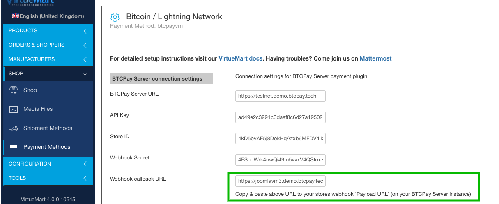

**2.1 Angalia kwa kutumia mstari wa amri (Linux au MacOS):**

```
curl -vX POST -H "Content-Type: application/json" \
    -d '{"data": "test"}' WEBHOOK_CALLBACK_URL
```

(badilisha `WEBHOOK_CALLBACK_URL` na ile iliyonakiliwa hapo juu)

Matokeo:

```
.... snip ....
* upload completely sent off: 16 out of 16 bytes
< HTTP/1.1 403 Forbidden
< access-control-allow-origin: *
< Content-Type: application/json; charset=UTF-8
< X-Cloud-Trace-Context: 4f07d5b2e5c2f05949d04421a8e2dd6a
< Date: Thu, 17 Feb 2022 10:06:50 GMT
< Server: Google Frontend
< Content-Length: 26
```

Ukiona mstari huo "HTTP/1.1 403 Forbidden" au "HTTP/2 403" basi kuna kitu kinachozuia data iliyotumwa kwenye tovuti yako ya VirtueMart. Unapaswa kuuliza mtoa huduma wako wa mwenyeji au kuhakikisha hakuna firewall au programu-jalizi inayozuia maombi.

**2.2 Angalia kwa kutumia huduma ya mtandaoni (ikiwa huna mstari wa amri unaopatikana:**

- Nenda kwenye [https://reqbin.com/post-online](https://reqbin.com/post-online)
- 1. Weka url yako ya callback (iliyonakiliwa kutoka hatua ya 1 hapo juu): `https://EXAMPLE.COM/index.php?option=com_virtuemart&view=pluginresponse&task=pluginnotification&pm=2`
     (badilisha URL hii na url ya callback ya webhook kutoka hatua ya 1)
- Hakikisha "POST" imechaguliwa
- 2. Bonyeza [Send]


Ukiona "**Status 403 (Forbidden)**" basi maombi ya POST kwenye tovuti yako yamezuiwa kwa sababu fulani. Unapaswa kuuliza mtoa huduma wako wa mwenyeji au kuhakikisha hakuna firewall au programu-jalizi inayozuia maombi. Ukiona msimbo wowote mwingine wa hali (200, 500, ...) tatizo la firewall linaonekana kutohusika, pengine unahitaji kuchunguza zaidi.

## Nina matatizo na matumizi ya programu-jalizi au maswali mengine yanayohusiana

Jisikie huru kujiunga na kituo chetu cha usaidizi kupitia [https://chat.btcpayserver.org/](https://chat.btcpayserver.org/) ikiwa unahitaji usaidizi au una maswali yoyote zaidi.
