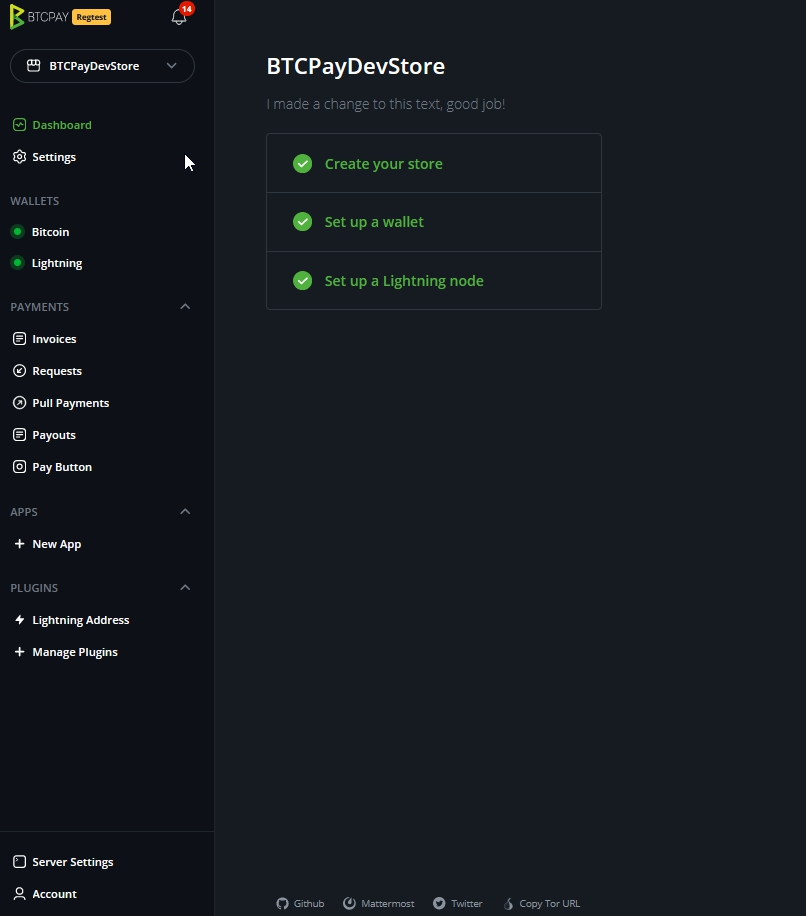
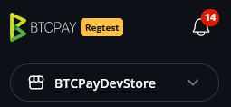
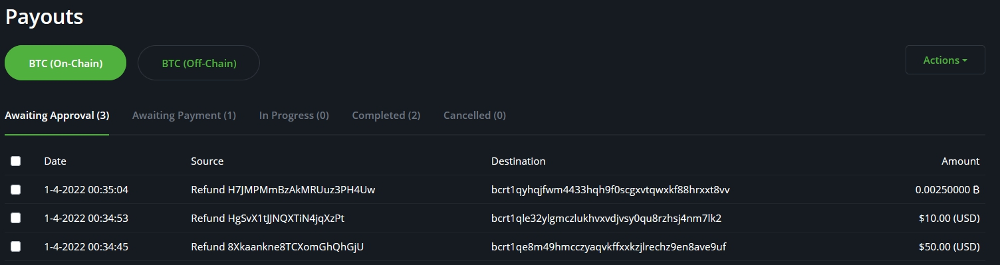
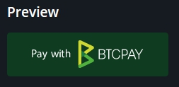

# Maelekezo ya BTCPay Server

Ukurasa huu unakuelekeza kwenye **kiolesura cha mtumiaji cha BTCPay** na unaonyesha jinsi ya kusogeza kwenye chaguo tofauti kwenye menyu ya kando.

Angalia video hapa chini kwa muhtasari wa mwingiliano wa vipengele.

Baada ya kuunda akaunti kwenye kielelezo cha BTCPay Server kinachosimamiwa na wewe au mtu wa tatu, utakaribishwa na nyumba mpya ya duka lako au, kama tunavyoiita, `dashboard` yako.

Mipangilio mingi kwenye menyu ya kushoto inahusishwa na duka unalolichagua hapo juu. Sehemu zingine zinaonekana tu wakati akaunti yako ina ruhusa ya kuzitumia. Kwa mfano, `Server Settings` inapatikana kwa mameneja wa seva pekee, na plugins binafsi zinaonekana tu baada ya kuwezeshwa kwa duka lako au kusakinishwa kwenye seva.

- [Arifa](Walkthrough.md#notifications)
- [Dashboard](Dashboard.md)
- [Mipangilio](Walkthrough.md#store) **mipangilio ya duka**
- [Pochi](Walkthrough.md#wallets)
  - Bitcoin
  - Lightning
- [Malipo](Walkthrough.md#payments)
  - Ankaran
  - Maombi
  - Malipo ya Kuvuta (Pull Payments)
  - Malipo (Payouts)
  - Kitufe cha Malipo
- [Plugins](Walkthrough.md#plugins)
  - Sehemu ya Mauzo
  - Ufadhili wa Umma
  - Plugins za ziada
- [Mipangilio ya Seva](Walkthrough.md#server-settings)
- [Akaunti](Walkthrough.md#account)

## Duka

Ndani ya BTCPay, unaweza **kuunda na kusimamia idadi isiyo na kikomo ya maduka**. Kila duka lina pochi yake, linaweza kutumia plugins kama vile Sehemu ya Mauzo, Kitufe cha Malipo, na Ufadhili wa Umma, au kupewa pamoja na programu ya biashara ya mtandaoni kupitia mojawapo ya ushirikiano unaopatikana. Mameneja hawana udhibiti juu ya funguo za siri za maduka ya watumiaji wengine. Kwa maelezo zaidi, angalia [FAQ ya Maduka](/FAQ/Stores/).

- Mipangilio ya duka - Sanidi mipangilio ya jumla ya malipo na ubinafsishe uzoefu wa malipo kwa wateja wako.
- Bei - Weka chanzo cha [bei za kubadilisha sarafu ya crypto hadi fiat kwa duka lako](/FAQ/Stores/#how-to-change-the-exchange-rate-provider-for-invoices).
- Uzoefu wa malipo - [Binafsisha muonekano](/FAQ/ServerSettings/#how-to-modify-the-checkout-page) wa ukurasa wa malipo, chagua sarafu ya kimsingi, n.k.
- Tokensi za Ufikiaji - Tokensi za [kupewa pamoja duka na ushirikiano](/sw/WhatsNext/#connecting-your-btcpay-store-to-your-e-commerce-platform)
- Watumiaji - Wawezeshe watumiaji wengine walio na akaunti iliyosajiliwa ya BTCPay kufikia duka lako kama mgeni au mmiliki.
- Kitufe cha Malipo - [Unda kitufe cha malipo](/sw/WhatsNext/#creating-the-pay-button) unachoweza kupachika kwa urahisi kwenye tovuti yako.

## Arifa

Arifa humjulisha mtumiaji kuwa **tukio limetokea kwenye kielelezo cha BTCPay Server**.
Tukio kama hilo linaweza kuwa malipo yaliyopokelewa au yaliyoshindikana, ankara ya malipo ya ziada au ya upungufu, toleo jipya la BTCPay na mengine.

Kwa kubonyeza ikoni hiyo, unaweza kufikia ukurasa wa `Notifications`, ambapo unaweza kuona arifa za zamani na kuzifuta kwa hiari.
Jifunze zaidi kuhusu arifa zote za BTCPay [hapa](/Notifications/).

## Dashboard

Katika dashboard utaona salio la pochi ya duka, muhtasari wa ankara, na mwonekano wa haraka wa manufaa yako bora ya ufadhili wa umma.
Kuna vigae 5 vikuu kwenye Dashboard.

- Mwonekano wa haraka wa salio la pochi
- Shughuli za miamala na malipo
- Miamala ya hivi karibuni
- Ankaran za hivi karibuni
- Ufadhili wa umma unaoendelea

Endelea kusoma zaidi kuhusu [Dashboard](/Dashboard/)

## Pochi

### Bitcoin

Kulingana na njia ngapi tofauti za malipo ulizozisanidi, ndani ya kichupo cha pochi utaona pochi kwa kila moja ya njia za malipo. Pochi ya Bitcoin kwenye mnyororo hukuruhusu kusimamia fedha zinazopokelewa. Pochi ya BTCPay ina vipengele vingi na ina sifa za faragha zilizojengewa ndani. Zaidi ya hayo, ina ushirikiano kamili wa pochi ya maunzi, kwa hivyo unaweza kusimamia fedha zako na pochi ya maunzi inayoendana moja kwa moja kutoka kwenye BTCPay yako. Angalia [ukurasa wa pochi](/Wallet/) kwa maelezo zaidi.

Vipengele vya Pochi ya ndani ya BTCPay ni:

- Miamala - Hii inaonyesha historia yako yote ya miamala.
- Tuma - Inatumika kutuma fedha nje ya pochi yako (lazima isainiwe na kuthibitishwa kwenye pochi ya maunzi inayoendana).
- Pokea - Inatumika kutengeneza anwani mpya kwa mikono.
- Skana upya - Inakuwezesha kuagiza pochi za zamani kwenye BTCPay kwa urahisi zaidi na kutatua suala la kikomo cha pengo ambalo pochi nyingi za nje nazo.
- Malipo ya Kuvuta - Inatumika kuunda na kusimamia Pull Payments. Kwa maelezo zaidi kuhusu kipengele hiki, angalia [Pull Payments](/PullPayments/).
- Malipo - Inatumika kusimamia maombi ya Pull Payment.
- PSBT - Inatumika kusaini miamala ya saini-nyingi kupitia kiwango cha PSBT.
- Mipangilio - Inatumika kuona na kurekebisha mipangilio ya ziada ya pochi yako.

### Lightning

Zaidi ya hayo, tunapendekeza kuongeza pochi ya lightning. Kuna chaguo mbili, unganisha [nodi ya ndani](/LightningNetwork/#connecting-your-internal-lightning-node-in-btcpay) au unganisha [nodi ya nje ya Lightning](/LightningNetwork/).
Ukishamaliza, kazi ya pochi ya Lightning inakuwa hai.

Kwa maelezo zaidi, angalia [Pochi](/Wallet/) au [FAQ ya Pochi](/FAQ/Wallet/)

## Malipo

### Ankaran

**Ankaran** zote za akaunti yako ya mtumiaji zitaonyeshwa hapa. Unaweza kuchuja ankara kwa hali, oda, bidhaa, duka au tarehe. Unaweza pia kuunda ankara kwa mikono. Ankaran hupangwa kwa tarehe kutoka mpya hadi zamani. Unaweza kufungua ankara binafsi kwa maelezo zaidi. Tumia kitufe cha kupeleka nje (export) kuhifadhi faili (.json au .csv).

Kwa maelezo zaidi, angalia [Ankaran](/Invoices/)

### Maombi ya Malipo

Kila duka linaweza kuwa na idadi isiyo na kikomo ya **maombi ya malipo** yanayoonyeshwa hapa. Maombi ya malipo ni ankara za nguvu zinazoweza kushirikiwa kwa URL na kulipwa wakati wowote kwa kutumia bei za sasa za kubadilisha BTC. Hapa unaweza kuhariri na kuona maombi yako ya malipo. Unaweza kuona maelezo ya ankara kwa maombi yako ya malipo na kunakili maombi ya malipo yaliyoundwa hapo awali.

Kwa maelezo zaidi, angalia [Maombi ya Malipo](/PaymentRequests/)

### Malipo ya Kuvuta

Kipengele cha [malipo ya kuvuta](/PullPayments/) tunachokiona kinafaa kwa chaguo kama
huduma ya usajili, ulipaji pesa, uwekaji ankara wa muda kwa wafanyakazi huru, ufadhili, au huduma ya uondoaji.

Kwa maelezo ya kina ya dhana, tafadhali tembelea [Pull Payments](/PullPayments/)

### Malipo

Mtazamo wa `payouts` unatoa muhtasari wa malipo ya kuvuta ya sasa na hali yake.
Kama, kwa mfano, ulipaji pesa umetolewa na mlalamishi amekubali, hii itaonekana katika Payouts.
Hapa utapata chaguo za Kuidhinisha (Approve) na kutuma moja kwa moja kiasi kilichoombwa cha ulipaji pesa.
Wakati kuna matukio mengi ya Pull payments, haya yanaweza kuchaguliwa na kuunganishwa kwa kutuma kwa wakati mmoja.
Katika toleo la baadaye, tunatarajia hili kuwa na chaguo za upangaji.

### Kitufe cha Malipo

Unaweza kupachika kitufe cha mchango au malipo kwenye HTML ya tovuti yako kwa urahisi.
Mteja au mtembeleaji anapobofya kitufe hicho, BTCPay huonyesha ukurasa wa malipo na ankara kwa ajili yao.

Kwa maelezo zaidi, angalia [Unda kitufe cha malipo](/Apps/#payment-button)

## Plugins

Plugins hupanua [matumizi](/sw/UseCase/) ya BTCPay Server zaidi ya malipo ya ankara ya kimsingi. Sehemu za kuanzia za kimsingi ni:

- [Sehemu ya Mauzo](/Apps/#point-of-sale-app) - pokea malipo kutoka duka la kimwili, tukio, au jedwali la michango.
- [Ufadhili wa Umma](/Apps/#crowdfunding-app) - endesha kampeni ya ufadhili ya kujisimamia ambako michango inaenda moja kwa moja kwenye pochi yako.
- [Kitufe cha Malipo](/Apps/#payment-button) - pachika kitufe cha malipo kwenye tovuti yako.

Plugins zinazopatikana zinaonekana kwenye menyu ya kando zinaposakinishwa na kuwezeshwa. Mameneja wa seva wanaweza kusimamia upatikanaji wa plugins kutoka `Server Settings > Plugins`; watumiaji wa kawaida wanaweza kuomba mameneja wao wa seva kuwezesha plugin kwa duka lao. Unaweza pia kuchunguza plugins za ziada kwenye [Saraka ya Plugins za BTCPay Server](https://plugin-builder.btcpayserver.org/public/plugins/).

Kwa maelezo zaidi, angalia [Ushirikiano](/CustomIntegration/)
au mojawapo ya plugins zilizojengwa tayari kama vile:

- [WooCommerce](/WooCommerce/)
- [Shopify](/Shopify/)
- [Magento](/Magento/)
- [Prestashop](/PrestaShop/)

## Mipangilio ya seva

**Mipangilio ya seva** ni kitu ambacho mameneja wa seva pekee wanaweza kufikia. Kama unatumia seva ya mtu mwingine, hutaona Mipangilio ya Seva. Ndani ya mipangilio, unaweza kufanya kazi kama kudhibiti watumiaji, bei, kusasisha seva, n.k. Kwa maelezo zaidi, angalia [FAQ ya Mipangilio ya Seva](/FAQ/ServerSettings/)

- Watumiaji - Ongeza, ondoa au simamia watumiaji wa BTCPay Server yako.
- Seva ya barua pepe - Kama ungependa watumiaji kuthibitisha anwani za barua pepe zao wanaposajili, sanidi mipangilio ya SMTP.
- Sera - Wezesha au zima usajili wa watumiaji, uthibitisho wa barua pepe, uorodheshaji wa injini ya utafutaji, na chaguo za kuonyesha za umma.
- Huduma - gRPC, REST, na RTL hutumika kuunganisha nodi yako ya LN, funguo za SSH, na uhifadhi wa faili zilizopakiwa.
- Mandhari - Binafsisha muonekano wa mbele wa BTCPay Server yako.
- Matengenezo - Sasisha BTCPay yako kwa toleo jipya na usafishe BTCPay yako kwa kufuta picha za docker zisizotumika.
- Kumbukumbu (Logs) - Huonyesha kumbukumbu za hivi karibuni za BTCPay Server.
- Faili - Baada ya kuwezesha kipengele hiki katika Huduma, pakia faili za nje na uzifikie kupitia URL.

## Akaunti

Simamia akaunti yako ya BTCPay Server.
Badilisha chochote kinachohusiana na akaunti yako ya mtumiaji.
Sanidi Uthibitisho wa Sababu Mbili na usimamie funguo za API.

## Jiunge Na Jamii ya BTCPay

Kama una maswali, jaribu kutafuta kwenye [sehemu yetu ya FAQ](/FAQ/) au jiunge na [Jamii ya BTCPay](/Community/) na ushiriki maswali na mawazo ya uboreshaji.

Kama wewe ni mtengenezaji, angalia mwongozo wa [Local Development](/Development/LocalDevelopment/) na utusaidie kwa [matatizo yoyote wazi](https://github.com/btcpayserver/btcpayserver/issues) kwenye Github. Kama ungependa kuchangia BTCPay kwa njia nyingine, angalia [Mwongozo wa Kuchangia](/Contribute/) kwa mawazo.