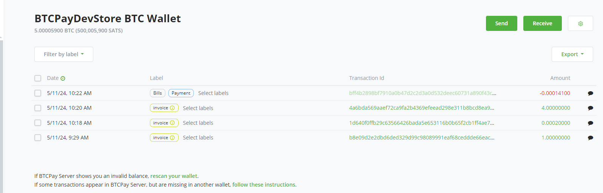
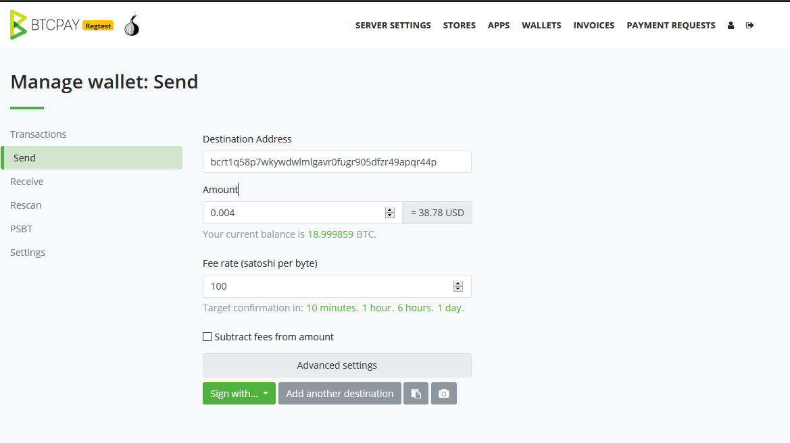
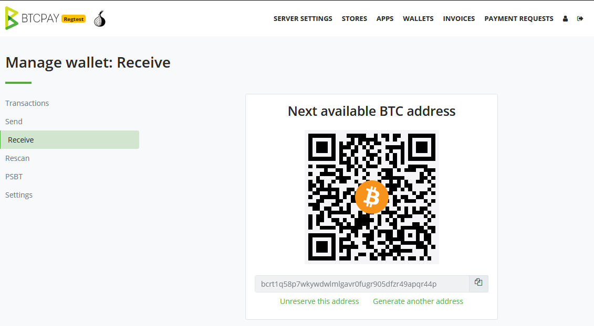
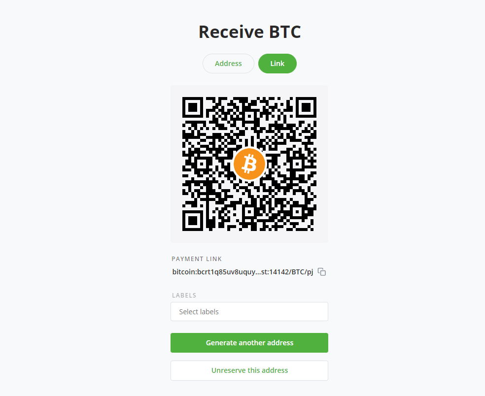
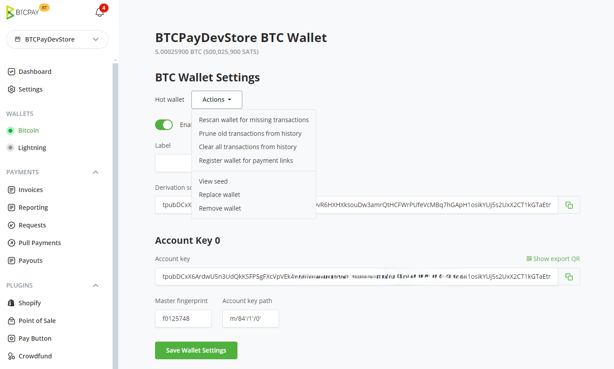
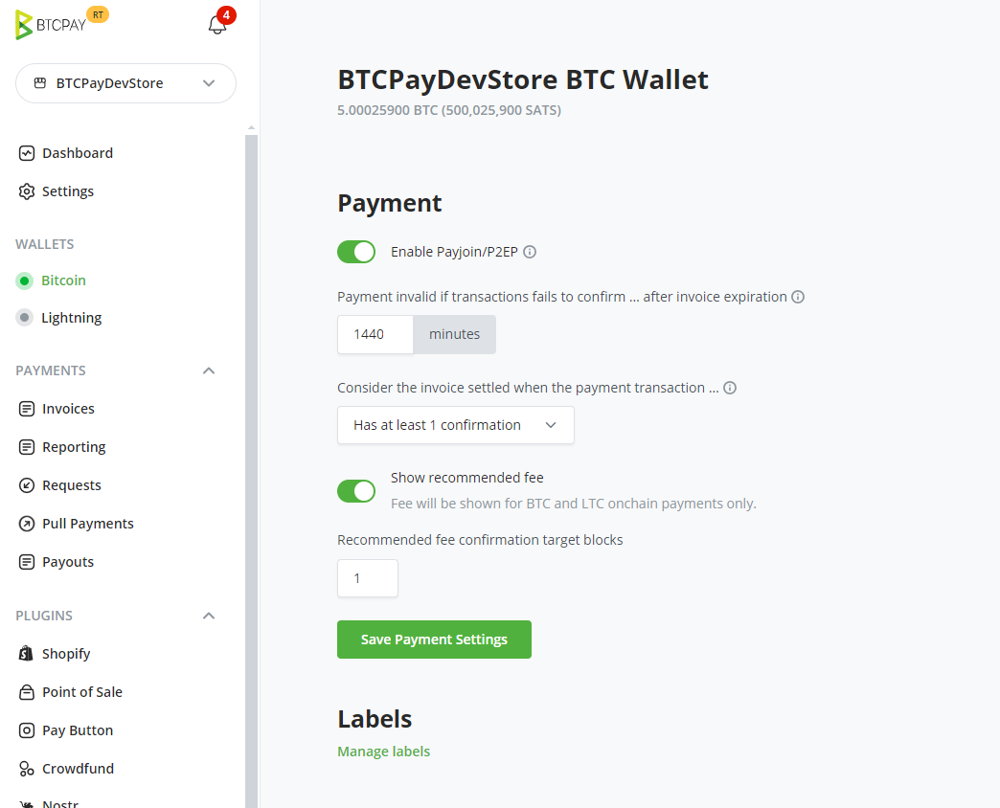
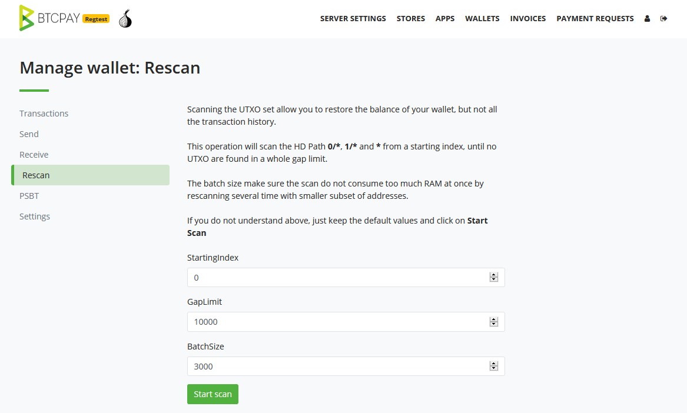
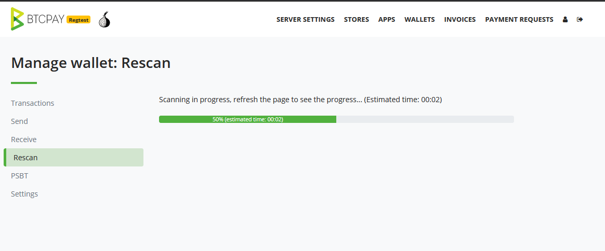
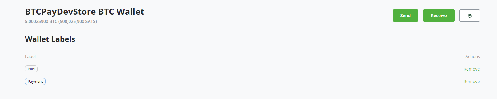

# Pochi ya BTCPay Server

BTCPay Server ina pochi iliyojengwa ndani, **inayotegemea nodi kamili** inayowezesha usimamizi rahisi wa fedha.

Kila sarafu ya kidigitali iliyosanidiwa kwenye [duka](/sw/CreateStore.md) ina pochi tofauti inayoonyeshwa chini ya Pochi kwenye upau wa menyu.

## Vipengele vya pochi

Pochi ina vipengele vifuatavyo:

1. Miamala
2. Tuma
3. Pokea
4. Chambua upya
5. Malipo ya kuvuta
6. Malipo
7. PSBT
8. Mipangilio

### Miamala

Muhtasari wa **miamala** inayoingia (kijani), inayotoka (nyekundu) na isiyothibitishwa (iliyofifishwa) iliyoonyeshwa pamoja na muda na salio, zilizopangwa kwa tarehe. Unaweza kubofya kitambulisho cha muamala ili kuona maelezo ya muamala kwenye kichunguzi cha bloku.

#### Lebo za Muamala

Jedwali hapa chini linaorodhesha **lebo mbalimbali za muamala zinazotumiwa na BTCPay**.

| Aina ya Muamala | Maelezo                                          |
| ---------------- | ---------------------------------------------------- |
| app              | Malipo yalipokelewa kupitia ankara iliyoundwa na programu  |
| invoice          | Malipo yalipokelewa kupitia ankara              |
| payjoin          | Haijalipwa, muda wa ankara bado haujaisha        |
| payjoin-exposed  | UTXO ilifunuliwa kupitia pendekezo la ankara ya payjoin |
| payment-request  | Malipo yalipokelewa kupitia ombi la malipo       |
| payout           | Malipo yalitumwa kupitia malipo au kurejeshewa          |

Unaweza pia kuunda [lebo na maoni yako mwenyewe ya muamala](./FAQ/Wallet.md#how-to-add-custom-labels-and-comments-to-transactions).

### Tuma

Kazi ya Tuma inaruhusu **kutumia fedha kutoka kwenye pochi ya BTCPay**.

#### Mipangilio ya Juu

Vipengele fulani vya pochi vinapatikana kwa watumiaji wa juu. Washa `Advanced Settings` ndani ya kichupo cha `Send` ili kuviona mapema.

##### Usitengeneze mabadiliko ya UTXO

Chaguo hili linapatikana katika `Advanced mode` ya ukurasa wa `Send`.

Ni kipengele cha kuimarisha faragha ambacho ni muhimu unapotuma fedha kwenda pochi yako nyingine au kwenda kwenye soko la kubadilishana fedha. Inahakikisha kwamba hakuna UTXO ya mabadiliko inayoundwa kwa **kukusanya juu** kiasi kilichotumwa.

Kwa chaguo-msingi kipengele hiki kimezimwa, kwa hivyo ikiwa pochi yako ina UTXO ya `1.1 BTC` na unaweka kiasi sawa na `1.0 BTC`, muamala utakaopatikana utakuwa na matokeo mawili `0.1 BTC` ya mabadiliko, na `1.0 BTC` kwenda kwenye lengwa lako.

Uchambuzi wa blockchain utaelewa kwamba `0.1 BTC` hizo za mabadiliko zinamilikiwa na chombo kile kile kilichokuwa na `1.1 BTC` hapo awali, na kinaweza kufuatilia ununuzi wa baadaye unaofanya kwa muundo ule ule.

Kwa kuwezesha kipengele hiki, pochi ya BTCPay Server itakusanya juu kiasi kilichotumwa hadi `1.1 BTC` hivi kwamba hakuna matokeo ya mabadiliko yatakayotumwa kurudi kwako.

Onyo: Licha ya ukweli, katika mfano huu, kwamba uliweka `1.0` kwenye sehemu ya kiasi, kiasi kitakachotumwa kikweli kwenda kwenye lengwa lako kitakuwa `1.1 BTC`.

##### Vipengele vingine

###### Kuchambua QR kwa kamera

Chaguo la kuchambua kwenye pochi (ikoni ya kamera kwenye skrini ya kutuma) hukuwezesha **kutumia kamera ya kifaa chako kuchambua msimbo wa QR ulio na anwani au kiungo cha malipo cha BIP21**. Inajaza kiotomatiki taarifa za kutuma ili usilazimike kunakili kwa mkono anwani na kiasi.

###### Bandika anwani ya BIP21

Chaguo hili **linafumbua kiungo cha malipo cha BIP21**. Ni muhimu unapojaribu kulipa ankara ya [Payjoin](./Payjoin.md).

#### Kutia sahihi muamala (kutumia)

Ili kutumia fedha, unahitajika **kutia sahihi** muamala. Miamala inaweza kutiwa sahihi kwa:

- Pochi ya Maunzi
- Pochi inayoauni PSBT
- Funguo ya faragha ya HD au mbegu ya kurejesha
- Pochi Moto

##### Kutia sahihi kwa Funguo ya Faragha ya HD au mbegu ya kikumbusho

Ikiwa ulisanidi [pochi iliyopo na BTCPay Server yako](/sw/WalletSetup.md#use-an-existing-wallet), unaweza kutumia fedha kwa kuingiza funguo yako ya faragha kwenye sehemu husika. Hakikisha umeweka `AccountKeyPath` sahihi katika Pochi > Mipangilio vinginevyo hutaweza kutumia.

##### Kutia sahihi kwa pochi inayoauni PSBT

PSBT (**Partially Signed Bitcoin Transactions**) ni muundo wa kubadilishana kwa miamala ya Bitcoin ambayo bado haijatiwa sahihi kikamilifu.
PSBT inaauniwa katika BTCPay Server na inaweza kutiwa sahihi kwa pochi za maunzi na programu zinazoendana.

Ujenzi wa muamala wa Bitcoin uliotiwa sahihi kikamilifu unapitia hatua zifuatazo:

- PSBT inajengwa ikiwa na pembejeo na matokeo fulani, lakini bila sahihi
- PSBT iliyosafirishwa nje inaweza kuingizwa ndani na pochi inayoauni muundo huu
- Data ya muamala inaweza kuchunguzwa na kutiwa sahihi kwa kutumia pochi
- Faili ya PSBT iliyotiwa sahihi inasafirishwa nje kutoka kwenye pochi na kuingizwa ndani na BTCPay Server
- BTCPay Server inazalisha muamala wa mwisho wa Bitcoin
- Unathibitisha matokeo na kutangaza kwenye mtandao

Mafunzo:
- [Tia sahihi muamala wa PSBT kwa Pochi ya Maunzi ya ColdCard](./ColdCardWallet.md#spending-from-btcpay-server-wallet-with-coldcard-psbt) (ikiwa nje ya mtandao kabisa/air-gapped)
- [Unda na utie sahihi muamala wa PSBT kwa pochi ya Sparrow](./Sign-PSBT-with-sparrow-wallet.md)

##### Kutia sahihi kwa pochi ya maunzi

BTCPay Server ina usaidizi wa pochi ya maunzi uliojengwa ndani unaokuwezesha **kutumia pochi yako ya maunzi na BTCPay**, bila kuvujisha taarifa kwa programu au seva za wahusika wengine.

[Angalia maelekezo](/sw/HardwareWalletIntegration.md) juu ya jinsi ya kusanidi na kutia sahihi kwa [pochi ya maunzi inayoendana](https://github.com/bitcoin-core/HWI#device-support).

##### Kutia sahihi kwa pochi moto

Ikiwa [uliuunda pochi mpya](/sw/CreateWallet.md) wakati wa kusanidi duka lako na kuwezesha kama [pochi moto](/sw/CreateWallet.md#hot-wallet), tangu toleo la 1.2.0, tumeongeza chaguo kwamba [pochi moto](/sw/CreateWallet.md#hot-wallet) inapoundwa, itatumia kiotomatiki mbegu iliyohifadhiwa kwenye seva kutia sahihi.

:::danger
Kutumia kipengele cha pochi moto kunakuja na athari za kiusalama; tafadhali hakikisha umesoma na kuzielewa katika [Nyaraka za Pochi Moto](/sw/CreateWallet.md#security-implications)
:::

### Pokea

Kichupo cha Pokea **kinazalisha anwani isiyotumika ambayo inaweza kutumika kupokea malipo**. Vivyo hivyo kunaweza kufanywa kwa kuzalisha ankara (Ankara > Unda ankara mpya).

### Malipo ya Kuvuta

Kipengele hiki kinakupa uwezo wa **kuunda Malipo ya Kuvuta**, ili mtu wa nje aweze kuomba `kuvuta` fedha kutoka kwenye pochi yako.

Kwa maelezo zaidi, angalia [Malipo ya Kuvuta](/sw/PullPayments.md).

### Malipo

Sehemu hii inakuwezesha kusimamia Malipo ya Kuvuta na inakupa uwezo wa **kukubali au kukataa malipo yaliyoombwa na watu wa nje**.

Kwa maelezo zaidi, angalia [Malipo](/sw/PullPayments.md#approve-and-pay-a-payout).

### Mipangilio

Katika kona ya juu kulia ya `pochi` yako utapata `mipangilio ya pochi`.
Katika kichupo cha mipangilio ya pochi unaweza kurekebisha mipangilio fulani. Ikiwa umesanidi pochi yako kwa [kuunda pochi mpya](/sw/CreateWallet.md) au kutumia pochi iliyopo kupitia [uingizaji wa pochi ya maunzi](/sw/HardwareWalletIntegration.md), mipangilio hii itakuwa imesanidiwa mapema.
Hapa, una chaguo za kufanya vitendo kadhaa kwenye pochi yako, kama vile Kuchambua upya pochi kwa miamala iliyopotea, kupogoa miamala ya zamani, kuona kifungu cha pochi, kuondoa pochi miongoni mwa vipengele.

Ikiwa uliongeza kwa mkono funguo ya umma iliyopanuliwa kutoka kwenye pochi ya nje, utahitaji kurekebisha `AccountKeyPath` ambayo unaweza kuipata kwenye pochi yako ya nje, kwa mfano `m/84'/0'/0'` ili kuweza kutumia kutoka kwenye Pochi ya BTCPay.

Katika `mipangilio ya pochi` utapata pia `sera ya kasi` kwa duka husika.
Kuna mipangilio 2 kuu chini ya `Payment`, [Malipo batili ikiwa muamala utashindwa kuthibitishwa kwa ... baada ya kuunda ankara](./FAQ/Stores.md#payment-invalid-if-transactions-fails-to-confirm--minutes-after-invoice-expiration) na [Fikiria ankara imethibitishwa wakati muamala wa malipo...](./FAQ/Stores/#consider-the-invoice-confirmed-when-the-payment-transaction). Ya mwisho inakuwezesha kuweka idadi ya uthibitisho unaohitajika kutambuliwa kama uliokamilika.

### Chambua upya

Uchambuzi upya unategemea `scantxoutset` ya Bitcoin Core 0.17.0 **kuchambua hali ya sasa ya blockchain** (inayoitwa Seti ya UTXO) kwa sarafu zinazomilikiwa na mpango wa utohozi uliosanidiwa.

Uchambuzi upya wa pochi unatatua matatizo mawili muhimu kwa watumiaji wa BTCPay:

1. [Kikomo cha pengo](./FAQ/Wallet.md#missing-payments-in-my-software-or-hardware-wallet)
2. Kuingiza pochi iliyotumika hapo awali

**Kikomo cha pengo**: Pochi nyingi kwa kawaida huwa na kikomo cha pengo cha anwani kimewekwa kuwa 20. Hii inamaanisha kwamba ikiwa mfanyabiashara atapokea ankara 21 au zaidi mfululizo ambazo hazijalipwa, pochi hizo zinaonyesha salio lisilo sahihi na baadhi ya miamala inaweza isionekane.

**Kuingiza pochi**: Watumiaji wanapoongeza mpango wa utohozi wa pochi iliyokuwa na miamala zamani (pochi iliyotumika hapo awali), BTCPay haitaweza kuonyesha salio na miamala ya zamani.

Uchambuzi upya ni kipengele kinachotatua matatizo yote haya mawili. Mara uchambuzi utakapokamilika, BTCPay Server itaonyesha salio sahihi, pamoja na miamala ya zamani ya pochi.

Uchambuzi upya wa pochi unahitaji ufikiaji wa nodi kamili ambayo inamaanisha kwamba kazi hii inapatikana tu kwa wamiliki wa seva.

Watumiaji wanaotumia mwenyeji wa mhusika wa tatu wanapaswa kutumia fungou ya xpub iliyozalishwa upya na pia kutumia pochi ya nje kama Electrum ambayo inawaruhusu kuongeza kikomo cha pengo.

### Lebo

Chini ya mipangilio ya pochi yako, unaweza kusimamia `lebo yako maalum ya muamala`.

Kubofya kiungo kutakupeleka kwenye ukurasa ambapo unaweza kuona lebo zote maalum zinazohusiana na muamala wote. Unaweza kuondoa lebo zozote au zote maalum iwapo una ruhusa inayohitajika.

