# Kuunganisha Pochi ya Wasabi kwenye BTCPay Server

Hati hii inaonyesha jinsi ya **kuunganisha [Pochi ya Wasabi](https://wasabiwallet.io/) kwenye BTCPay Server**.

1. Unda Duka katika BTCPay Server
2. [Pakua Pochi ya Wasabi](https://wasabiwallet.io/#download)
3. [Sakinisha Pochi ya Wasabi](https://docs.wasabiwallet.io/using-wasabi/InstallPackage.html)

## Usanidi wa Pochi ya Wasabi

Baada ya usakinishaji, fungua Pochi ya Wasabi kwa kubonyeza ikoni kwenye eneo-kazi lako.

## Usanidi wa Haraka

1. Unda pochi mpya katika Wasabi
2. Katika Wasabi, nakili **Extended Account Public Key** kwenye `Wallet Info`.
3. Katika BTCPay Server, Store > Settings > Wallet > Setup > Connect an existing wallet > Enter extended public key
4. Katika Wasabi, zalisha anwani mpya kwenye `Receive`.
5. Thibitisha kwamba anwani katika Wasabi na BTCPay Server zinalingana.

## Hatua kwa Hatua

Wakati wa uzinduzi wa kwanza wa Wasabi, kidirisha cha `Add wallet` kitafunguliwa kiotomatiki.
Chagua `Create new wallet` kuzalisha pochi mpya.

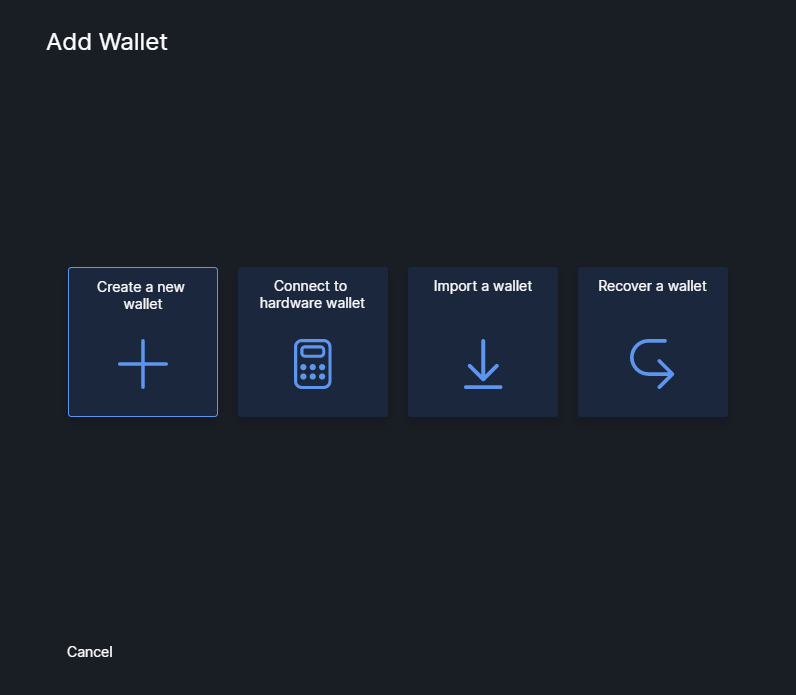

Ipe pochi yako jina, kwa mfano `BTCPay Server Wallet`.

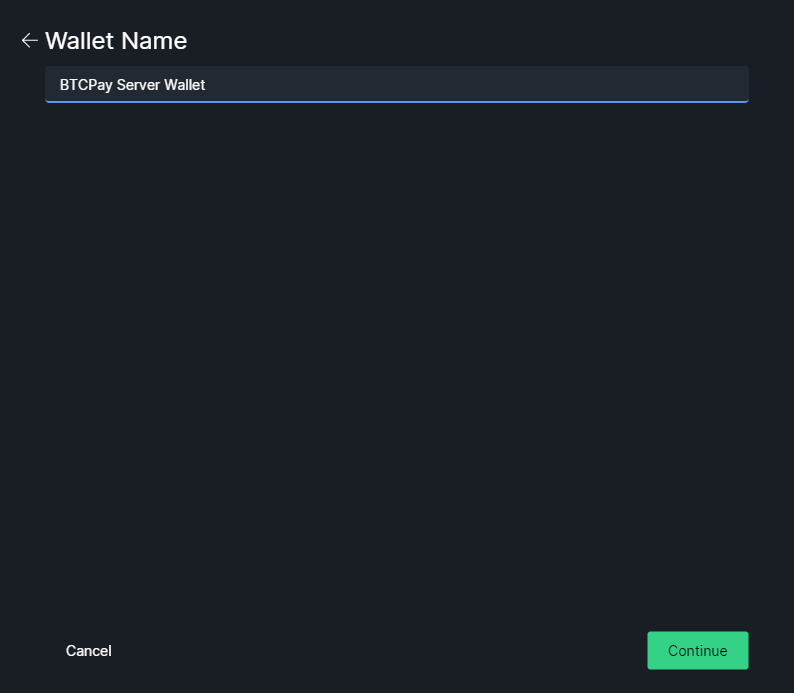

Andika Maneno ya Urejeshaji kwa mpangilio sahihi.

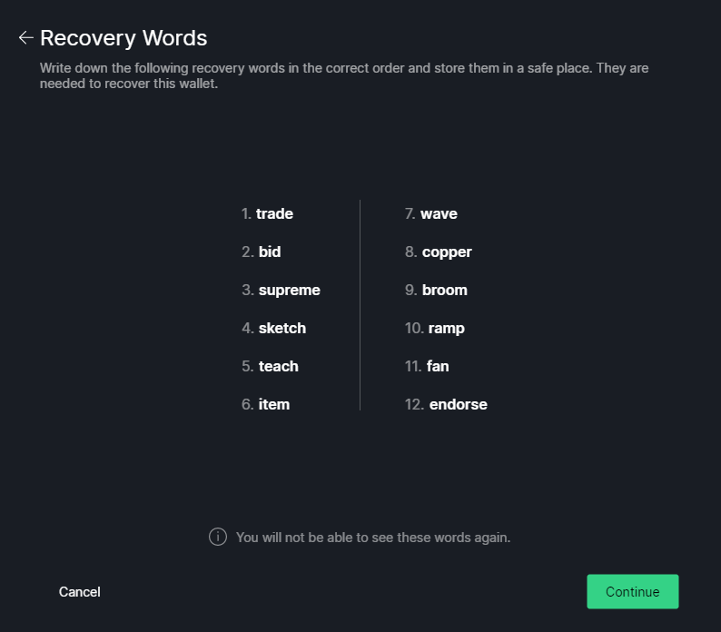

Thibitisha 3 kati ya maneno 12 ya urejeshaji.
Huu ni mtihani wa haraka kuhakikisha kwamba umeyaandika.

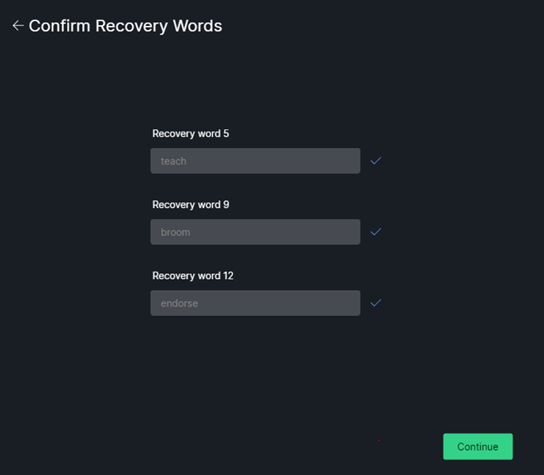

Ongeza nenosiri.
Nenosiri linatumika kama kaulisiri na haliwezi kubadilishwa baadaye.

:::danger Maneno ya Urejeshaji NA nenosiri vyote vinahitajika kurejesha pochi hii
Hakikisha una hifadhi rudufu ya maneno ya urejeshaji na nenosiri.
:::

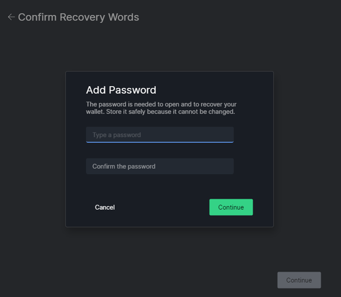

**KUMBUKA MUHIMU:** Andika maneno yako ya urejeshaji kwa mpangilio unavyoyaona kwenye skrini. Yaandike kwenye karatasi na uyahifadhi mahali salama. Chukua muda wako na angalia kila neno mara tatu. Usihifadhi mbegu yako katika muundo wa kidijitali (picha, hati ya maandishi). Yeyote mwenye ufikiaji wa mbegu yako na nenosiri lako anaweza kufikia fedha zako. Hakikisha una hifadhi rudufu sahihi ya Maneno ya Urejeshaji na Nenosiri.

Chagua Mkakati wa Coinjoin.
Wasabi inachanganya fedha zako zote kiotomatiki.
Ikiwa hutaki kuchanganya fedha zako, unaweza kuzima coinjoin baadaye kwa kuzima `Automatically start coinjoin` katika Mipangilio ya Coinjoin.
Kwa maelezo zaidi kuhusu coinjoins na mipangilio inayohusiana, tafadhali rejea [Nyaraka za Wasabi](https://docs.wasabiwallet.io/).

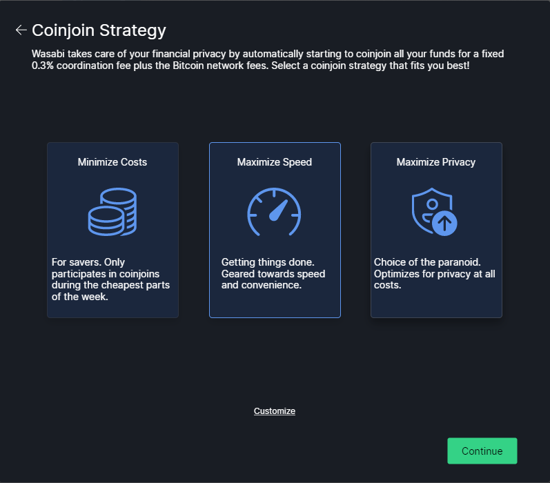

Pochi imeundwa kwa mafanikio!

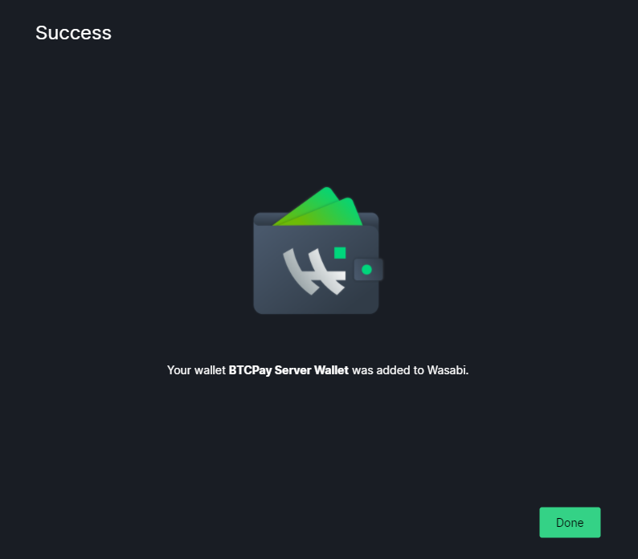

Fungua pochi mpya kwa kuingiza nenosiri.

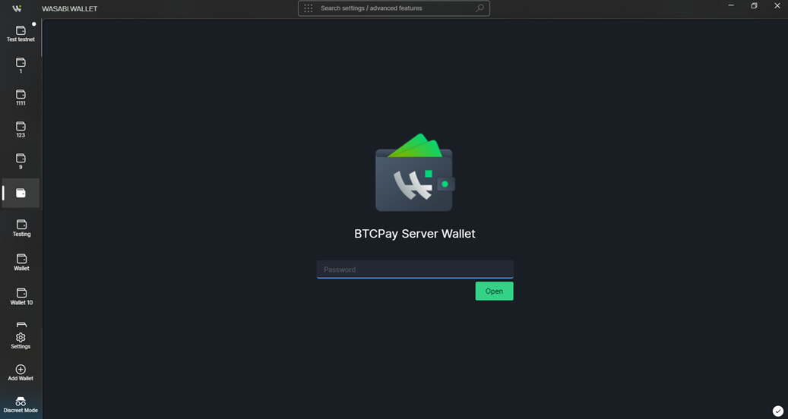

Pochi itapakia (inaweza kuchukua muda).
Baada ya upakiaji kumalizika na pochi kufunguliwa, bonyeza nukta 3 kwenye kona ya juu kulia kwenda kwenye `Wallet Info`.

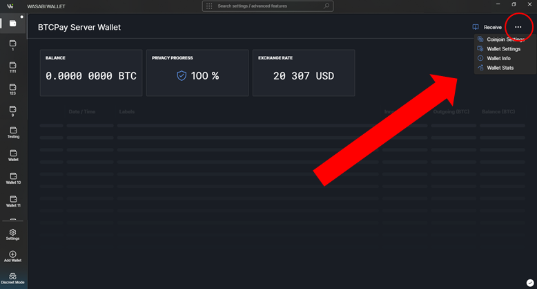

Chagua na **nakili** `Extended Account Public Key`. Huu ni ufunguo wa **umma** ambao BTCPay itatumia kutoa anwani. Huu hauwezi kutumiwa kutoa funguo za siri na kutumia bitcoin.

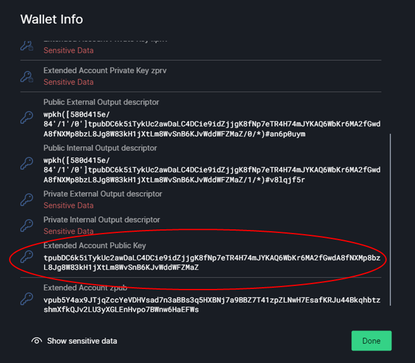

## Sanidi pochi ya duka

1. Kwa kuchukulia uliunda duka na sasa uko kwenye Dashibodi. Bonyeza `Set up a wallet`

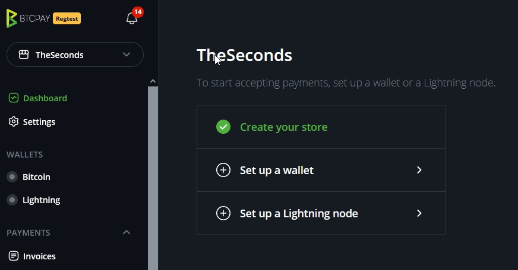

2. Kwa vile ulifanya hatua zilizo hapo juu katika wasabi, Bonyeza `Connect an existing wallet`

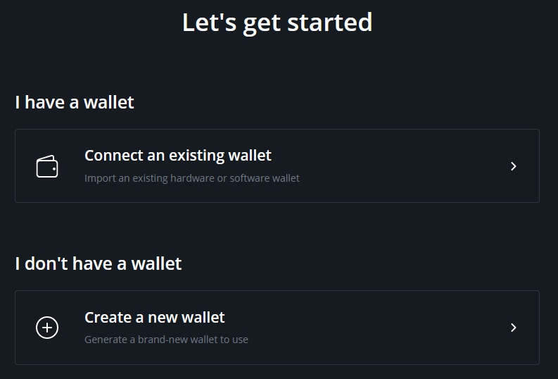

3. Chagua `Enter extended public key`

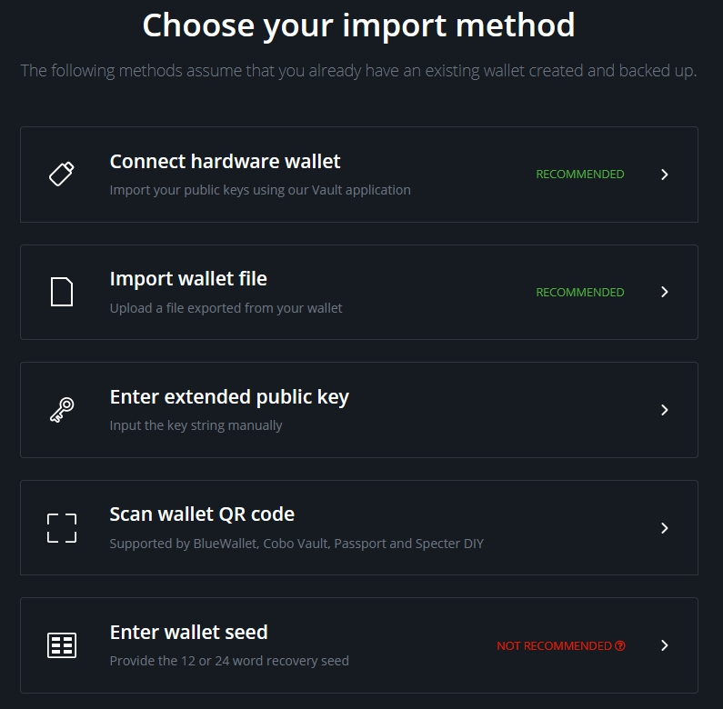

4. Bandika `Extended Account Public Key` kwenye uga wa mpango wa utoleaji kama ilivyo, bila kuongeza kitu chochote kingine na ubonyeze `Continue`

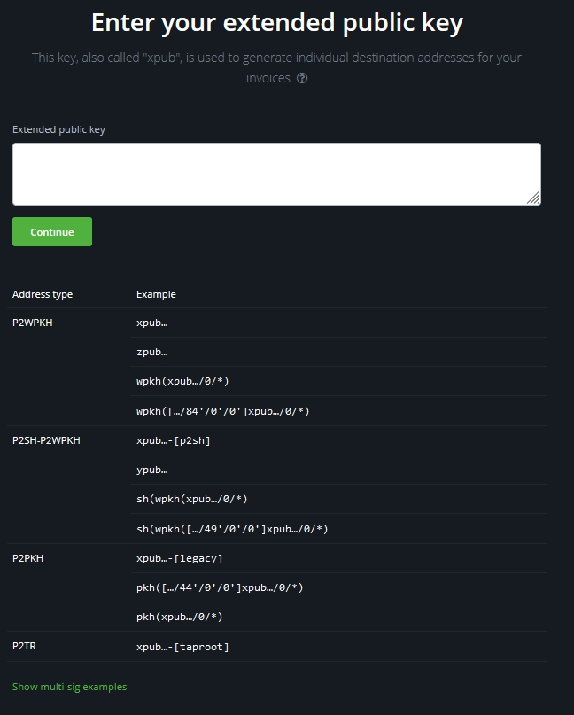

5. Rudi kwenye Pochi ya Wasabi. Bonyeza kitufe cha `Receive` na uzalishe anwani mpya.

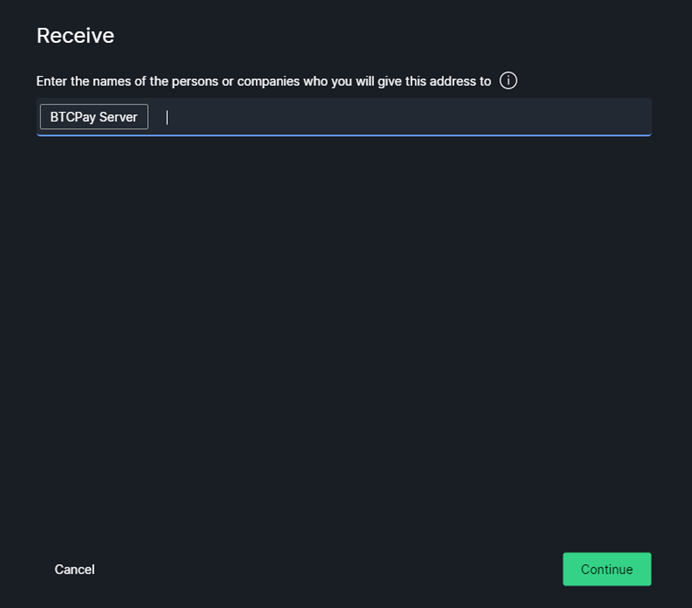

6. Linganisha anwani unayoona katika Pochi ya Wasabi na anwani zilizoonyeshwa katika BTCPay Server. Pata ulinganifu, endelea (`continue`).

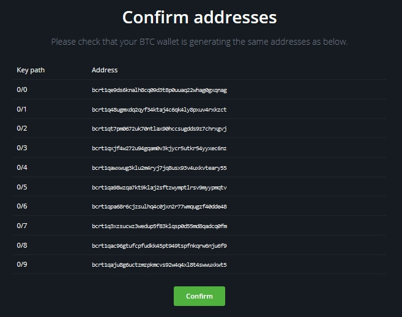

7. Ulipopata ulinganifu, pochi yako sasa imeunganishwa kwenye duka.

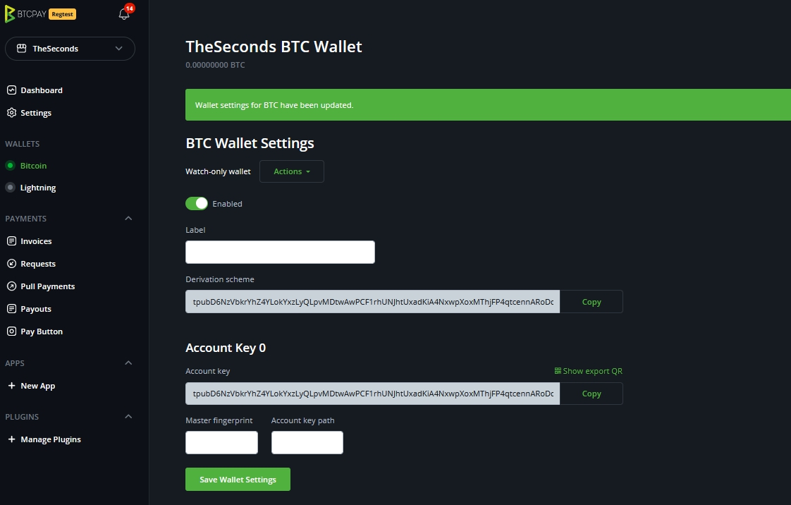

### Kuunganisha Wasabi kwenye Nodi Kamili ya BTCPay Server (Ikiwa unajipangishia BTCPay)

Baada ya pochi kuunganishwa, inapendekezwa sana **kuunganisha Pochi ya Wasabi kwenye nodi yako kamili katika BTCPay**. Mchakato ni rahisi lakini unaweza kufanywa tu ikiwa unajipangishia BTCPay na umeingia kama `Admin`. Tor lazima iwashwe katika BTCPay (imewashwa kwa chaguo-msingi). Mchakato huu unaboresha faragha hata zaidi.

Katika BTCPay, nenda Server Settings > Services > **Full node P2P > See Information**.
Kwenye ukurasa wa BTCP-P2P, bonyeza `Show Confidential QR Code`. Chini ya Msimbo wa QR, kuna kiungo `See QR Code information by clicking here`, kwa hivyo bonyeza kiungo ili kufunua mfuatano wako. Nakili mfuatano lakini ondoa sehemu ya `bitcoin-p2p://`.

Katika Wasabi, nenda kwenye kichupo cha Bitcoin kwenye `Settings` na ubandike kituo cha mwisho katika `Bitcoin P2P Endpoint`.

Anzisha upya Wasabi ili kutumia mabadiliko.

### Kusanidi Kikomo cha Pengo katika Wasabi

Kwenye upau wa utafutaji juu, bonyeza `Wallet Folder`. Hivi karibuni faili ya `json` itaonyeshwa katika folda ndogo. Fungua faili hiyo na kihariri cha maandishi kama notepad.
Tafuta mstari `"MinGapLimit": 21,` na ubadilishe kuwa `"MinGapLimit": 100,` na uhifadhi faili.

Hakuna jibu zuri la kiasi gani unapaswa kuweka kikomo cha pengo. Wafanyabiashara wengi huweka 100-200. Ikiwa wewe ni mfanyabiashara mkubwa mwenye kiasi kikubwa cha miamala, unaweza kujaribu kikomo cha juu zaidi cha pengo.

Kwa maelezo zaidi kuhusu [Kikomo cha Pengo, angalia Maswali Yanayoulizwa Mara kwa Mara](./FAQ/Wallet.md#missing-payments-in-my-software-or-hardware-wallet).

**Pochi ya Wasabi na BTCPay Server sasa zimeunganishwa**. Malipo yoyote yaliyopokelewa kwenye BTCPay yako yataonekana katika Wasabi, ambapo unaweza kuyatumia zaidi au kuyachanganya.
