# Ushirikiano wa WooCommerce

Hati hii inaelezea jinsi ya **kuunganisha BTCPay Server kwenye duka lako la WooCommerce**.
Ikiwa huna duka bado, fuata [makala hii ya hatua kwa hatua](https://web.archive.org/web/20221003083329/https://bitcoinshirt.co/how-to-create-store-accept-bitcoin/5/) ili kuunda moja kutoka mwanzo.

:::tip Kumbuka
Mwongozo huu unahusu programu-jalizi ya BTCPay ya WooCommerce V2. Unaweza kupata maagizo kwa programu-jalizi ya urithi isiyodumishwa tena (kulingana na API ya BitPay) [hapa](https://github.com/btcpayserver/btcpayserver-doc/blob/cba96292ceea9483711ab53c479a98357383f857/docs/WooCommerce.md).
:::

[[toc]]

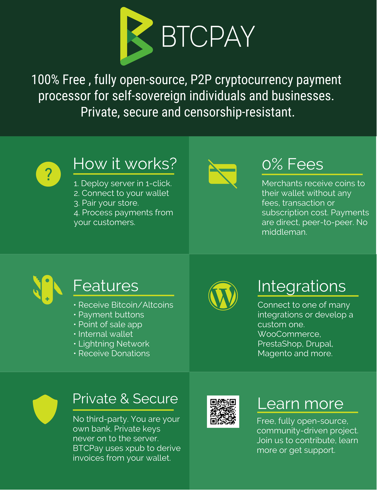

Ili kuunganisha BTCPay Server kwenye duka lililopo la WooCommerce, fuata hatua zifuatazo na/au tazama video hii:

[](https://www.youtube.com/watch?v=ULcocDKZ1Mw)

## Mahitaji

Tafadhali hakikisha kwamba unatimiza mahitaji yafuatayo kabla ya kusakinisha programu-jalizi hii.

- Toleo la PHP 8.0 au jipya zaidi
- Viendelezi vya PHP vya cURL, gd, intl, json, na mbstring vinapatikana
- Tovuti ya WooCommerce ([Maagizo ya usakinishaji](https://woocommerce.com/document/installing-uninstalling-woocommerce/) au [moja kwa moja kwenye BTCPay Server](#kusambaza-woocommerce-kutoka-btcpay-server))
- Una BTCPay Server toleo la 1.3.0 au jipya zaidi, ama [iliyojisimamia mwenyewe](/Deployment/README.md) au [inayosimamiwa na mtu wa tatu](/Deployment/ThirdPartyHosting.md)
- [Una akaunti iliyosajiliwa kwenye kielelezo](./RegisterAccount.md)
- [Una duka la BTCPay kwenye kielelezo](./CreateStore.md)
- [Una pochi iliyounganishwa na duka lako](./WalletSetup.md)

## 1. Sakinisha Programu-jalizi ya BTCPay

Kuna njia tatu za **kupakua programu-jalizi ya BTCPay ya WooCommerce V2**:

- Kutoka ndani ya WordPress kupitia Dashibodi ya Msimamizi (inapendekezwa, angalia hapa chini)
- [Hazina ya WordPress](https://wordpress.org/plugins/btcpay-greenfield-for-woocommerce/)
- [Hazina ya GitHub](https://github.com/btcpayserver/woocommerce-greenfield-plugin/releases)

### 1.1 Sakinisha programu-jalizi kutoka Dashibodi ya Msimamizi wa WordPress (inapendekezwa)

1. WordPress > Plugins > Add New.
2. Katika Utafutaji, andika "BTCPay V2".
3. Sakinisha na amilisha.

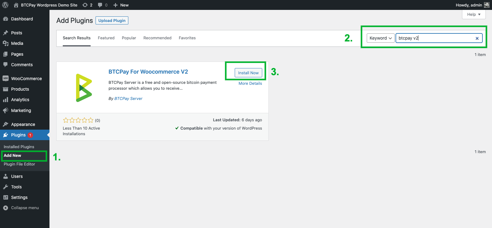

### 1.2 Pakua na usakinishe programu-jalizi kutoka GitHub

[Pakua programu-jalizi ya hivi karibuni ya BTCPay](https://github.com/btcpayserver/woocommerce-greenfield-plugin/releases), ipakie katika umbizo la .zip kwenye tovuti yako ya WordPress na uamilishe.

[](https://www.youtube.com/watch?v=6QcTWHRKZag)

## 2. Kuunganisha WooCommerce na BTCPay Server

Programu-jalizi ya BTCPay ya WooCommerce V2 ni **daraja kati ya BTCPay Server yako (kichakataji malipo) na duka lako la biashara ya mtandaoni**.
Haijalishi kama unatumia suluhisho la kujisimamia mwenyewe au la mtu wa tatu, mchakato wa muunganisho ni sawa.

Unaweza ama kubonyeza kiungo cha arifa kinachosema "**please configure the plugin here**" (angalia picha ya skrini hapa chini), au:

- Nenda kwenye dashibodi ya duka lako.
- WooCommerce > Settings.
- Bonyeza kichupo cha [BTCPay Settings].

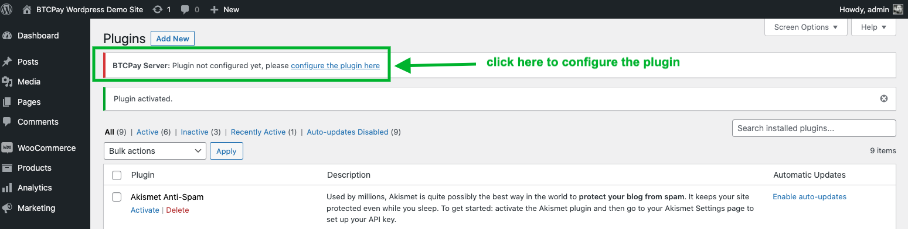

### 2.1 Unganisha kwa kutumia mchawi wa ufunguo wa API (inapendekezwa)

1. Katika sehemu ya "**BTCPay Server URL**", weka URL kamili ya mwenyeji wako (ikijumuisha https) – https://btcpay.mydomain.com
2. Bonyeza kitufe cha [Generate API key] (utaelekezwa kwenye ukurasa wa "Authorization request" wa BTCPay Server.
   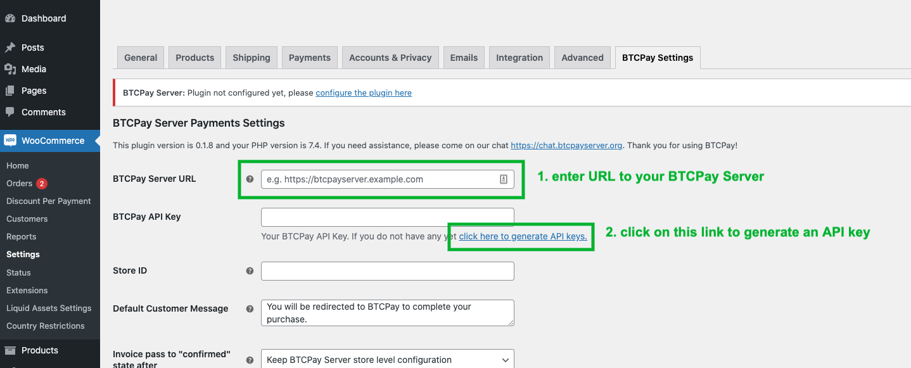

3. Ikiwa haujaingia kwenye kielelezo chako cha BTCPay Server, ingia sasa. (kwa hiari)
   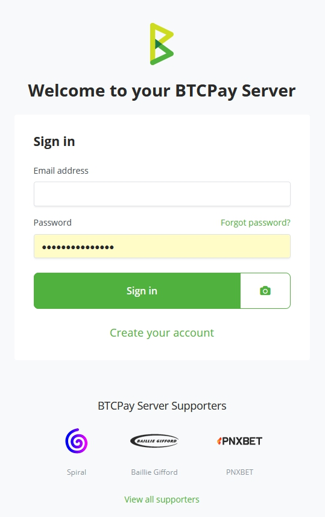
4. Chagua duka unalotaka kuunganisha nalo (ikiwa una duka moja tu litachaguliwa kiotomatiki).
   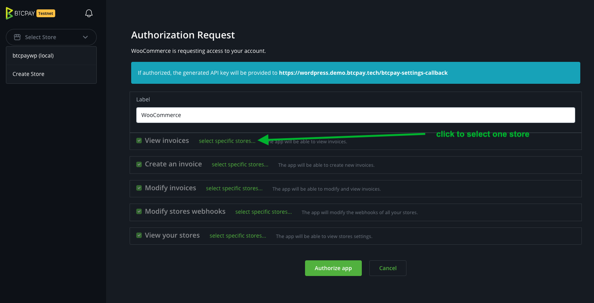
5. Ruhusa zote zinazohitajika tayari zimejazwa, unahitaji tu kubonyeza [Authorize app]
   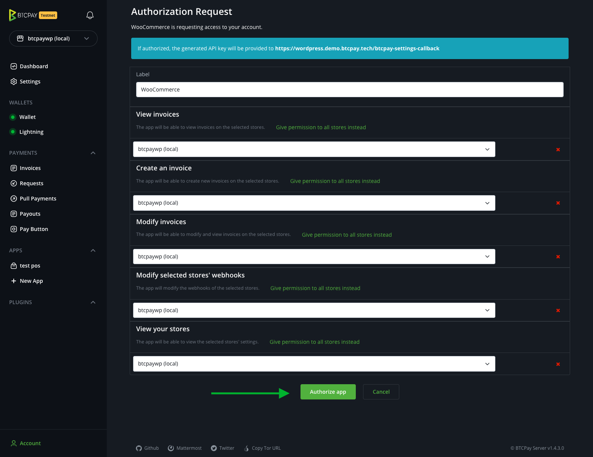
6. Utaelekezwa tena kwenye duka lako la WooCommerce na ufunguo wa API na Kitambulisho cha Duka zitajazwa mapema. Kwa kuongeza, webhook itakuwa imeundwa kiotomatiki kwako. Angalia sehemu ya "Webhook status" ionyeshe "Webhook setup automatically." ikifuatiwa na kitambulisho.
   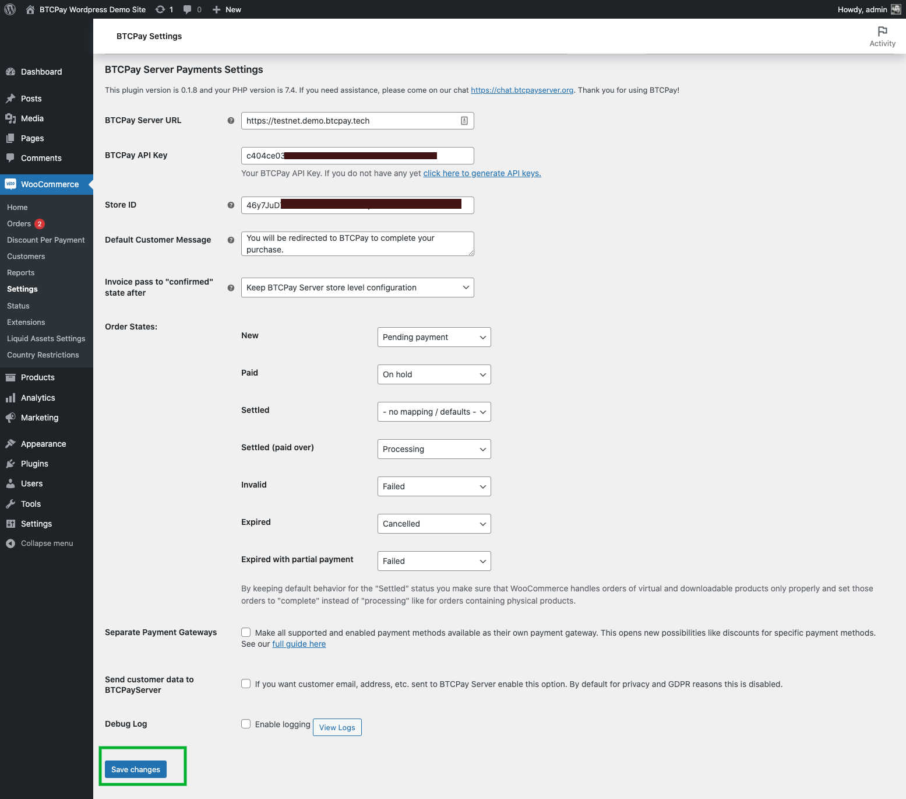
7. Kabla ya kufanya usanidi wowote zaidi bonyeza **[Save]** ili kuhakikisha yote yamewekwa.
   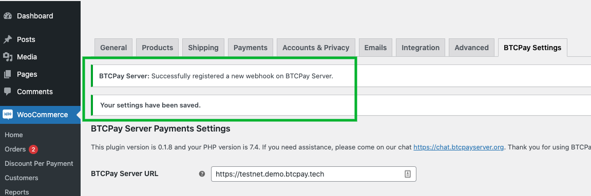

Hongera, umekaribia kumaliza. Ili kufanya lango la malipo la Bitcoin lionekane kwenye malipo yako. Kwenye upau wa kando nenda kwenye "WooCommerce" -> "Settings", bonyeza kichupo cha "Payments" na uwezeshe lango la malipo la "BTCPay (default)".

Endelea na "3. Kujaribu malipo" hapa chini ili kuhakikisha yote yanafanya kazi kama inavyotarajiwa.

### 2.2 Unganisha kwa kuunda kwa mkono ufunguo wa API na ruhusa

Ikiwa huwezi kutumia mchawi uliotajwa katika sehemu iliyotangulia unaweza pia kuzalisha ufunguo wa API kwa mkono.

1. Bonyeza _[Account]_ -> _Manage Account_ chini kushoto
   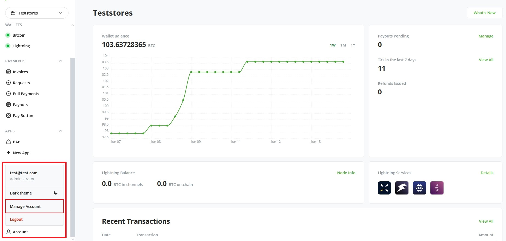
2. Nenda kwenye kichupo cha _"API Keys"_
3. Bonyeza _[Generate Key]_ ili kuchagua ruhusa.
   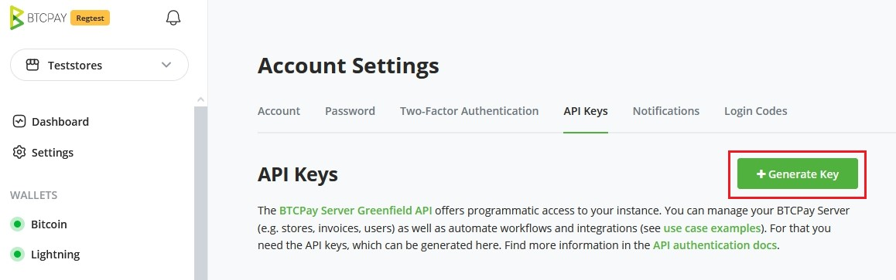
4. Bonyeza kiungo cha _"Select specific stores"_ kwa ruhusa zifuatazo: `View invoices`, `Create invoice`, `Modify invoices`, `Modify stores webhooks`, `View your stores`, `Create non-approved pull payments` (inatumika kwa marejesho)
   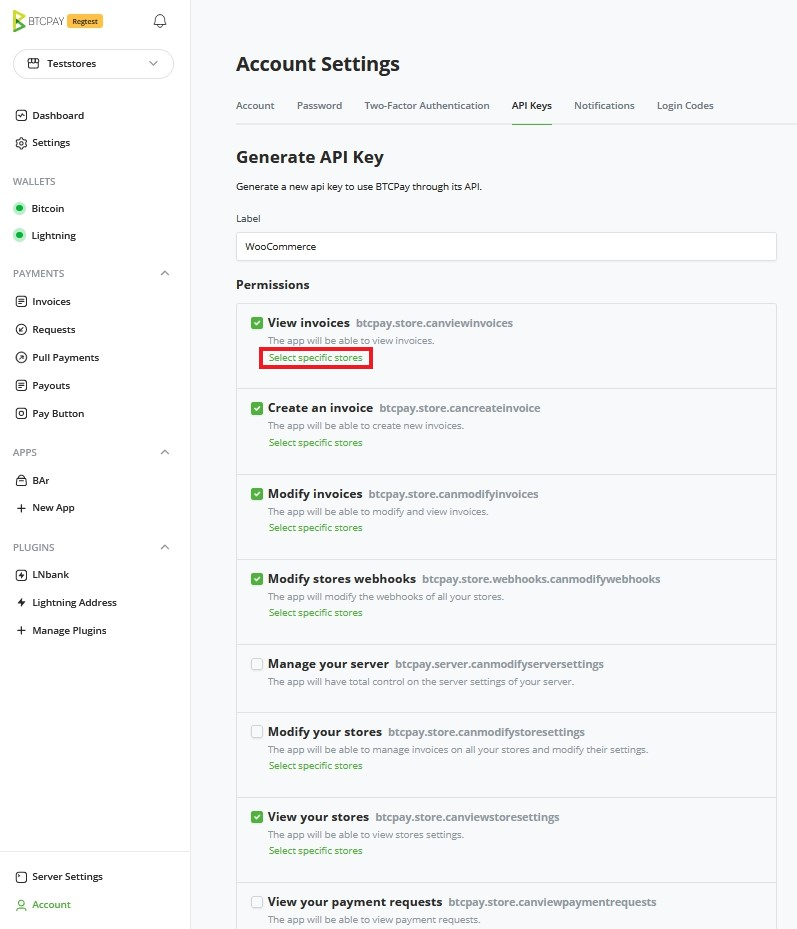
5. Bonyeza _[Generate API Key]_
   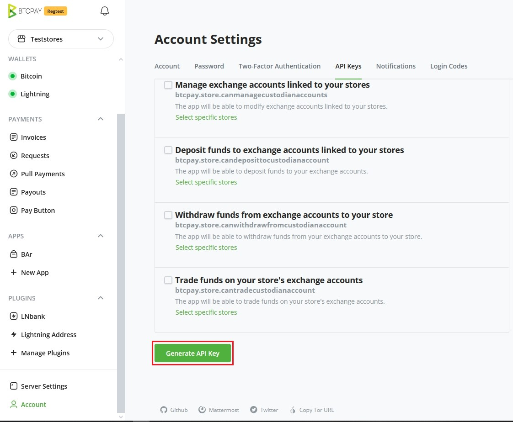
6. Nakili Ufunguo wa API uliozalishwa kwenye fomu yako ya WordPress ya _BTCPay Settings_ (Mipangilio ya juu)
   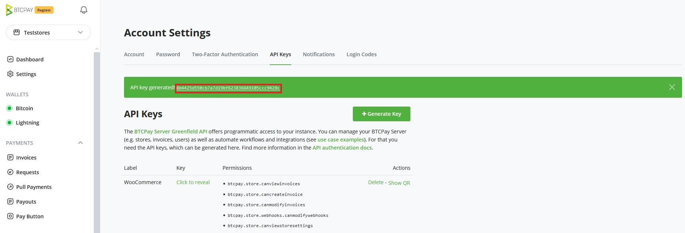
7. Nakili kitambulisho cha duka (store ID) kwenye fomu yako ya WordPress ya _BTCPay Settings_ (Mipangilio ya juu)
   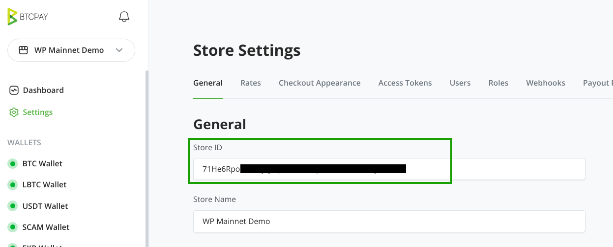
8. Kwenye fomu ya Mipangilio ya BTCPay:
- Weka _BTCPay Server URL_ (URL ya kielelezo chako cha BTCPay Server, ambapo umeunda ufunguo wa API hivi punde)
- Bonyeza kisanduku cha kuteua cha "Advanced settings" ili kuingiza _BTCPay Server API Key_ na _Store ID_ (acha _Webhook secret_ ikiwa tupu)
- Bonyeza _[Save]_ chini ya ukurasa
  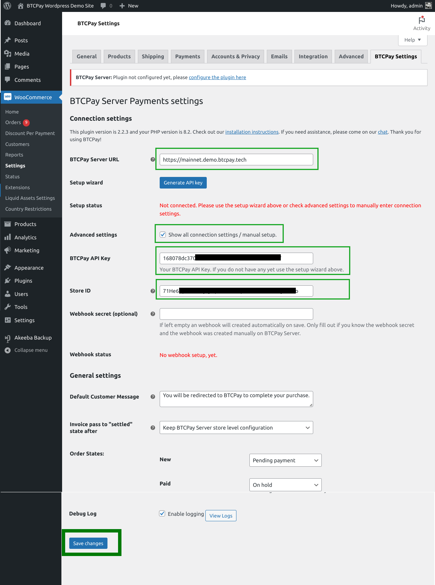
9. Hakikisha unaona arifa "_BTCPay Server: Successfully registered a new webhook on BTCPay Server_" na _Setup status_ na _Webhook status_ ni za kijani.
   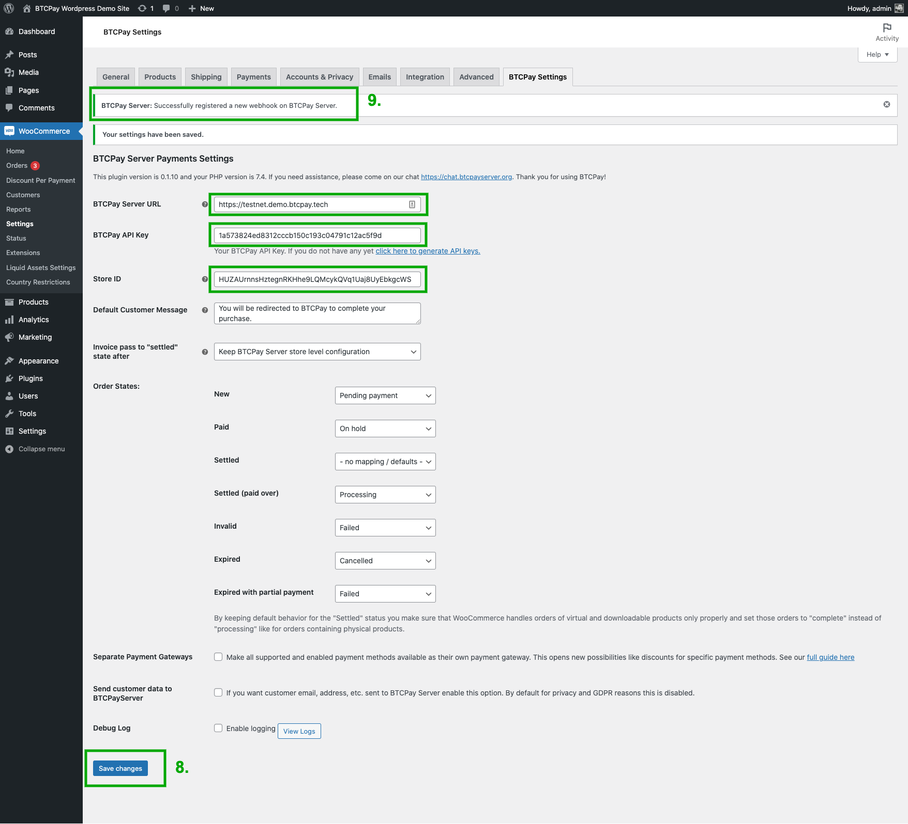

Hongera, umekaribia kumaliza. Ili kufanya lango la malipo la Bitcoin lionekane kwenye malipo yako. Kwenye upau wa kando nenda kwenye "WooCommerce" -> "Settings", bonyeza kichupo cha "Payments" na uwezeshe lango la malipo la "BTCPay (default)".

Endelea na "3. Kujaribu malipo" hapa chini ili kuhakikisha yote yanafanya kazi kama inavyotarajiwa.

## 3. Kujaribu malipo

Kufanya ununuzi mdogo wa majaribio kutoka duka lako kutakupa amani ya akili.
Daima hakikisha kwamba kila kitu kimewekwa vizuri kabla ya kuanza rasmi.
Video ya mwisho inakuongoza kupitia hatua za kuweka kikomo cha pengo katika pochi yako ya Electrum na kujaribu mchakato wa malipo.

[](https://www.youtube.com/watch?v=Fi3pYpzGmmo)

## 4. Kubinafsisha BTCPay WooCommerce V2

### 4.1 Mipangilio ya Jumla (Global Settings)

Inapatikana kwenye _WooCommerce -> Settings -> Tab [BTCPay Settings]_

**BTCPay Server URL**

URL kwenye kielelezo chako cha BTCPay Server, ikijumuisha itifaki k.m. `https://btcpay.yourdomain.com`.

**BTCPay API Key**

Ufunguo wako wa API. (Ilizalishwa kiotomatiki katika hatua zilizotangulia).

**Store ID**

Kitambulisho cha duka cha duka lako la BTCPay Server. Kinapatikana kwenye ukurasa wa mipangilio ya duka.

**Default Customer Message**

Hapa unaweza kubinafsisha ujumbe wa mteja unaoonyeshwa baada ya kuchagua lango la malipo la BTCPay wakati wa malipo. Hii inaweza kubadilishwa kwenye mipangilio ya lango la malipo kwa kila lango ikiwa unatumia chaguo la "Separate payment gateways".

**Invoice pass to "Settled" state after**

Weka baada ya uthibitishaji ngapi malipo yanazingatiwa kuwa yamelipwa kikamilifu na kukamilishwa. Chaguo-msingi ni kile kilichosanidiwa kwenye mipangilio ya duka la BTCPay.

**BTCPay Order Statuses**

Kulingana na mtindo wako wa biashara na mipangilio ya duka, unaweza kutaka kusanidi hali zako za agizo.
Unaweza kuweka BTCPay kuchochea hali fulani ya agizo katika WooCommerce kiotomatiki.

- _New_ - agizo limewekwa, halijalipwa bado.
- _Paid (unconfirmed)_ - agizo limelipwa, hakuna uthibitishaji wa kutosha kwenye blockchain, bado.
- _Settled_ - agizo limelipwa, limethibitishwa kwenye blockchain.
- _Settled (paid over)_ - agizo limelipwa, limethibitishwa kwenye blockchain lakini limelipwa zaidi.
- _Invalid_ - agizo limelipwa, halikupata idadi ya kutosha ya uthibitishaji katika muda uliofafanuliwa mapema uliowekwa katika mipangilio ya duka la BTCPay, au limewekwa alama kuwa batili kwa mkono.
- _Expired_ - ankara imeisha muda, agizo halijalipwa.
- _Expired with partial payment_ - ankara imeisha muda na imelipwa kwa kiasi

Chukua muda kufikiria jinsi unavyotaka kuendesha kiotomatiki hali hizi. Mipangilio chaguo-msingi itafanya kazi vizuri tu kwa matumizi mengi. Zibadilishe tu ikiwa una kesi maalum ya matumizi akilini.

:::tip
Unapaswa kuweka hali ya agizo ya "Settled" kuwa "- no mapping / defaults-" ikiwa unauza bidhaa za kidijitali na halisi. Kwa bidhaa za kidijitali WooCommerce itaruka kiotomatiki hali ya "Processing" na kwenda moja kwa moja kwenye "Completed" kwa maagizo yale yaliyo na bidhaa za kidijitali pekee.
:::

Mfano mwingine, ikiwa mfanyabiashara anataka kutuma barua pepe kumjulisha mteja kwamba malipo yamepokelewa, lakini agizo litachakatwa baada ya uthibitisho, mfanyabiashara atahitaji kuweka hali ya agizo kwa "Paid (unconfirmed)" kuwa "On hold". Kisha, mfanyabiashara atahitaji kubinafsisha na kuchochea barua pepe kwa hali ya "On hold" ya agizo katika WooCommerce.

Angalia pia [kipengee hiki cha FAQ](../FAQ/Integrations/#overriding-the-paid-payment-status) ikiwa unataka kubadilisha hali ya agizo kwa "Paid (unconfirmed)".

Inachukua muda kupata fomula kamili, kwa hivyo watumiaji wanapaswa kujaribu mambo kabla ya kuanza rasmi.

**Modal checkout**

Wezesha chaguo hili ikiwa unataka ankara ya BTCPay Server ionyeshwe moja kwa moja kwenye ukurasa wa malipo (na usiwaelekeze wateja kwenye kielelezo chako cha BTCPay Server).

**Separate Payment Gateways**

Ikiwa chaguo hili limewezeshwa programu-jalizi itazalisha lango moja tofauti la malipo kwa kila njia ya malipo inayotumika kwenye BTCPay Server. K.m. ikiwa una BTC, LightningNetwork na labda Liquid Assets zimewezeshwa kwenye duka lako la BTCPay Server, basi utakuwa na lango tofauti linalopatikana kwa kila moja. Hii inaruhusu kesi nyingi mpya za matumizi kama punguzo kwa kila lango au vizuizi vya kimsingi vya nchi. Maelezo zaidi [hapa](./FAQ/Integrations/#how-to-configure-additional-token-support).

**Send customer data to BTCPayServer**

Kwa chaguo-msingi _hakuna_ data ya mteja isipokuwa barua pepe inayotumwa kwa BTCPay Server. Ikiwa unataka kutuma data ya anwani ya mteja kwa BTCPay Server unaweza kuiwezesha hapa.

**Debug Log**

Chaguo hili linasaidia iwapo una tatizo na unahitaji maelezo zaidi juu ya kinachoendelea. Kumbukumbu zinaweza kupatikana chini ya WooCommerce -> Status -> Log. Hakikisha unazima hili tena baada ya utatuzi kwani litajaza mfumo wako wa faili na kumbukumbu.

### 4.2 Maalum kwa Lango la Malipo

Kulingana na ikiwa umewezesha "Separate Payment Gateways" iliyotajwa hapo juu utakuwa na Lango moja au zaidi la Malipo linalopatikana kusanidiwa katika mipangilio ya lango la malipo kupitia _WooCommerce -> Settings -> Tab [Payments]_

Kwenye malango yote ya malipo unaweza kuweka chaguo zifuatazo:

**Title**
Maandishi ya lango la malipo yanayoonyeshwa kwenye ukurasa wa malipo. Chaguo-msingi ni "BTCPay (Bitcoin, Lightning Network, ...)".

**Customer Message**

Hapa unaweza kubinafsisha ujumbe unaoonyeshwa baada ya kuchagua lango la malipo la BTCPay.

**Gateway Icon**

Pakia au chagua ikoni maalum kuonyeshwa kando ya lango la malipo wakati wa malipo. Chaguo-msingi ni nembo ya BTCPay.

#### 4.2.1 BTCPay (default)

Chaguo za ziada zinazopatikana tu kwa lango la malipo chaguo-msingi:

**Enforce payment tokens**

Ukiwa na kipengele cha "Separate Payment Gateways" kimewezeshwa katika Mipangilio ya BTCPay unaweza kutumia chaguo hili kulazimisha tokeni za malipo pekee. Hii inamaanisha kuwa ankara iliyoundwa _itakuwa na_ tokeni za aina "payment" tu na _si zozote_ za aina "promotion". Angalia tofauti ya aina za tokeni [hapa](./FAQ/Integrations/#how-to-configure-additional-token-support#token-types)

#### 4.2.2 Malango Tofauti ya Malipo

Chaguo za ziada zinazopatikana tu kwa malango tofauti ya malipo (ikiwa kipengele hicho kimewezeshwa):

**Token Type**

Kwa chaguo-msingi aina ya "payment" imechaguliwa. Lakini ikiwa una Liquid Assets na mali/tokeni yako mwenyewe iliyotolewa (k.m. inayotumika kama vocha) unaweza kuchagua "promotion" hapa. Hizo zinachakatwa tofauti kuliko tokeni za kawaida za malipo. Maelezo yanaweza kupatikana [hapa](./FAQ/Integrations/#how-to-configure-additional-token-support#promotional-tokens-100-discount)

## Utatuzi wa Matatizo

### Hitilafu: Call to undefined function BTCPayServer\Http\curl_init()

Tafadhali hakikisha toleo lako la PHP linatumia kiendelezi cha cURL (kama ilivyoandikwa katika mahitaji hapo juu). Unaweza kukisakinisha kwenye Debian/Ubuntu kwa kuendesha amri `sudo apt install php-curl`.

### Hali za agizo hazisasishi ingawa ankara imelipwa

Tafadhali angalia kwanza ikiwa webhook imeundwa chini ya mipangilio ya duka la BTCPay Server. Ikiwa hakuna webhook iliyoundwa unaweza kutembelea kwenye duka lako la WooCommerce kichupo cha BTCPay Settings chini ya mipangilio ya WooCommerce na ubonyeze kitufe cha kuhifadhi. Hii itaunda webhook.

Unaweza pia kuangalia maelezo ya ankara yako ikiwa kulikuwa na hitilafu zozote wakati wa kutuma ombi la webhook. Baadhi ya watoa huduma za mwenyeji, usanidi wa firewall au programu-jalizi za usalama za WordPress (kama Wordfence) huzuia maombi ya POST kwenye tovuti yako ya WordPress ambayo husababisha hali ya http ya "403 Forbidden" au "503 Service Unavailable".

Unaweza kuangalia na kuthibitisha mwenyewe ikiwa kuna kitu kinachozuia maombi kwenye tovuti yako kwa moja ya njia hizi mbili:

**Angalia kwa kutumia mstari wa amri (Linux au MacOS):**
(badilisha EXAMPLE.COM na URL ya tovuti yako ya WordPress)

```
curl -vX POST -H "Content-Type: application/json" \
    -d '{"data": "test"}' https://EXAMPLE.COM/?wc-api=btcpaygf_default
```

Kwenye jibu, ukiona mstari huo "HTTP/1.1 500" au "HTTP/2 500" na ujumbe "Webhook request validation failed" hiyo inamaanisha kwamba tovuti yako haizui ombi kwa "403 Forbidden".

```
.... snip ....
* We are completely uploaded and fine
< HTTP/2 500
< server: nginx
< date: Sun, 05 Jun 2022 16:55:08 GMT
< content-type: application/json; charset=UTF-8
< x-powered-by: PHP/8.1.6
< expires: Wed, 11 Jan 1984 05:00:00 GMT
< cache-control: no-cache, must-revalidate, max-age=0
<
* Connection #0 to host example.com left intact
{"code":"wp_die","message":"Webhook request validation failed.","data":{"status":500},"additional_errors":[]}
```

Kwa upande mwingine, ukiona mstari huo "HTTP/1.1 403 Forbidden" au "HTTP/2 403" basi kuna kitu kinachozuia data iliyotumwa kwenye tovuti yako ya WordPress. Unapaswa kuuliza mtoa huduma wako wa mwenyeji au kuhakikisha hakuna firewall au programu-jalizi inayozuia maombi.

```
.... snip ....
* upload completely sent off: 16 out of 16 bytes
< HTTP/1.1 403 Forbidden
< access-control-allow-origin: *
< Content-Type: application/json; charset=UTF-8
< X-Cloud-Trace-Context: 4f07d5b2e5c2f05949d04421a8e2dd6a
< Date: Thu, 17 Feb 2022 10:06:50 GMT
< Server: Google Frontend
< Content-Length: 26
```

**Angalia kwa kutumia huduma ya mtandaoni (ikiwa huna mstari wa amri unaopatikana:**

- Nenda kwenye [https://reqbin.com/post-online](https://reqbin.com/post-online)
- Weka kikoa chako: `https://EXAMPLE.COM/?wc-api=btcpaygf_default`
  (badilisha EXAMPLE.COM na URL ya tovuti yako ya WordPress)
- Hakikisha "POST" imechaguliwa
- Bonyeza [Send]

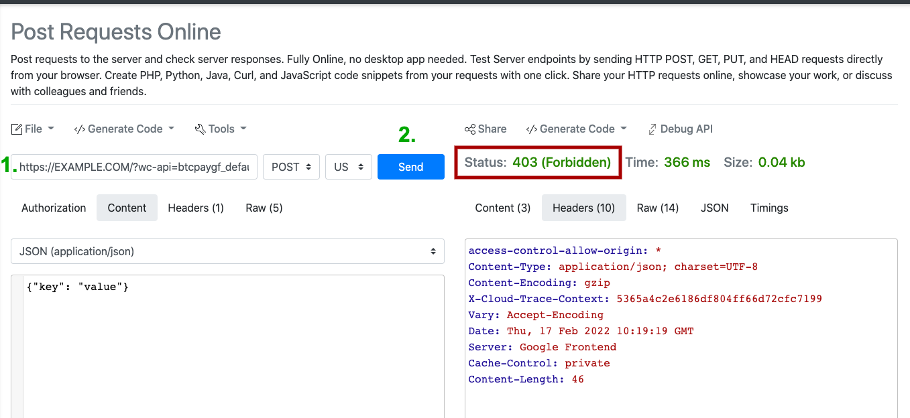

Ukiona "Status 403 (Forbidden)" basi maombi ya POST kwenye tovuti yako yamezuiwa kwa sababu fulani. Unapaswa kuuliza mtoa huduma wako wa mwenyeji au kuhakikisha hakuna firewall au programu-jalizi inayozuia maombi.

### Napata hitilafu wakati wa malipo lakini sina uhakika tatizo ni nini.

Katika Mipangilio yako ya BTCPay kwenye dashibodi yako ya msimamizi: _WooCommerce -> Settings: Tab [BTCPay Settings]_ unaweza kuwezesha modi ya utatuzi kwa kuweka tiki kwenye chaguo hilo.

Sasa unaweza kupata Kumbukumbu za kina zaidi unapobonyeza kitufe cha [View Logs] au unaenda kwenye _WooCommerce -> Status: Tab [Logs]_ na uchague kumbukumbu za hivi karibuni za btcpay.

:::warning Onyo
Tafadhali hakikisha kwamba unazima modi ya utatuzi tena baada ya kumaliza kuchunguza, vinginevyo utendaji wa tovuti yako unaweza kuathiriwa na pia kuandika data nyingi za kumbukumbu kwenye mfumo wako wa faili bila sababu.
:::

Kwa kuongeza unaweza pia kuangalia kwenye kumbukumbu za hitilafu za seva yako ya wavuti ikiwa utapata hitilafu yoyote inayohusiana na programu-jalizi ya BTCPay.

### Nina matatizo na matumizi ya programu-jalizi au maswali mengine yanayohusiana

Jisikie huru kujiunga na kituo chetu cha usaidizi kupitia [https://chat.btcpayserver.org/](https://chat.btcpayserver.org/) ikiwa unahitaji usaidizi au una maswali yoyote zaidi.

### Unda ufunguo mpya wa API

Ikiwa umekuwa ukitumia programu-jalizi ya WooCommerce V2 kabla ya toleo la 2.0.0, ufunguo wako wa API hautakuwa na ruhusa zinazohitajika kutoa marejesho kupitia pull-payments. Ikiwa unataka kutumia kipengele hicho, unaweza kuunda ufunguo mpya wa API (kuhariri ufunguo wa API hakutumiki kwa sasa). Unaweza kutumia ilivyoelezwa hapo juu [2.1 Unganisha kwa kutumia mchawi wa ufunguo wa API](#21-unganisha-kwa-kutumia-mchawi-wa-ufunguo-wa-api-inapendekezwa) au [uzalishaji wa ufunguo wa API kwa mkono](#22-unganisha-kwa-kuunda-kwa-mkono-ufunguo-wa-api-na-ruhusa). Webhook iliyosanidiwa itaendelea kufanya kazi, na hakuna mabadiliko yanayohitajika.

### Niliharibu webhook, jinsi ya kurekebisha

Tuseme umebadilisha webhook ya WooCommerce kwa bahati mbaya, na haifanyi kazi tena. Katika kesi hiyo, unaweza kulazimisha uundaji upya wake haraka unapofuta ufunguo wa API kwenye BTCPay Server na kisha nenda kwenye Mipangilio ya BTCPay Server (kwenye tovuti yako ya WordPress) na ubonyeze kuhifadhi tena. Unapaswa kuona ujumbe kwamba webhook imeundwa kwa mafanikio.

## Kusambaza WooCommerce kutoka BTCPay Server

Ikiwa tayari una BTCPay Server, unaweza kuanzisha WooCommerce kwa urahisi sana kutoka kwa mazingira yako yaliyopo.

1. Elekeza IP ya nje ya mashine pepe ambapo BTCPay yako inasimamiwa kwenye kikoa cha duka lako, kwa mfano store.yourdomain.com.

2. Ingia kwenye seva yako ya BTCPay kama root.

```bash
sudo su -
```

3. Sanidi vigezo vya WooCommerce. Unaweza kuongeza [vigezo vya hiari](https://github.com/btcpayserver/btcpayserver-docker/blob/master/docker-compose-generator/docker-fragments/opt-add-woocommerce.yml) pia.

```bash
export BTCPAYGEN_ADDITIONAL_FRAGMENTS="$BTCPAYGEN_ADDITIONAL_FRAGMENTS;opt-add-woocommerce"
export WOOCOMMERCE_HOST="yourstoredomain.com"
```

4. Mwisho, endesha tu hati ya Usanidi wa BTCPay ambayo itaongeza vigezo vilivyowekwa.

```bash
. ./btcpay-setup.sh -i
```

5. Nenda kwenye jina la kikoa cha duka lako, katika mfano wetu hiyo ni store.yourdomain.com na ufuate mchawi wa usakinishaji wa WordPress.

## FAQ

Unaweza kupata maelezo ya ziada kuhusu ushirikiano wa WooCommerce katika FAQ yetu [hapa](../FAQ/Integrations/#woocommerce-faq).
